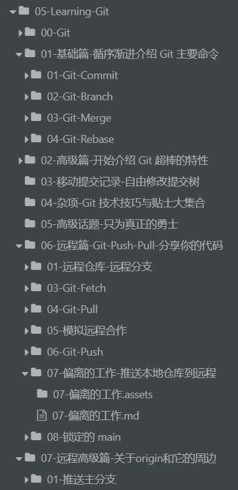
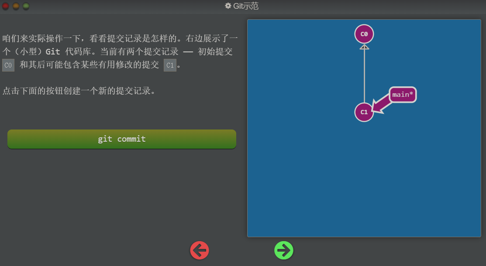
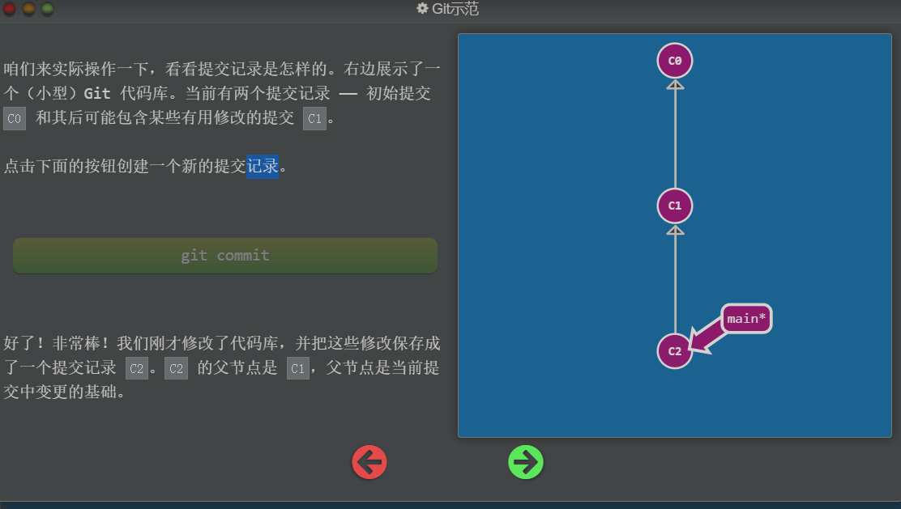

## 蓝莓有个新计划

哈哈哈 ~ 我有了一个新的计划，我之前在我的第 2 期资源分享中提到了一个学习 `Git` 的游戏，我觉得这个 `Git` 游戏非常棒，能够对 `Git` 的使用方法有很好的理解，我打算今天开始陆陆续续的把这个 `Git` 学习的游戏做成文本的学习资料，现在我已经做了不少了

今天开始，我争取每天推送一篇学习资料出来，放在公众号的专栏中

先给大家看一下我目前进度：

## Git 游戏的传送门

传送门：https://learngitbranching.js.org/?locale=zh_CN

可能这个链接不太友好，需要通过一些 `方法（你懂 ~ ）` 才能登录这个网站

今天推送的是 `01-基础篇` 的 `01-Git-Commit`

## Git Commit

Git 仓库中的提交记录保存的是你的目录下所有文件的快照，就像是把整个目录复制，然后再粘贴一样，但比复制粘贴优雅许多！

Git 希望提交记录尽可能地轻量，因此在你每次进行提交时，它并不会盲目地复制整个目录。条件允许的情况下，它会将当前版本与仓库中的上一个版本进行对比，并把所有的差异打包到一起作为一个提交记录。

Git 还保存了提交的历史记录。这也是为什么大多数提交记录的上面都有父节点的原因 —— 我们会在图示中用箭头来表示这种关系。对于项目组的成员来说，维护提交历史对大家都有好处。

关于提交记录太深入的东西咱们就不再继续探讨了，现在你可以把提交记录看作是项目的快照。提交记录非常轻量，可以快速地在这些提交记录之间切换！

## 图解过程

执行 `git commit` 后：

## 任务

在当前的分支上提交两次记录

## 图解过程

第一关比较简单

使用两次 `git commit` 提交两次记录，通关

## 总结

在这个游戏中使用 `git commit` 来提交记录

通常我们真正使用 `git commit` 这个命令的时候是需要加参数的，但是这个游戏的重点并不是这些，而是让我们理解 `Git` 提交的记录的工作原理

------

我是：蓝莓

微信：点击我的公众号底部联系我按钮

GitHub：https://github.com/teenager-lijh

小红书：2133670884

B站：公众号同名

