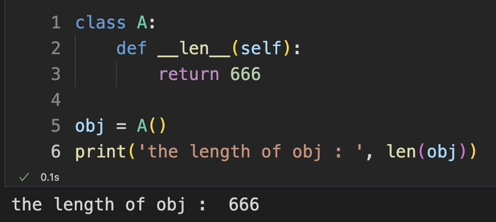
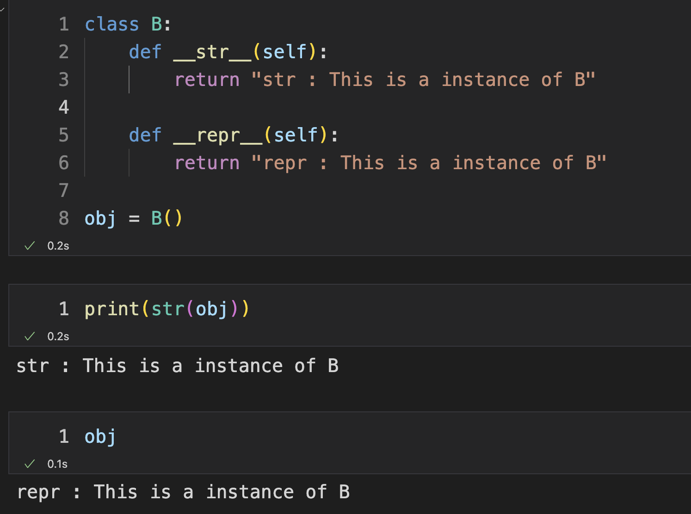

哈喽 ~ 

你好啊，我是 蓝莓 :)

在这个文章说一说 Python 语言中的 魔法函数 ~ 这并不是一个专业的名称，只是因为这个语言特性看上去非常神奇，所以被起了这样的一个昵称 ~

## 什么是魔法函数

在学习 Python 的过程中你一定使用过例如 `len` 这个函数，这个函数不仅可以在 `list` 类型上边使用，还可以在 `tuple` 类型上边使用。当然了，还有非常多的其他类型也都可以使用 `len` 这个函数 ~ 

可是你有没有想过呢，为什么同样一个函数可以接收很多类型的对象而且可以实现相似的功能的？

如果学习过静态编程语言的话，你一定会觉得这是一件非常神奇的事情 ~ 

## len 函数的神秘面纱

```python
class A:
    def __len__(self):
        return 666

obj = A()
print('the length of obj is ', len(obj))
```

运行这段代码，你会发现我们竟然可以把 `obj` 实例对象传给 `len` 函数了，而且得到的值是 `666`。相信聪明的你已经明白了这是怎么回事儿。`Python` 可以基于协议编程，也就是`Python`实现约定好一些函数，当你实现了这个函数之后，你就可以让你自己创建的类型表现得像原生类型一样。这类函数都是以双下划线开头并且以双下划线结尾的。就比如当你实现了 `__len__` 函数后，当你把 `obj` 对象传给 `len` 后就会自动调用`obj`的 `__len__` 函数了。




## 更多的魔法函数

Python 中的魔法函数非常多

**非数学运算**

字符串表示:  `__repr__` `__str__`

集合、序列相关:  `__len__` `__getitem__` `__setitem__` `__delitem__` `__contains__`

迭代相关 `__iter__` `__next__`

可调用 `__call__`

with上下文管理器 `__enter__` `__exit__`

数值转换:  `__abs__` `__bool__` `__int__` `__float__` `__hash__` `__index__`

元类相关:  `__new__` `__init__`

属性相关:  `__getattr__`  `__setattr__` `__getattribute__` `__setattribute__` `__dir__`

属性描述符:  `__get__` `__set__`  `__delete__`

协程:  `__await__` `__aiter__` `__anext__` `__aenter__` `__aexit__`


**数学运算**

一元运算符: `__neg__（-）` `__pos__（+）` `__abs__`

二元运算符: `__lt__(<)`  `__le__ <=`   `__eq__ ==`   `__ne__ !=`   `__gt__ >`   `__ge__ >=`


算术运算符:  `__add__ +`   `__sub__ -`   `__mul__ *`   `__truediv__ /`   `__floordiv__ //`   `__mod__ %`   `__divmod__ divmod()`   `__pow__ ** 或 pow()`   `__round__ round()`

反向算术运算符: `__radd__`   `__rsub__`   `__rmul__`   `__rtruediv__`   `__rfloordiv__`   `__rmod__`  `__rdivmod__`   `__rpow__`

增量赋值算术运算符:`__iadd__`   `__isub__`   `__imul__`   `__itruediv__`   `__ifloordiv__`   `__imod__`  `__ipow__`

位运算符: `__invert__ ~`   `__lshift__ <<`   `__rshift__ >>`   `__and__ &`   `__or__ |`   `__xor__ ^`

反向位运算符: `__rlshift__`   `__rrshift__`   `__rand__`   `__rxor__`   `__ror__`

增量赋值位运算符: `__ilshift__`   `__irshift__`   `__iand__`   `__ixor__`   `__ior__`


## 再举个例子

我们来看一下`__repr__` `__str__` 这两个魔法函数会发生什么

```python
class B:
    def __str__(self):
        return "str : This is a instance of B"

    def __repr__(self):
        return "repr : This is a instance of B"

obj = B()
```

 

观察运行结果你会发现 `str` 调用了 `__str__` 函数

如果你直接输入`obj` 并且运行的话，因为我这是在交互式模式下，所以它会调用 `__repr__` 函数并且把它的返回值作为结果输出。`__repr__` 是给开发者使用的一个函数，方便在交互式模式下开发。 

好啦，今天就分享这么多啦 ~ 

