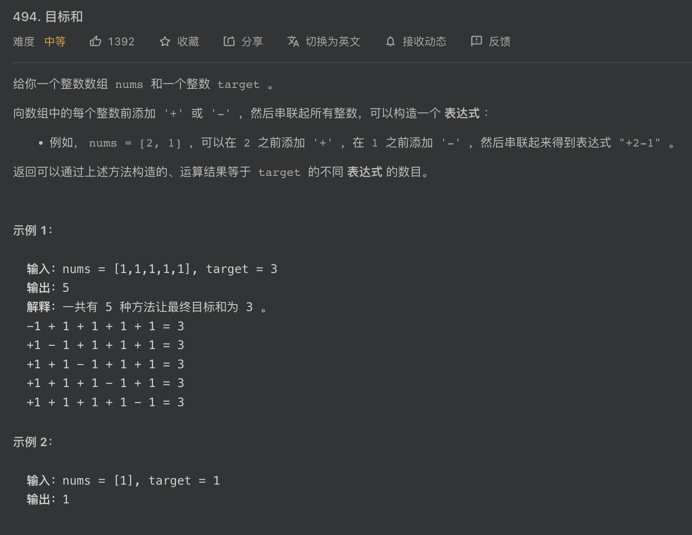

## LeetCode 494

这个题目依然是可以用 `背包` 的思路来解决，题目如下：




## 最简单的方法

看到这个题目，可以想到的最简单的方法就是遍历一遍所有的方案，在所有的方案中记录下复合要求的方案就几个就可以了。

## 动态规划

这个问题看上去根本不像是背包的问题，那么要如何转换成背包的问题呢？

在题目中使用 `nums` 数组给出了所有可选的数值，并且数组 `nums` 中的数值均为正整数。在这里，用 $ sum(nums) $ 来表示 `nums` 数组中所有元素的和。对于每一个数值可以选择加上这个数值或者减去这个数值，所以对于每个数值来说有两种选择，要么为它添上一个`正号`，要么为它添上一个`负号`。

1. 对于要添上正号的这些数值，我把他们归类到集合 $ A $ 中。
2. 对于要添上负号的这些数值，我把他们归类到集合 $ B $ 中。

这里注意到，我并不是说集合 $ B $ 中的数值都是负数，而是说把那些要添加上负号的数值归类到集合 $ B $ 中。

这样一来，$ sum(A) $ 代表集合 $ A $ 中所有元素的和，$ sum(B) $ 代表集合 $ B $ 中所有元素的和。 这就把所有的数值拆分成了两个集合。目标值 $target$ 就等于 $ sum(A) - sum(B) $ ，因为集合 $ B $ 中的元素都是要添加负号的，所以就是把他们累加后减去这个数。接着再把这个式子变一变就变成了 $ sum(A) = (target + sum(nums)) / 2 $ 。
$$
sum(A) - sum(B) = target \\
sum(A) = target + sum(B) \\
两边同时加上一个 sum(A) \\
sum(A) + sum(A) = target + sum(B) + sum(A) \\
2sum(A) = target + sum(nums) \\
sum(A) = (target + sum(nums)) / 2
$$
**你可以发现**

1. $ target $ 是题目给出的值，这是一个固定值
2. $ sum(nums) $ 也是一个固定值，因为数组 $ nums $ 是固定的

所以，这个题目的问题就变成了，在数组 $ nums $ 中有多少个子集 $ A$ ， 可以使得 $ sum(A) $ 等于 $ (target + sum(nums)) / 2 $

这怎么就是一个背包问题了呢？

其实这就是在求，一个背包容量 $ C = (target + sum(nums)) / 2 $ 并且 `第i号` 物品的重量为 `nums[i]` ，然后问你，有多少种装法可以刚好装满背包。 

**dp 数组**

`int dp[nums.size()][C+1]`

1. `nums.size()` 给出 `[0...nums.size()-1]` 的下标范围
2. `C+1` 给出 `[0...C]` 的下标范围，因为容量是从 0 到 C 的，所以共有 `C+1` 种容量

`dp[i][j]` 代表考虑 `[0...i]` 这些编号的数值并且背包容量为 `j` 的时候有多少种装法可以刚好装满

**状态转移方程**
$$
dp[i][j] = dp[i-1][j] + dp[i-1][j-nums[i]]
$$
思考一下，$ dp[i][j] $ 可以取决于当我们 `不装`  `第i号` 物品时的方案数 `以及` 当我们 `装`   `第i号` 物品时的方案数的和。

当我们决定要试一试装入 `第i号` 物品的时候，还要判断一下当前的背包容量 `j` 是不是 `大于等于` `nums[i]`。 如果不是的话，说明当前的容量是不能够装入 `第i号` 物品的。

**LeetCode 给出的代码**

以下给出 `C++` 代码

只需要让 `findTargetSumWays` 这个函数返回一个整型值就可以了

```c++
class Solution {
public:
    int findTargetSumWays(vector<int>& nums, int target) {

    }
};
```


**边界处理**

这里的代码都是属于 `findTargetSumWays` 函数的 ~

```C++
// 计算 nums 数组中所有元素的和
int sum = 0;
for(int each : nums)
  sum += each;
```

1. 因为 $ sum(A) $ 的结果一定是一个整数，而且目标是 $ sum(A) = (target + sum(nums)) / 2 $ 所以说 $ target + sum(nums) $ 必须是一个偶数才有可能找到满足题目的子集 $ A $
2. 当 $ target > 0 $ 的时候，必须 $ sum(nums) >= target $ 成立才有可能找到一个子集 $ A $，否则就是你把所有的数值前边都添上一个正号累加起来还不能比 $ target $ 大，那更不可能存在一个这样的子集 $ A $了。
3. 当 $ target < 0 $ 的时候，必须 $sum(nums) >= -target $ 成立才行，否则就是你把所有的数值都添上一个符号后累加起来还不能比 $ target $ 小，那也不可能找到满足的子集。

如此一来就有了下边的边界检测代码：

```C++
// 所有的元素均是大于 0 的
// 当把所有元素累加后应该 小于 target
// 或 把所有元素累加后应该 小于 -target (target 可为负) 就是所有元素都取负号累加的情况
if((target + sum) % 2 == 1 || sum < target || sum < -target) return 0;

int C = (target + sum) / 2;
int dp[nums.size()][C+1];
```

  

**第0号行的处理**

从状态转移方程可以看出来，计算出当前行的数据需要知道上一行的数据才行，所以我们先专门计算一下 `第0号` 行的结果，然后再依次计算出后边行的数据

对于 $ dp[0][0] $ 代表仅考虑 `第0号` 元素并且背包容量为 0 时的情况。这个情况下，一定有一种方案可以满足，那就是不装入 `第0号` 物品就可以装满容量为 0 的背包了，所以 $ dp[0][0] = 1 $

接着就是，如果我们想要装入 `第0号` 物品的话，就是 `dp[0][nums[0]]` 的状态，也就是当背包容量刚好等于 `第0号` 物品的重量的时候可以刚好装满背包。但是要判断一下 `nums[0]` 和背包的最大容量 `C` 的大小关系，否则就数组越界了。

```C++
// 处理第 0 号行
for(int j = 0 ; j <= C ; ++j)
dp[0][j] = 0;

dp[0][0] = 1; // 不装入 0 号元素是一种装法
if(nums[0] <= C) dp[0][nums[0]] += 1; // 装入 0 号元素是一种装法
```


**处理剩余行**

1. 当前的背包容量 `j` 小于 `nums[i]` 的时候是不能够装入 `第i号` 物品的，所以 `dp[i][j]` 只能选择不装 `第i号` 物品时的方案数
2. 当前的背包容量可以装入 `nums[i]` 的时候，就可以和状态转移方程一样，把两种情况下的方案数加起来了

```c++
        for(int i = 1 ; i < nums.size() ; ++i){
            for(int j = 0 ; j <= C ; ++j){
                // 当装不进去 nums[i] 时
                if(j - nums[i] < 0){
                    dp[i][j] = dp[i-1][j];
                }
                else{
                    // 当可以装进去 nums[i] 时
                    dp[i][j] = dp[i-1][j] + dp[i-1][j-nums[i]];
                }
            }
        }
```


**完整代码**

```C++
class Solution {
public:

//    sum(A) = (target + sum(nums)) / 2

    int findTargetSumWays(vector<int>& nums, int target) {

        int sum = 0;
        for(int each : nums)
            sum += each;

        // 所有的元素均是大于 0 的
        // 当把所有元素累加后应该 小于 target
        // 或 把所有元素累加后应该 小于 -target (target 可为负) 就是所有元素都取负号累加的情况
        if((target + sum) % 2 == 1 || sum < target || sum < -target) return 0;

        int C = (target + sum) / 2;
        int dp[nums.size()][C+1];


        // 处理第 0 号行
        for(int j = 0 ; j <= C ; ++j)
            dp[0][j] = 0;

        dp[0][0] = 1; // 不装入 0 号元素是一种装法
        if(nums[0] <= C) dp[0][nums[0]] += 1; // 装入 0 号元素是一种装法

        for(int i = 1 ; i < nums.size() ; ++i){
            for(int j = 0 ; j <= C ; ++j){
                // 当装不进去 nums[i] 时
                if(j - nums[i] < 0){
                    dp[i][j] = dp[i-1][j];
                }
                else{
                    // 当可以装进去 nums[i] 时
                    dp[i][j] = dp[i-1][j] + dp[i-1][j-nums[i]];
                }
            }
        }

        return dp[nums.size()-1][C];
    }
};
```


