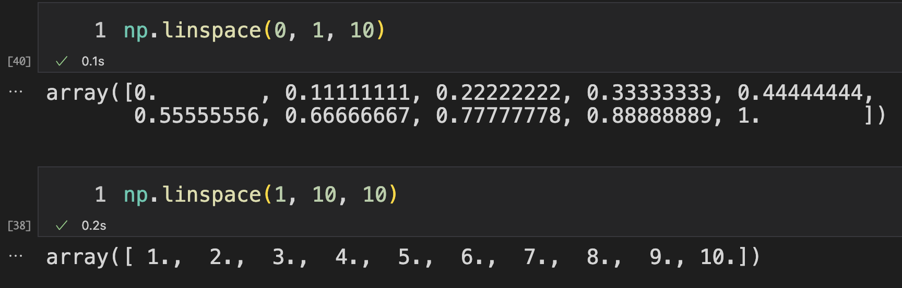

哈喽 ~ 

你好啊，我是蓝莓，

这两天用 matplotlib 画了不少的图，应该以后也会经常画图了，在这里总结一些常用的 matplotlib 使用方法。在这篇文章中会用到一些数据，这些数据都放在 `excel` 文件中，可以在我的 `GitHub` 或 `百度网盘` 下载

**在 GitHub 下载**

传送门 ： https://github.com/teenager-lijh/My-Blog

在这个仓库里有一个文件夹叫 `2022-10-11` ，这里就是这篇文章的所有数据和代码啦！

**百度网盘**

在后台回复 **2022-10-11**，如果失效了，可以及时告诉我喔 ~

**蓝莓的目录结构**

我的代码放在 `code` 文件夹中，都是用 `jupyter notebook` 来写的，数据都放在 `data` 文件夹中，`code` 和 `data` 在同级目录下，`content.md` 是我正在写的这篇文章 ~ 

如果你不是在 `notebook` 中写代码，运行程序后发现图片没有显示出来，那么你就调用一下这个函数

```python
plt.show()
```

 这样就可以让它显示出来了 ~ 


## 导入包

```Python
import pandas as pd
import numpy as np
import matplotlib.pyplot as plt
```


## 1 绘制散点图

**数据读取**

代码文件: `code/scatter.ipynb`

读取 `data/位置.xlsx` 文件，在这里使用 `pandas` 读取 `data/位置.xlsx` 文件的数据，这个位置存的是一些小区的经纬度信息，我们把他的经纬度分别作为 `x` 和 `y` 坐标的值，画成散点图

```python
data = pd.read_excel('../data/位置.xlsx', sheet_name='Sheet1')
```

其中 `sheet_name` 就是指 `excel` 文件下边的这个名字，有些 `excel` 文件会有多个 `sheet` 


可以看一下读取出来的数据长什么样子：


代码文件: `code/scatter.ipynb`

在这里就把 `选址横坐标_x` 作为散点图的 `横坐标值`，把 `选址纵坐标_y` 作为散点图的纵坐标值，把这两列的数据转换成 `numpy` 的格式

通过这样的方式，就可以拿到对应列的数据了：


 转换成为 `numpy` 的格式，只需要把这样一个可迭代的数据类型扔给 `np.array` 就可以啦 ~ 

```python
all_x = np.array(data['选址横坐标_x'])
all_y = np.array(data['选址纵坐标_y'])
```

可以发现，`all_x` 和 `all_y` 都是一个长度为 `129` 的向量：


使用 `plt` 的 `scatter` 函数就可以绘制出散点图了，它会把 `all_x[i]` 和 all_`y[i]` 的值放在一起作为一个点的横纵坐标的值，绘制出所有的点，所以 `all_x` 和 `all_y` 的长度必须一致，不然就会报错 ~ 这时候你绘制出来的所有点的颜色都是相同的，在一次调用 `scatter` 函数的时候，它会把这一次需要绘制的所有的点的颜色都绘制成为同一种颜色

```python
plt.scatter(all_x, all_y)
```


当然，你还可以指定颜色：

```python
plt.scatter(all_x, all_y, color='red')
```


还可以让每个点的颜色略有差别，在用 `scatter` 画图的时候，每调用一次，他就会使用一种有别于上一次使用的颜色，可以这样：

```python
for x, y in zip(all_x, all_y):
    plt.scatter(x, y)
```


当然啦，你不一定非要用小圆点，你还可以用其他的形状，可以使用 `marker` 参数来指定画出来的形状，关于这个参数更多的取值，自己去搜索一下就好啦

```python
for x, y in zip(all_x, all_y):
    plt.scatter(x, y, marker='*')
```


## 2 绘制折线图

代码文件 `code/plot.ipynb`

读取文件 `data/感染总数.xlsx`

读取文件 `data/无症状总数.xlsx`

这两个 `excel` 文件存储了某地区 `新冠感染总数` 和 `新冠无症状总数` 不同时间的值，如下图：


**读取数据**

```python
data_one = pd.read_excel('../data/感染总数.xlsx', sheet_name='新增本土感染者')
data_two = pd.read_excel('../data/无症状总数.xlsx', sheet_name='新增无症状感染者')
```

在这里使用 `value` 这一列的值作为纵坐标值，使用 0 到 `len(value)-1` 这些值分别作为每一个 `value` 值的横坐标。就是说，`3月4日` 用 0 代替，`3月5日` 用 1 代替，巴拉巴拉，以此类推 ~

先看一看 `np.linspace` 函数

`np.linspace(a, b, n)` 会返回一个 `numpy` 的向量，就是在闭区间 $[a, b]$ 上等距离划分出来 $n$ 个点，并且第一个点的值等于 $a$ ，最后一个点的值等于 $b$，就像下边这样：



**读取 感染总数文件中  value 列的值**

读取 `value` 列的值，并且构造一个刚才我们所说到的所有点横坐标的值 `x_one`

横坐标的值从 0 开始，并且最后一个值是 `len(y_one)-1`，在这个闭区间内等距离的分割出来 `len(y_one)` 个点

```python
y_one = data_one['value']
x_one = np.linspace(0, len(y_one)-1, len(y_one))
```


`plt.show()` 会把 `x_one` 和 `y_one` 中的每个点依次使用直线连接起来。直线连接的顺序取决于 `x_one` 和 `y_one` 中点的存储顺序；`matplotlib` 并不会按照横坐标从小到大的顺序为你依次连接，而是取决于点的存储顺序

并且调用一次 `plot` 就是一笔连接下来的

```python
plt.plot(x_one, y_one)
```


**加上 marker 和 color**

当然，折线也是可以指定颜色的，那么 `marker` 的作用就是在顶点上打个标记

```python
plt.plot(x_one, y_one, color='orange', marker='o')
```


**读取 新增无症状感染者文件中  value 列的值**

```python
y_two = data_two['value']
x_two = np.linspace(0, len(y_two)-1, len(y_two))
len(x_two), len(y_two)
```

**绘制两条折线**

因为调用一次是一笔连接下所有当前的点，所有我们使用两次 `plot` 函数就可以画出两条折线了

这里的 `plt.cla` 函数可以清除之前画过的所有内容

```python
plt.cla()
plt.plot(x_one, y_one, marker='o')
plt.plot(x_two, y_two, marker='*')
plt.show()
```


## 3 plot 函数的花式玩儿法

你觉得 `plot` 只能绘制直线图吗？

因为 `plot` 函数每调用一次就一笔连接上所有的点，如果每个点的距离足够的小，那么就可以画函数图像

**画函数图像**

比如，就画一个 `sin(x)` 的函数图像

`x` 的范围是 $[0, 2\pi]$ ，这个区间的近似值就是 0 到 2 倍的 3.14

```python
x = np.linspace(0, 3.14*2, 100)
y = np.sin(x)

plt.plot(x, y)
```


**画一个方形**

选取这样的 4 个点作为方形的顶点

1. $(0, 0)$
2. $(5, 0)$
3. $(5, 5)$
4. $(0, 5)$ 

代码中之所以在最后多出来一个 $(0,0)$ 点，是因为最后还要连接一下 $(0,5)$ 到 $(0,0)$ 这两个点之间的直线

```python
x = np.array([0, 5, 5, 0, 0])
y = np.array([0, 0, 5, 5, 0])

plt.plot(x, y)
```


当然你还可以为它填充一个颜色，使用 `alpha` 参数来设置透明度

```python
x = np.array([0, 5, 5, 0, 0])
y = np.array([0, 0, 5, 5, 0])

plt.plot(x, y)
plt.fill(x, y, alpha=0.5)
```


更多有趣的玩儿法，快发挥你的想象力！！

# 4 保存图像

说了那么多，都没有说该怎么保存图片，

使用 `plt.savefig` 函数来保存当前画好的图像，这个函数一定要在 `plt.show()` 函数图像调用之前使用，因为使用了 `plt.show()` 函数之后，应该是自动就把当前画板上的所有内容都给清除了 ~

`dpi` 参数的值越高，那么导出的图片的清晰度也就越高 ~

你可以发现 `hello.jpg` 存在了当前文件 `plot.ipynb` 的上一级目录的 `images` 目录下，这里的 `../` 就代表是相对于当前文件的目录的上一级目录的意思，而 `./` 代表的是当前文件所在的目录

```python
x = np.array([0, 5, 5, 0, 0])
y = np.array([0, 0, 5, 5, 0])

plt.plot(x, y)
plt.fill(x, y, alpha=0.5)

plt.savefig('../images/hello.jpg', dpi=1000)
```


好啦 ~ 今天就先介绍这么多叭  ~ 

如果你能看到这里，那你一定是 **铁粉** 了！

快给我点个赞叭  ~ 

你真的忍心不点就走了么 ~ 

比如：**某个人** ~ 哈哈哈 ~


