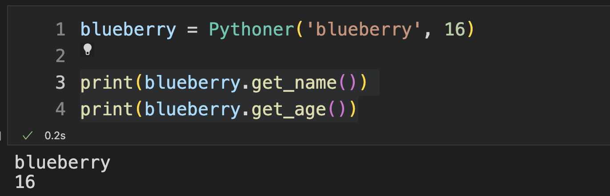
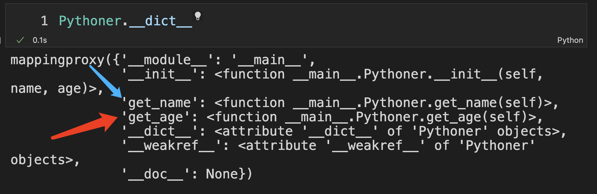
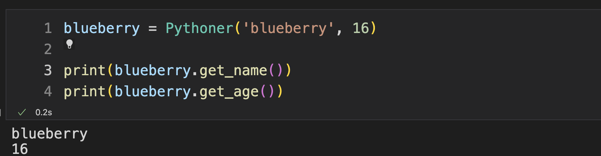
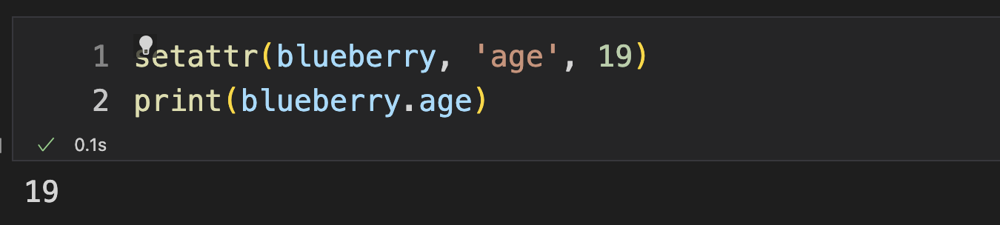
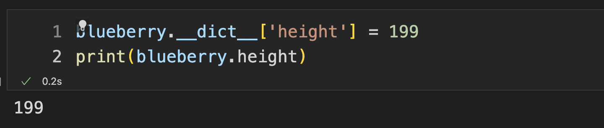
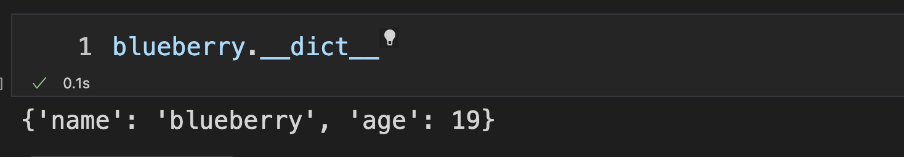
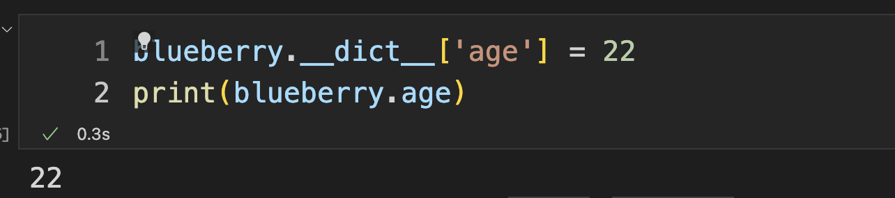
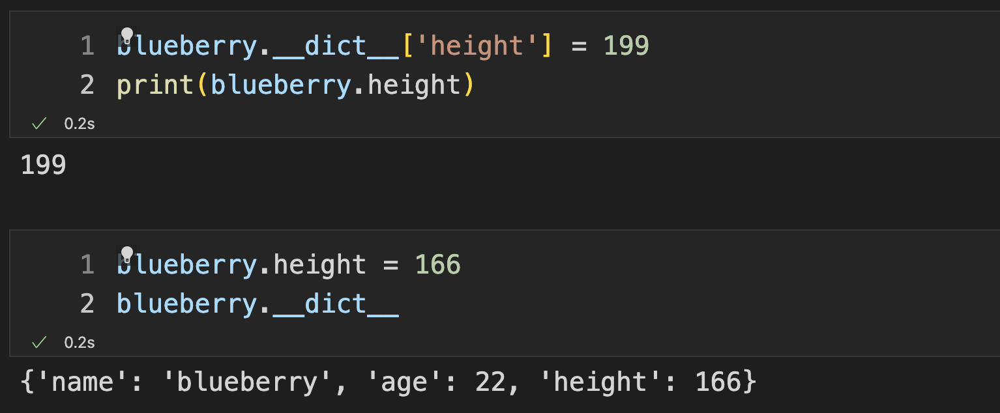
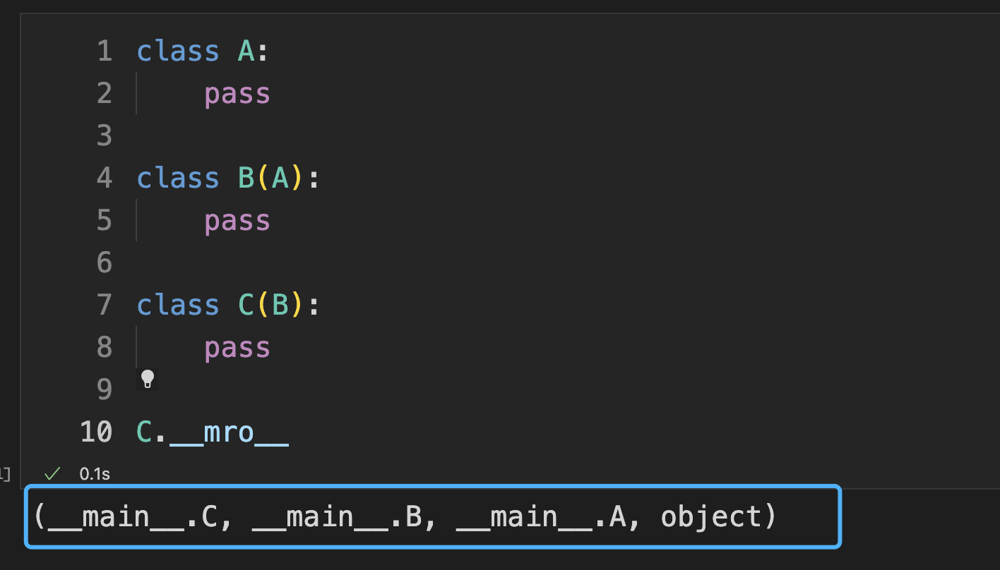
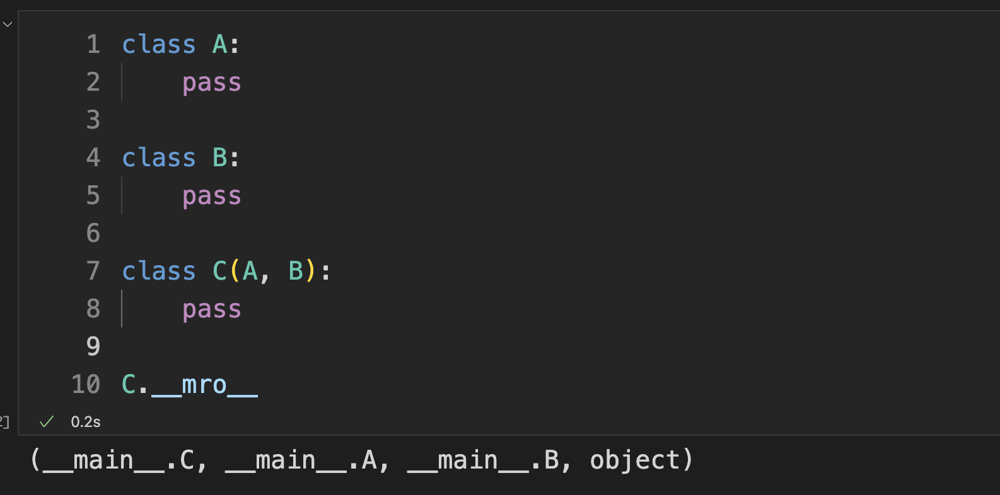

## Python 面向字典编程


在这篇文章中看一看 Python 中的类有没有什么神奇的地方，又为什么说 Python 几乎是面向 "字典" 编程了呢 ~ 

哈哈哈，没有 "面向字典" 编程这个词，这是我瞎说的 ~ 

## 一个平平无奇的类

```python
class Pythoner:
    def __init__(self, name, age):
        self.name = name
        self.age = age
    
    def get_name(self):
        return self.name

    def get_age(self):
        return self.age
```

创建一个 `Pythoner` 类，哈哈，做一个合格的 `Pythoner` 就要加油啊！

好啦，在这个类中有两个成员函数（方法），分别是 `get_name` 和 `get_age`，你可以看到这个两个函数都有一个参数 `self` ，说明这两个方法是 `Pythoner` 类对应的实例对象才可以使用的方法。


## 彻彻底底的面向对象

`Python` 是一个彻彻底底的面向对象的编程语言，而且有一些看上去非常神奇的地方，比如我创建了一个类后我还可以在程序的运行过程中动态的修改这个类所拥有的一些属性和方法。即使是实例化对象也可以在运行的过程中动态的修改实例化对象的属性和方法。

在一些静态语言中办到这件事情是比较困难的，但是在 `Python` 中想做到这件事情非常简单。甚至我觉得，`Python` 这门编程语言近乎就是对 `字典` 这种数据结构的封装，其实在 `Python` 的 `C` 语言实现中也确实是这样的。


## 类本身就是 对象

在使用一个类的时候，几乎你一定会写一行下边这样的类似的代码，通过这行代码我就创建了一个 `Pythoner` 类的实例化对象 `blueberry`，其中 `blueberry` 是一个对象是可以理解的。现在要知道，`blueberry` 和 `Pythoner` 是同等身份的。

```python
blueberry = Pythoner('blueberry', 16)
print(blueberry.get_name())
print(blueberry.get_age())
```



`Pythoner` 本身也是一个对象！为了方便区分，我就把我们写出来的类叫做 `类对象`，而通过 `类` 实例化出来的对象叫做 `实例对象`。在这里，`Pythoner` 是一个类对象，而 `blueberry` 是一个实例对象。

既然 `Pythoner` 是一个对象，那么它就有属于自己的各种属性，对象有一个属性叫做 `__dict__`，这个属性的类型是字典，它通过键值对的方式记录了每个对象中的 `属性名` -> `对应的实例`

```python
Pythoner.__dict__
```



让我们看看 `__dict__` 中都包含了什么，你会发现，你能够看到你在 `Pythoner` 这个类中定义的一切内容。

1. 你看到了蓝色箭头指向的 `get_name` 方法的名字，这个名字是以字符串的类型给出的，也就是说你可以在程序中通过访问 `__dict__` 属性来遍历这个类里边都有什么方法。
2. 你看到了红色箭头指向的 'get_age' 方法的名字，同理 ~ 

很奇怪！你没有看到我们定义的两个属性，分别是 `self.name` 和 `self.age` 对嘛？

因为 `self` 表示的是 `Pythoner` 这个对象对应的实例对象，而不是 `Pythoner` 对象本身。所以 `self.name` 和 `self.age` 是属于 `Pythoner` 的实例对象的，因此你在这里是看不到这两个属性的。

所以属性也分为了两类，一个叫做 `类属性` 就是属于 `类对象` 本身的，一类属性是 `实例属性` 这个属性是属于类的实例对象的。

## 创建实例对象

```python
blueberry = Pythoner('blueberry', 16)

print(blueberry.get_name())
print(blueberry.get_age())
```



## setattr

这个函数，或许你也使用过，当我为一个对象的属性赋值的时候，我可以通过 `obj.attr = value` 的形式来赋值，也可以通过 `setattr` 函数来赋值，两种风格，让我们来看看。

其中 `age` 属性的初始值是 16，现在我为它赋一个新的值

就是说，我要为 `blueberry` 这个对象的一个名字叫做 `age` 的属性赋值为 `19` 啦！输出后，你可以发现，`age` 属性的值确实变成了 `19` 

```python
setattr(blueberry, 'age', 19)
print(blueberry.age)
```




## getattr

还有一个对应的方法叫做 `getattr`

就是说，我要获取 `blueberry` 这个对象的一个名字叫做 `name` 的属性值啦！

```python
name = getattr(blueberry, 'name')
print(name)
```




## 一切都是字典的封装

我们可以来看看 `blueberry` 这个实例对象的 `__dict__` 属性中都记录了一些什么东西。你可以惊奇的发现，这里记录的东西正式在我们初始化实例对象的时候创建的这两个属性。



既然，在一开始的时候说了，不管是类啊还是实例对象，其实都是 `字典` 结构的封装。如果我修改一下 `__dict__` 里边的内容，会发生什么呢？如果我添加一个键值对，那么这个对象的属性会不会增加呢？如果我直接通过字典的方式来修改某个属性的值，那么会不会对原本的对象造成影响呢？

好啦！既然提出了疑问，就来实验一下



现在你可以发现，当我修改了这个字典中属性的值后，通过用点的方式来访问一个对象的属性值，那么 `age` 这个属性的值也发生了变化。既然理解到了这里，那么 `Python` 中很多神奇的行为也就得到了解释。原来 `Python` 中的对象都是通过对 `字典` 结构进行封装后得到的，所以属性可以动态的增加和减少也就得到了解释 ：）

## 动态添加属性

直接通过字典的方式进行复制，如果不存在一个叫做 `height` 的 `key`， 那么就会创建这个 `key` 并且你可以通过点的方式来访问这个属性值。当然啦，不仅可以通过这种方式来动态添加属性，其他的方式，可以搜索相关资料，或者自己来尝试一下。



如果你知道 `Python` 关于字典的一些操作，那么到这里，你可以尽情地发挥你的想象力了！

看看还能不能有更加方便有趣的用法呢 ：）


## 一个类的继承关系

如果你创建的类有继承关系，那么这个继承链也会被记录下来，并且也以属性的形式记录在类中，通过这段代码来试一下

你可以看到，在这里蓝色方框标识的，通过查看 `__mro__` 属性，就可以找到它的继承链了




因为 `Python` 是允许多继承的，也就是说一个类可以同时继承多个类。那么就会有一个问题，如果它继承的两个类中都存在了名字相同的方法或者属性，那么到底继承那个类的方法或者属性呢？

这就是为什么使用 `__mro__` 这个变量名的原因，当发生这种情况的时候，`Python` 采用了 `mro` 的属性查找顺序，简单看一下多继承

你可以看到，如果发生了上述所说的情况，按照 `mro` 的属性查找顺序，还是优先选择了继承 `A` 的那些发生冲突的属性


