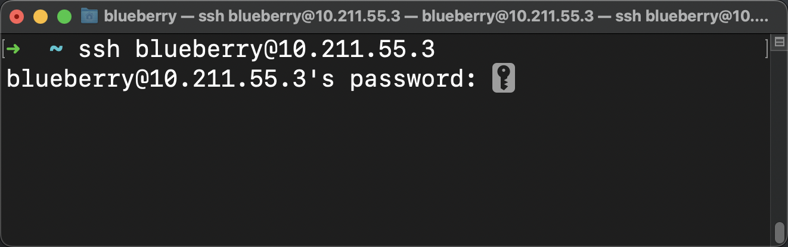

哈喽 ~ 你好啊 ~ 

我是蓝莓 ~ 做一个纯粹的计算机爱好者 ~ 

在这次文章，一起来看一下怎么实现 `SSH` 的免密登录，在这里看一下在 `Linux` 相关的平台下如何通过 SSH 免密登录 `Linux` 服务器。如果你的系统不是 `Linux` 的话，那么你可以尝试开两台虚拟机，用其中一台去连接另外一台，也没有什么毛病 ~ 


## 建立 SSH 连接

我在电脑上开了一台 `Ubuntu` 虚拟机，它的 ip 地址为 `10.211.55.3` 如果你已经安装了 `ssh` 客户端的话，那么可以直接通过这个命令建立 `ssh` 连接

```
ssh <username>@<ip_addr>
```

因为我的虚拟机登录用户的用户名是 `blueberry` 并且 ip 地址为 `10.211.55.3 ` 所以我可以通过下边的形式来登录

```
ssh blueberry@10.211.55.3
```

当我执行了这条命令后，就会要求我输入登录用户的密码啦，直接输入就可以了，在你输入密码的时候并不会显示出来



当我输入完成密码按下回车后 ，出现了下边的信息，表示我登录成功了


## SSH 的 config 配置文件

在 `Linux` 用户的家目录下有一个 `.ssh` 的目录。进入到目录后，如果你的 `.ssh` 目录下没有 `config` 文件的话，你可以手动创建一个


好吧，我把我的 `config` 文件备份一下，让我们从头开始。

通过 `touch config` 来创建一个 `config` 文件，使用 `cat config` 输出一下文件中的内容，你会发现这是一个空文件


**config 配置项**

1. Host ：别名
2. HostName : 主机名（重要）
3. Port : 端口（重要）
4. User : 用户名
5. IdentityFile : 秘钥文件的路径

**Example one**

我们先来看一个没有配置秘钥文件的配置

可以通过 `vim` 编辑器来编辑这个文件。

 `vim config` 然后把这个配置粘贴进去

相信这个配置文件非常容易懂，其中 `HostName` 后边就写你服务器的 `ip` 地址，在 `User` 后边写用到的 `ssh` 的端口号是什么，默认情况下就是 `22` 端口。

```
Host "mc"
    HostName 10.211.55.3
    User blueberry
    Port 22
```

看一下文件内容：


其中配置在 `Host` 后边的 `mc` 就是为你使用的 `ssh` 连接起了一个名字，具体的用法就像下边这样，你再也不用输入一长串的 `ip` 地址啦。

只需要通过 

`ssh mc` 就可以自动连接你配置在配置文件中的那个 `ip` 地址所对应的服务器啦，并且用的登录用户正式你配置在配置文件中的 `User` 后边的那个，这时候只需要输入密码就可以连接上了。


到这里你会发现，你依然不能免密登录。


## 生成一对秘钥

1. ssh key 使用非对称加密方式生成 `公钥` 和 `私钥`
2. 私钥存放在本地 `~/.ssh` 目录
3. 公钥可以对外公开，放在服务器的 `~/.ssh/authorized_keys` 文件中
4. 私钥放在本地，可通过 `config` 配置私钥的存放路径 `IdentityFile ~/.ssh/id_rsa`

那么要怎么生成这一对秘钥呢？非常简单

**生成秘钥**

其中 `dsa` 和 `rsa` 是两种不同的加密算法，可以选其一

`ssh-keygen -t rsa`

`ssh-keygen -t dsa`

在这里我就直接使用 `ssh-keygen -t rsa` 来生成秘钥啦 ~ 

当你输入这个命令后，第一次停下来时让你输入你所生成的秘钥文件的名字，我就用 `hello` 作为我的秘钥文件名啦，你可以随意用其他的任何名字，然后按下回车！


接下来又停顿了几次，不用管它，每次停下来的时候都直接按下回车就可以啦。最终的效果就是这样子了 ~ 


你会看到在当前目录下对出来了两个文件，分别是 `hello` 和 `hello.pub`

其中 `hello.pub` 是公钥，后缀 `pub` 就是 `public` ，这里边存的是公钥，其实就是普通的文本文件，你可以直接 `cat` 一下看看里边的内容是什么。

另外的 `hello` 文件就是私钥

**公钥文件内容**


**私钥文件内容**

私钥文件的内容比较长，我截取了开头和结尾，你可以看到它还会标识私钥内容的开始和结束。


好啦，这时候你就成功生成了一对秘钥了。

那么解释一下，公钥和私钥是配对的。

1. 私钥 顾名思义就是给个人使用的，私有的嘛，就是说这个文件要存放在客户端
2. 公钥 顾名思义就是公有的，这个文件要放在服务器上

当你配置上这两个钥匙文件后，它就会自动检查是不是配对，如果配对就可以自动连接啦。


## 把文件传送到服务器上

可以使用 `scp` 命令来传送文件

`<file-name>` 是本地要上传的文件所在位置

`<username>` 是登录 `Linux` 服务器的用户名

`<ip-addr> ` 是 `Linux` 服务器的 `ip` 地址

`<dest-file-path>` 是你要把这个文件存放在 `Linux` 服务器的什么位置

```shell
scp -r <file-name> <username>@<ip-addr>:<dest-file-path>
```

那么具体的我可以这样做：

```shell
scp -r hello blueberry@10.211.55.3:~/.ssh
scp -r hello.pub blueberry@10.211.55.3:~/.ssh
```


因为 `scp` 命令用到的也是 `ssh` 来完成数据传输的，中间也会要求你输入一下登录用户的密码。你会看到这两个文件就上传完成了！


## 免密登录

在能够免密登录之前，让我们先通过使用密码登录的方式登录一下 `Linux` 服务器，来配置一下。其实我们只上传公钥到服务器就可以啦，但我刚才都上传了，也不影响。

**配置服务器**

现在我已经登录到了 `Linux` 服务器


相信你现在也看到了在 `.ssh` 目录下有我们刚才刚上传上来的两个文件，分别是 `hello` 和 `hello.pub` 这两个文件。

那么这个时候，服务器上的配置非常简单，如果你的服务器上的 `.ssh` 目录下没有 `authorized_keys` 文件的话，那么你就直接手动 `touch authorized_keys` 创建一个就可以啦。

创建完成后

执行 `cat hello.pub > authorized_keys` 就可以把 `hello.pub` 文件中的内容直接覆盖进 `authorized_keys` 文件中啦。

其中 `>` 代表输出重定向，当你执行了上边的命令后你会发现在控制台没有输出任何文件的内容，就是说把输出重定向到箭头后边的那个文件里边了。

让我们来试试：

现在你会发现我们已经把文件的内容放进去了！


至此，服务器上的配置就完成了，是不是非常简单。

**配置本地**

我们只需要修改本地的 `config` 文件中的配置内容就可以了，只需要加上私钥的文件路径就可以了。具体的配置就像下边这样子 ~ 

```
Host "mc"
    HostName 10.211.55.3
    User blueberry
    Port 22
    IdentityFile ~/.ssh/hello
```


好啦！现在就是见证奇迹的时刻啦！


完结 ~ 撒花 ~ 恭喜你成功啦！

如果你想在本地配置多个 `ssh` 的连接，那么你就直接在 `config` 文件中追加几个与上边相同的配置项就可以啦，但是你的 `Host` 后边配置的名字要有所区别，要不然，你到底是想让 `ssh` 使用哪个配置项呢 ？


