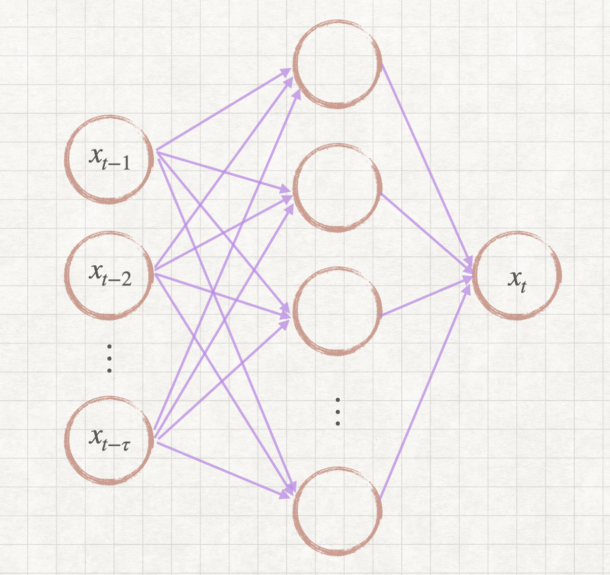
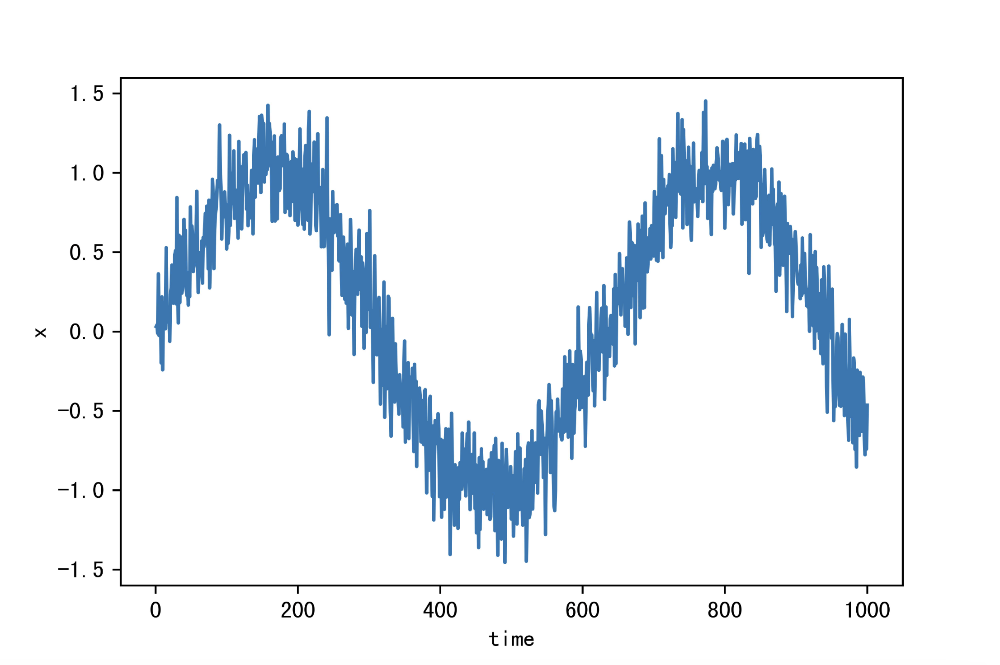
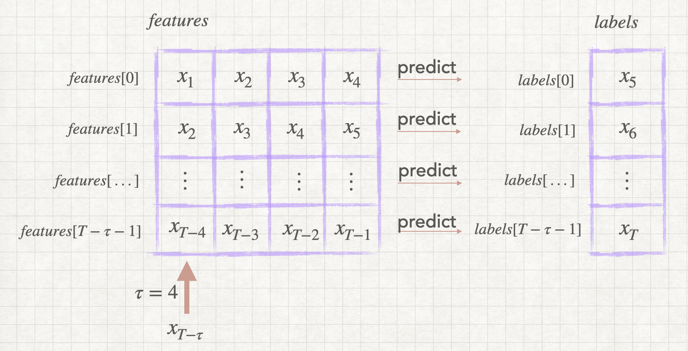
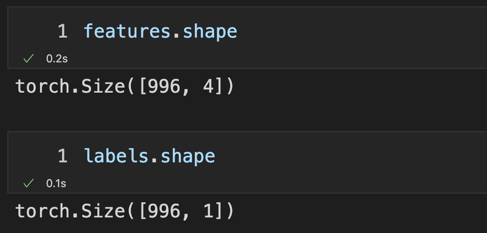
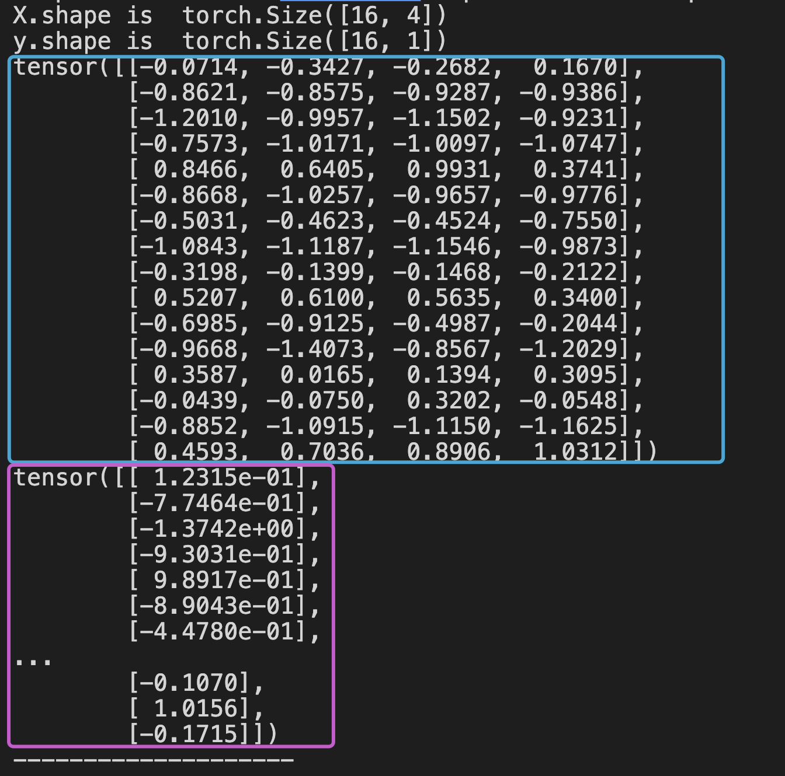
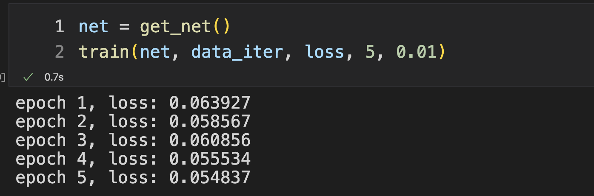

**这是一张图片**


在这次文章中来玩儿一下最简单的可以处理序列问题的模型。

生活中有哪些序列问题呢？

1. 比如说一支股票未来的涨跌趋势很有可能是与最近的这一段时间的涨跌相关的。
2.  再比如一个电影的售票情况在很大程度上也是和时间有关系的。

怎么说呢？

就是之前的一段时间内发生的事情会对未来所发生的事情产生一定的影响。处理类似这样的问题就是序列类型的问题啦。

## 简单的数据


设在时刻 $t$ 取到了对应的值 $x_t$ ，而 $t$ 时刻的取值又受到了时刻 $t$ 之前数据的影响。

在已知的这些数据情况下，又可以分为两种情况了

1. 时刻 $t$ 的取值会很大程度的受到 $t$ 时刻之前所有数据的影响，就是距离时刻 $t$ 很远很远的数据也会对它产生影响
1. 时刻 $t$ 的取值只受到距离时刻 $t$ 比较近的几个数据的影响

那么，这里的第 2 种想法被称为 `马尔可夫模型` ，我们可以设一个参数 $\tau$ ，就是假设时刻 $t$ 的取值 $x_t$ 会受到 $x_{t-1}, x_{t-2}, ··· , x_{t-\tau}$ 这些取值的影响较大，而直接忽略了更靠前的那些时间点的取值。

从而，使用 $x_{t-1}, x_{t-2}, ··· , x_{t-\tau}$ 来预测 $x_t$ 

在算法中，我们可以把 $x_{t-1}, x_{t-2}, ··· , x_{t-\tau}$ 作为算法的输入，而  $x_t$  作为算法的输出。这个网络结构是非常简单的，这并不能有非常好的效果，不过，这对我们理解序列类型数据的处理方式会起到不错的帮助。给出一张示意图。当然啦，中间部分是隐藏层，可以有更复杂的结构，为了画图方便，画出了最简单的结构：




## 生成随机数据

**导入包**

```python
import torch
from torch import nn
import matplotlib.pyplot as plt
```

**生成随机数据**

在闭区间 $[1, T]$ 并取整数生成 $1000$ 个 $x=sin(time)$ 函数的数据点

对于每一个数据点都加上一点噪音 `torch.normal(0, 0.2, (T,))`

```python
T = 1000  # 总共产生1000个点
time = torch.arange(1, T + 1, dtype=torch.float32)
x = torch.sin(0.01 * time) + torch.normal(0, 0.2, (T,))
```

**绘图**

在这里把每一个相邻的样本点之间都用直线连接起来后并绘图

一定要注意 

1. 横坐标是 $time$
2. 纵坐标是 $x$

```python
plt.plot(time.numpy(), x.numpy())
plt.xlabel('time')
plt.ylabel('x')
plt.show()
```




## 创建样本数据集

这篇文章中用到的网络结构非常简单，但是最重要的地方就是这里了，关键在于如何创建样本数据集

你可能有疑问了，我们在上边已经生成了数据集，如果按照曲线拟合的思路来完成的话，当然是可以直接把刚生成的 $time$ 作为曲线的横坐标，把其对应的值 $x$ 作为曲线的纵坐标然后拟合一条曲线出来。但曲线拟合的思路并不是从时序关系的角度出发的。

新名词 `时间步` 就是 时间点 也就是 $time$ 数组所存储的内容，数组中的时间步是从 $1$ 开始的，在生成数据的时候所使用的数据范围是 $[1, T]$。可是 $time$ 数组的下标是从 $0$ 开始的，同时，$x$ 数组中的元素是一一对应于 $time$ 数组中的时间步的。

在后边的叙述中 $x_t$ 这里的 $t$ 代表的是时间步 $t$ 而不是数组 $x$ 的下标，所以一定要区分开来。

**构建数据集**

可以看到，在特征矩阵 $features$ 中的每一行都是一个样本，而这个样本的特征个数就取决于定义的 $\tau$ 的大小，在这里以 $\tau = 4$ 举例子，这样就把一个序列的问题转化成了下边所表示的这样一个问题了。

那么如何构建 $features$ 这个矩阵呢？有这样两种方法

1. 你可以每次从 $x$ 数组中取出 $4$ 个元素然后放进 $features$ 数组的一行，然后以步长为 $1$ 的方式再去取下一段的 $4$ 个元素然后放在 $features$ 数组的下一行上边，不用多说，相信 $labels$ 的构建方式你一看也就明白了
2. 另外一种方式是一列一列的生成 $features$ 矩阵。你可以观察到 $features$ 的第 0 号列是从 $x_1$ 一直到 $x_{T-\tau}$ 也就是从 $x_1$ 一直到 $x_{T-4}$ ，这里定义的 $\tau=4$；$features$ 的第 2 号列是从 $x_2$ 一直到 $x_{T-\tau+1}$ 也就是 从 $x_2$ 一直到 $x_{T-3}$。不难发现他们的规律，$features$ 的每一列都有 $T-\tau$ 个元素，仅仅是第一个元素的其实位置不同而已，因此也就有了第二种构建 $features$ 矩阵的方法。同理，后边的 $labels$ 构建方法就更简单了。

如果选定的 $\tau=4$ 并且序列长度为 $T$ ，那么构建出的训练集就只能有 $T-\tau$ 个样本了，因为预测一个值需要紧临这个值的前边的 $\tau$ 个值。而前 $\tau$ 个元素的前边是没有足够的元素的，因此直接不考虑这部分了。 



**代码实现**

对于刚才的思路，我们使用代码实现第 2 种数据集的构建方式：

在这里的 $i$ 就是 $features$ 矩阵的列下标，一定要注意，时间步的编号是从 $1$ 开始的，而数组的下标是从 $0$ 开始的，所以时间步为 $1$ 的值 $x_1$ 存放在 数组 $x[0]$ 的位置。

$feautres$ 数组的每一列都有 $T-\tau$ 个元素，所以每一次都从数组 $x$ 中选取 $T-\tau$ 个元素赋值给 $features$ 数组相应的列，只不过偏移量不同，从数组 $x$ 中选取 $T-\tau$ 元素并且初始位置的偏移为 $i$ 就可以写成这个样子：`x[i: T - tau + i]`

```python
tau = 4
features = torch.zeros((T - tau, tau))  # 创建一个全 0 且大小为 (T-tau) × tau 的矩阵
for i in range(tau):  # 构建 features 矩阵
    features[:, i] = x[i: T - tau + i]
labels = x[tau:].reshape((-1, 1))  # 构建 labels
```

数据结创建完成后，看一下它是什么形状的：




## 创建数据迭代器

在训练的过程中可以对数据分批进行训练，就是说，每一次在计算模型损失的时候，只计算训练数据集中某一部分数据上的损失，这一部分数据的大小称为 `batch_size`，而把所有的数据都跑过一遍叫做 `epcho`。

对于每次都从数据集中抽出 `batch_size` 个样本这件事儿，在 `PyTorch` 中有比较好用的方法可以供我们直接使用。

参数 `shuffle=True` 就代表要把这 600 个样本给打乱，然后再每次从中取出 `batch_size` 个样本数据作为一个 `batch`。

1. 首先要创建一个 `TensorDataset` 对象，你可以理解为数据集对象
2. 然后把数据集对象丢给 `DataLoader` 这会返回给我们一个数据迭代器 

```python
from torch.utils import data

batch_size = 16  # 每一个 batch 的大小
n_train = 600  # 从 features 中抽取 600 个样本作为训练

dataset = data.TensorDataset(features[:n_train], labels[:n_train])
data_iter = data.DataLoader(dataset, batch_size=batch_size, shuffle=True)
```

现在，我们来看看这个迭代器要怎么用

```python
for X, y in data_iter:
    print('X.shape is ', X.shape)
    print('y.shape is ', y.shape)

    print(X)
    print(y)
    print('--------------------')
```

这段代码的其中一轮循环的输出效果就是这样的，你可以发现，每一次返回给我们的特征矩阵和对应的标签都是 `batch_size` 这么大。




## 定义网络模型

下边所定义的模型和我在文章上半部分画的那张图是不一样的，这里的模型有两个全连接层，并且还在两个全连接层之间放了一个 $ReLU$ 作为激活函数。

1. `init_weights` 函数用来初始化全连接层的权重

2. `get_net` 函数用来生成刚才所说到的网络模型，在这个函数内部 `net.apply(init_weights)` 就是说要把 `init_weights` 这个函数用于 `net` 网络模型的参数初始化，并且你在 `init_weights` 函数中可以看到一条判断语句。因为在网络模型中可以有很多很多层，而且每一层都可以是不同类型的网络层，这个 `init_weights` 函数会被应用到每一层上去，并且会传递给这个函数一个参数，就是那一层的实例对象，你如果只想让这个函数在线性层（全连接层）上起作用的话，你就判断一下，如果当前传过来的是这样一个网络层，那么在调用 `nn.init.xavier_uniform_(m.weight)` 来完成权重参数的 初始化。
3. 最后就是使用 `MSE` 作为损失函数

```python
# 初始化网络权重的函数
def init_weights(m):
    if type(m) == nn.Linear:
        nn.init.xavier_uniform_(m.weight)

# 一个简单的多层感知机
def get_net():
    net = nn.Sequential(nn.Linear(4, 10),
                        nn.ReLU(),
                        nn.Linear(10, 1))
    net.apply(init_weights)
    return net

# 平方损失。注意：MSELoss计算平方误差时不带系数1/2
loss = nn.MSELoss(reduction='none')
```


## 训练模型

**模型损失评估**

1. 参数 `net` 网络模型
2. 参数 `train_iter` 数据迭代器
3. 参数 `loss` 损失函数 

就是计算出在训练数据集中共有多少个样本，用 `size` 变量来统计，再计算出模型在所有样本上的损失总和 `loss_sum`，最后函数的返回值就是取一下平均值 `loss_sum / size` 就是平均情况下对于单个样本的损失大小了

```python
def evaluate_loss(net, train_iter, loss):
    size = 0
    loss_sum = 0

    for X, y in train_iter:
        loss_sum += loss(net(X), y).sum()
        size += len(y)
    
    return loss_sum / size
```


**训练模型**

如果下边儿这段代码不太好理解，可以先参考这篇文章：


对所有的数据进行 `epochs` 次训练

1. 参数 `net` 网络模型
2. 参数 `train_iter` 数据迭代器
3. 参数 `loss` 损失函数
4. 参数 `lr` 学习率

```python
def train(net, train_iter, loss, epochs, lr):
    # trainer 就是 优化器, 优化器里有网络的参数
    trainer = torch.optim.Adam(net.parameters(), lr)
    for epoch in range(epochs):
        for X, y in train_iter:
            trainer.zero_grad()  # 梯度归零
            l = loss(net(X), y)  # 前向传播 and 计算损失
            l.sum().backward()  # 反向传播计算梯度
            trainer.step()  # 更新权重
            
        # 每训练完一遍数据后，输出一下当前的模型在数据上的平均损失情况
        print(f'epoch {epoch + 1}, '
              f'loss: {evaluate_loss(net, train_iter, loss):f}')
```


**训练**

```python
net = get_net()
train(net, data_iter, loss, 5, 0.01)
```

训练的输出：




