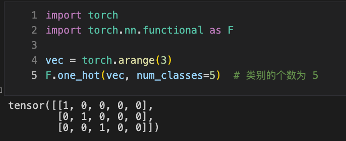
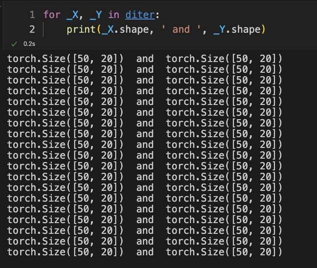

这篇文章有点长，我会把它分成几个部分。通过这篇文章希望能够帮助你彻底理解RNN循环神经网络的原理，并且能够在代码层面实现它。

## 1 这篇文章做了什么

通过这篇文章我做了一个`demo`，我们知道RNN是用来处理序列类型的数据的，它需要考虑序列中数值之间的时间关系，或者说是前后关系。

为了能够在学习的过程中从更加感性的角度来验证自己的模型确实能够学习到序列之间的前后关系。我生成了一串虚拟的序列，这一串数据的内部规律是非常强的。

**生成了什么数据**

这一串数据的长度是1000，并且里边的元素类型只有20个，那就是数字0到数字19，这样的20个元素类型。在这儿我举个小例子。

0，1，2，3，4

2，3，4，5，6

15，16，17，18，19

5，6，7，8，9

在生成这一串非常长的数据的时候，我先在$[0,15]$之间随机生成一个数值作为起点，然后生成从这个起点开始的$5$个连续的数值作为一组放在这一串序列数据的末尾。比如在上边是有四组这样的数据的。这些数据应该是一串而不是一行一行的，所以他们应该是长下边这样子。

0，1，2，3，4，2，3，4，5，6，15，16，17，18，19，5，6，7，8，9

那么这个序列数据的内部规律是非常明显的，这个规律就是在数字$i$后边应该出现的数字是$i+1$，你可以发现，这一串数据确实符合这样的一个规律，但是并不是所有地方都满足这个规律的。即使在实际生活中序列也是有这样的特点的，当前的数值和前边的数值是有联系的，但是有时候的联系是比较强的，有时候的联系是比较弱的。

在后边的部分会用代码来生成这串数据，当然了，这串数据的长度肯定不止这么点，在本文中生成的序列长度是1000。

**模型应该学习到什么**

既然，手动创建的这一串数据呈现了这样的规律，那么就希望我们的模型能够学习都这个规律。

最后，我希望给定一串前缀比如是`234`然后让模型向后预测五个字符，那么这个模型应该返回给我的一串数据是`23456789`

在模型训练之后，确实达到了这个预想的效果，这样就可以让我们在学习的过程中通过感性的方式来看到这个模型经过训练后产生的变化了。


在模型训练之前，通过默认参数进行预测，让我们看看效果。可以发现，这个效果是不尽人意的。


## 2 RNN 的输入和输出

根据上述的内容，我希望这个网络结构能够给定一个前缀作为输入然后它能够输出这个前缀接下来最有可能连着的数值是什么。

那么，除了把整个前缀一次性的作为输入全部输入进网络中，还有没有什么其他的方法呢？当然有这样的方法了，还可以选择每次只输入到这个网络中一个值，接着再输入第二个值，这时候希望这个网络拥有一定的记忆功能，能够记下第二个值的输入是在第一个值输入之后才输入进去的。

每一次在对网络进行输入的时候，这个网络都会产生一个输出，这个输出就是这个网络基于目前的这些输入所产生的输出信息。

比如说：

当我输入第一个值，这个网络产生了一个输出，这个输出是这个网络基于输入的唯一的一个值所产生的。

当我输入第二个值，这个网络又产生了一个输出，这个输出是这个网络基于之前输入的第一个值和后来输入的第二个值，在这两次输入的基础上所产生的。

**单步预测**

如果前缀只有两个值`23`的话，一次把2和3输入进网络中，由于它拥有记忆功能，所以输入3后产生的输出值就是预测出的在`23`后边最有可能出现的第一个值了。这样就完成了单步预测。

**多步预测**

在单步预测的基础上，我们可以预测出在`23`后边出现的第一个值是什么。如果这时候把预测出来的这个值再作为网络的输入的话，又会产生一个输出，这时候我们就得到了`23`后边最有可能出现的两个值是什么了。这时候就完成了两步预测。如果你想预测更长的串，那么你就可以继续把刚才的步骤重复下去，完成多步预测。

**输入到底是什么**

一直在说输入一个值，那么这个输入进去的值到底是什么？比如有这样一个前缀 `234`。按照刚才的逻辑，我应该先把2输入到网络中，再把3输入到网络中，最后把4输入到网络中，当我把4输入到网络中的时候，网络结构给出的输出的值就是在`234`的基础上最有可能的接下来的值。

当我在输入2到网络中的时候，我真的是把2输入进去吗？并不是。

输入到网络中的是数值2对应的`one-hot`编码。其实`one-hot`编码可以理解为是一个概率分布。（别担心，看上去非常晦涩的概念都会迎刃而解，先知道这么个东西就可以了）

**输出又是什么**

可以想象的是，当输入2到网络中的时候，输入到网络中的是数值2的`one-hot`编码，那么这时候你希望这个网络给出的是接下来出现在`2`这个数值后边的那个数值。然而网络并不是直接输出一个数值给你，而是输出一个概率分布给你。（同样的别担心）

**概率分布指什么**

在我们构建的虚拟数据中共有$20$个类别的选项，分别是数值$0$到$19$这些整数所组成的一个序列数据。

为了方便举例子，在这里我把选项的类别减少一些，仅使用数值$0$到数值$5$这样的6种整型作为序列数据中所有可能出现的数值。

如果我们要把数值2输入到模型中，让它预测下一个可能的数值什么么，那么在共有6种可能的数值情况下，2对应的`one-hot`编码是这样的。
$$
vec = (0,0,1,0,0,0)^T
$$
你可以看到2对应的`one-hot`编码只有在第2号位置上是1，而其他位置上都是0。（在这里$vec$向量的下标是从0开始编号的）

那么，你可以把这个编码理解为概率分布，这个分布表达的意思是对于第2号值也就是2，它的概率是1，而对于其他位置的值的概率为0。所以，我们就通过一个概率分布对一个数值进行了表达。对于模型的输出也是这个样子的。

**模型是个黑箱子**

你可以暂时把网络模型想象成一个不知道内部结构的黑箱子，你只要给定输入，它就会产生输出。我们先假设这个黑箱子是这样的。


$$
out = (0.1,0.1,0.1,0.4,0.2,0.1)
$$
通过输出的概率分布$out$，我们可以知道，通过这个模型的预测后，接下来最有可能出现的数值是第3号数值也就是数值3，因为它对应的概率为$0.4$而其他的数值对应的概率都比它要小。

## 3 RNN网络结构

在前边的内容，我们已经知道了，对于一个我们这个例子而言，RNN网络的输入和输出长什么样子。

那么现在就来看看这个网络结构具体是一个什么样子的。

**MLP网络结构**

$MLP$是多层感知机模型，如果用鼠标表达式来表达的话，它是这样的。

给定小批量样本$X$和权重参数$W$

1. $X$是一个$n×d$的矩阵，每一行都是一个数值的`one-hot`编码，为了方便理解，就把$X$想象成是只有$1$行的样本矩阵就可以了，就把它当做是一个行向量。
2. $W_{d h}$ 是一个 $d×h$ 的权重矩阵，其中$h$代表了在这一层上的隐藏单元个数。
3. $H$ ，用$H$来表示隐藏层的输出，因为样本量是$n$并且这一层的单元数为$h$，所以$H$有$h$列，代表这个隐藏层的输出维度是$h$，而一共输入了$n$个样本，说明同时处理了$n$个样本，所以$H$共有$n$行。当然，你也可以从纯数学的角度来分析矩阵的形状。
4. 函数$\phi$代表激活函数
5. $W_{n q}$ 是一个 $n×q$ 的权重矩阵，我们用一个线性层作为输出层，这样可以控制输出层输出的数据的维度，你可以看到输出层是没有激活函数的。
6. $O$ 代表最终的输出层的输出
7. $b_{h} 和 b_{q}$ 都是对应层的偏置，并且这两个向量都是行向量，向量和矩阵是不能进行加法运算的，而这里用到了广播机制，这里的向量与要和它进行求和的矩阵的列数是相同的，所以通过广播机制，这个向量会分别加在矩阵的每一行，从而得到最终的结果。

$$
\begin{aligned}
& H_{n h}=\phi\left(X_{n d} W_{d h}+b_h\right) \\
& O_{n q}=H_{n h} W_{n q}+b_q
\end{aligned}
$$

那么，现在的问题是什么呢，对于 $MLP$ 的结构而言，它是没有记忆功能的，每次输入一个新的样本的时候，它并不记得之前输入过什么。

**引入记忆功能**

对于矩阵$X_{n d}$中确实每一行都是一个数值的`one-hot`编码。

你应该知道有时间步的概念，关于这个概念，可以结合这篇文章来理解。

[这是一篇文章] --------------

若 $X_{n d}$ 这个矩阵的 $n=3$就代表矩阵 $X$ 中有三个样本，最重要的是，这三个样本都是位于同一个时间步上的数值。

如果时间步为$4$的话。通过序列我们构造出来了这样的三段。在这个序列中，每一行都是一个样本，这似乎和刚才所说的是矛盾的。（让我慢慢说来）


矩阵$X_{n d}$中包含$n$个样本，而每一行仅仅是一个数值的`one-hot`编码，而上边所示的这些值每一行都有多个数值。

矩阵$X_{n d}$存储的是位于某一个时刻的样本，仅仅存了在某一个时间步上的样本，而非所有的时间步。而上边的图所示的这样三行的每一行都包含了这个样本在所有时间步的对应的数值。

我们的模型每次输入也只是输入一个时间步上的值，而非一次性输入这个样本对应的所有时间步上的值。 


若时间步从$0$开始数的话，现在绿色方框所框选的便是在时刻$1$的时候每个样本对应的数值。若我们想批量化一次性处理多个样本，把他们送入模型中，那么这个时候矩阵$X_{n d}$应该是长这个样子。（可选的数值类型依然是6种，分别是0到5）
$$
\left[\begin{array}{llllll}
0 & 1 & 0 & 0 & 0 & 0 \\
0 & 0 & 1 & 0 & 0 & 0 \\
0 & 0 & 0 & 1 & 0 & 0
\end{array}\right]
$$


这个矩阵的第1行对应的是第1个样本中在1号时间步上的1所对应的`one-hot`编码。后边以此类推。

注意奥，模型不能够一次性把一个样本所有的时间步的数值输入到网络中，但是可以一次把多个样本输入到网络中，这里输入的多个样本只有这些样本某一个时间步上的值，而不是所有时间步上的值。根据矩阵运算的特性，这样只是达到了批量化处理的目的。

解释这些是为了阐述在矩阵的右上角加上一个角标的含义。

**note**

矩阵 $X_{n d}^{t}$ 代表的是这$n$个样本分别在时间步$t$所形成的样本矩阵，对于其他的矩阵如果我加上了右上角标$t$，那就代表这个样本是通过输入的$X_{n d}^{t}$所计算出来的。


好啦，那么要如何引入记忆功能呢？

我们只要把$MLP$的结构稍稍进行改造。
$$
\begin{aligned}
& H_{n h}^{t} = \phi\left(X_{n d}^{t} W_{d h} +H_{nh}^{t-1} W_{hh} + b_h\right) \\
& O_{n q}^{t}=H_{n h} W_{n q}+b_q
\end{aligned}
$$
你可以看到，在这个网络结构中仅仅是增加了一项$H_{nh}^{t-1} W_{hh}$，这样我们就使得这个网络结构拥有了以及功能。

别担心！这个$H_{nh}^{t-1}$ 只不过是当我们输入$X_{nd}^{t-1}$的时候所计算出来的隐藏层的输出值而已！真的就只是这样而已！没有什么神奇的地方了！

然后，当我们把$X_{nd}^{t}$ 作为网络的输入的时候，再把$H_{nh}^{t-1}$一起作为网络的输入给输入进去。这一点是非常容易办到的，我们只需要在写代码的时候把输入$X_{nd}^{t-1}$产生的隐藏层输出$H_{nh}^{t-1}$给保存起来就行了。

这里的隐藏层输出的值$H_{nh}^{t}$我们称之为隐状态。

当我们输入$X_{nd}^{t}$的时候，我们同时还要把$H_{nh}^{t-1}$作为网络的输入，这就好像是$H_{nh}^{t-1}$包含了我们之前所输入到网络中的信息一样。这样子看上去，是不是就有那么点拥有记忆的意思了？

再来看看隐藏层计算的这一部分：
$$
X_{n d}^{t} W_{d h} + H_{nh}^{t-1} W_{hh}
$$
你可以看到，它把时间步$t$所产生的内容$X_{n d}^{t} W_{d h}$和时间步$t-1$所产生的内容$H_{nh}^{t-1} W_{hh}$进行了一个求和。这就好像是把本次的信息和以往的信息累加在了一起一样。

你可以看到我一直都在说好像怎么怎么样。因为现在的神经网络模型确实是不太能被解释说明的。我有朋友和我说这东西就好像是个玄学一样的东西。好像确实是这么回事儿。不过从感性的层面上还是可以赋予一定的意义来理解的。

所以我们的网络结构其实就变成了两种输入，分别是

1. 时间步$t$的样本矩阵$X_{n d}^{t}$
2. 隐状态矩阵$H_{nh}^{t-1}$

而模型的输出也需要变成两种，分别是

1. 每个输入的样本对应的概率分布，就是矩阵$O_{n q}^{t}$ 
2. 以及在这一次运算中，隐藏层所产生的输出$H_{n h}^{t}$

如果非要用一张图来表示的话：

这张图中的右上角标被放在了右下的位置上，理解就好啦。


因为我们要把$H_{n h}^{t}$用于下一轮的输入，所以隐藏层的输出对于我们之后是有用的，因此也要在写程序的时候把隐藏层的输出值也给返回回来，这样方便用于下一次的输入。

那么，你现在理解了为什么叫循环神经网络了吗？

你发现了，对于不同时间步的样本矩阵$X_{n d}^{t}$在进行前向传播的时候所用到的权重矩阵一直都是那几个，一直都没变过！而且每次还要把上一次输出的$H_{n h}^{t}$用作下一次的输入。这个过程就像是在循环一样。而且当你预测多步的时候也是在循环这个操作。

如果我们把一次又一次输入和输出的过程画成一张图，连接在一起的话，那它可以是这个样子的，千万要注意，每一次用到的权重参数都是一样的，这张图你可以从左往右看。


**隐状态矩阵从哪里来**

不知道你会不会想到，每一次只要输入样本矩阵的时候就要对模型输入隐状态矩阵。那么第一次输入样本矩阵的时候由于还没有产生过隐状态矩阵。那么这个时候隐状态矩阵从哪里来？

这个问题很好解决，当你第一次输入内容到模型中的时候，之前是不包含任何信息的，所以样本矩阵就是一个全$0$的矩阵。那么也就是在做这个运算$X_{n d}^{t} W_{d h} + H_{nh}^{t-1} W_{hh}$的时候，$X_{n d}^{t} W_{d h}$加上的也是一个全$0$的矩阵，也就代表了没有累加上任何额外的之前的信息了。

**如何衡量损失**

训练模型的过程无非就是优化损失函数的过程。而我们如何衡量损失呢？

回想一下，我们的模型对于下一个数值的预测，输出的是一个概率分布。那么，我们是有训练数据集的，在训练的过程中我们肯定知道对于一个输入的数值以及这个数值应该对应的下一个数值是什么。

所以，我们就应该想办法来比较输出的概率分布和下一个数值对应的概率分布（就是下一个数值对应的`one-hot`编码）之间的差距有多大。

这个操作非常好完成，交叉熵就可以衡量两个概率分布之间的差异性。因此我们可以选择交叉熵作为损失函数。如此一来，我们所有理论层面的问题就都解决了。

关于交叉熵，在这里就不展开了。


## 4 生成数据集

**one-hot 编码**

```python
import torch
import torch.nn.functional as F

vec = torch.arange(3)
F.one_hot(vec, num_classes=5)  # 类别的个数为 5
```



创建一个向量 $vec$ 然后对它进行 `one-hot`编码，这个向量里边的每个元素都会被展开称为一个向量，因此展开后就多了一个维度，变成了一个矩阵。

**对矩阵one-hot编码**

```python
mat = torch.tensor([
    [1, 2, 3],
    [4, 5, 6]
])

# batch_size, num_steps,  num_classes
mat1 = F.one_hot(mat, 7)
print(mat1.shape)

# num_steps, batch_size, num_classes
# 每次拿到所有样本的同一个时间步上的数据集
mat2 = F.one_hot(mat.T, 7)
print(mat2.shape)
```


创建一个矩阵$mat$，我们就把这个矩阵当做是有2个样本并且每个样本的时间步为3的一个样本矩阵。

1. 先看第一个`print`语句那里，我们直接对它进行`one-hot`编码。这时候在2行3列的矩阵基础上多出了第三个维度。如何看待这个矩阵呢。$mat1[0]$ 是一个3行7列的矩阵，因此$mat1[0]$代表的含义是第0号样本的所有数值的`one-hot`编码。向量$mat1[0][0]$就是第0号样本的第0号时间步对应的数值的`one-hot`编码后的样子，以此类推，$mat1[0][1]$就是第0号样本的第1号时间步对应数值的`one-hot`编码。
2. 再来看看第2个`print`语句那里。我们再计算出$mat2$的时候，是先对$mat$矩阵做了一个转置，然后再对它进行的`one-hot`编码。$mat$矩阵的形状本来是`样本数量 × 时间步长`，但是对它进行转置后，形状就变成了`时间步长 × 样本数量`。我用$mat.T$代表$mat$矩阵转置后的矩阵，那么，$mat.T[0]$就是所有样本在第0个时间步上对应的数值组成的向量了。接着我对$mat.T$进行`one-hot`编码得到$mat2$矩阵，同样多出来了一个维度。这时候，$mat2[0]$代表的就是在第0个时间步上所有样本对应的数值的`one-hot`编码后得到的一个矩阵了。$mat2[0]$就相当于是我们之前在公式里看到的$X_{n d}^{t}$，只不过这里的$t=0$。实际上$mat2[0]$就是矩阵$X_{n d}^{0}$。以此类推，$mat2[t]$代表的就是矩阵$X_{n d}^{t}$。

**生成随机序列数据**

因为我们要生成长度为$1000$的序列，而每次生成的时候只生成$10$个，所以要生成$100$次。

在每一次生成$10$个数值的时候，先随机一个起点，然后把从这个起点开始的$10$个数值`append`进列表`seq`中。

```python
from random import randint

seq = []

for i in range(100):
    # 每次生成长度为 10 的连续序列
    start = randint(0, 10)  # [0, 10] 闭区间随机一个数值
    for j in range(start, start+10):
        seq.append(j)
```

可以看到，长度为$1000$，其中最小的值是$0$，最大的值是$19$。


**构建数据集**

现在只是生成了这一串数值，但是还不能够直接使用，要把它构造成一个样本矩阵。这里的操作如果你不太理解的话可以详细参考这篇文章的数据构造方法就理解了。

[这是一篇文章]

数据构造方法和上边这篇文章中$labels$构造的方法有一些不同。在下边代码中构造的$Y$就相当于$labels$，但是又不太一样。

```python
T = len(seq)  # 序列数据 seq 的长度
num_steps = 20  # 时间步长
num_classes = 20  # 有多少个种类的词元;用于生成 ont-hot 编码

dtype = torch.int64

x = torch.tensor(seq, dtype=dtype)
X = torch.zeros((T-num_steps, num_steps), dtype=dtype)
Y = torch.zeros((T-num_steps, num_steps), dtype=dtype)

for i in range(num_steps):
    X[:, i] = x[i:T-num_steps+i]
    Y[:, i] = x[i+1:T-num_steps+i+1]
```

详细看看这两行代码：

```python
X[:, i] = x[i:T-num_steps+i]
Y[:, i] = x[i+1:T-num_steps+i+1]
```

读过`最简单的序列模型-上`这篇文章后，这里构造$X$相信是非常好理解的。但是在构造$Y$的时候仅仅有一个细微的差别。那就是在对$x$切片的时候让切片的`起始`位置和`终止`位置都比构造$X$时候的基础上都增加了$1$。

这个代表的意思是，对`模型`输入一个值$X[i][j]$的`one-hot`编码后，它对应的应有的输出应该是$Y[i][j]$。而我们预测的时候，都是通过序列中的前一个数值预测后一个可能出现的数值。所以在构造$Y$的时候，让序列的偏移向后偏移一个位置就可以了。

同样的你可以验证一下：

在4后边出现的应该是5，而在$Y$矩阵的相同位置处确实满足了这个要求。


**创建数据迭代器**

选取批量大小$batch_size=50$，而为了让迭代器产生出的所有样本数据都具有相同的批量。在这里只要生成`sample_epochs`个小批量数据就可以了。为了维持每次生成的批量大小都是$50$，所以用样本总量除以批量大小50，并向下取整得到`sample_epochs`。

因此，我们只选取样本矩阵$X$的前$num_samples$个样本作为构造数据迭代器使用。

```python
batch_size = 50  # 批量大小

sample_epochs = X.shape[0] // batch_size
num_samples = sample_epochs * batch_size

from torch.utils import data
dataset = data.TensorDataset(X[:num_samples, :], Y[:num_samples, :])
diter =data.DataLoader(dataset=dataset, batch_size=batch_size)
```

```python
for _X, _Y in diter:
    print(_X.shape, ' and ', _Y.shape)
```

可以看到生成的每一个小批量数据都是$batch_size=50$的。




## 5 浅尝 RNN 层前向传播

```python
import torch
from torch import nn
import torch.nn.functional as F
```

```python
num_hiddens = 256  # rnn 隐藏层的输出个数 - 也是隐藏单元个数
num_classes = 20  # rnn 隐藏层的输入个数 - 也是 ont-hot 编码的长度 - 代表词元种类个数
```

```python
# 输入为 num_classes
# 输出为 num_hiddens
# 1 层 rnn 堆叠
rnn_layer = nn.RNN(num_classes, num_hiddens, 1)
```

我们可以直接使用 $PyTorch$中的$nn.RNN$创建一个$RNN$层。这里所说的$RNN$层就是单指模型中带激活函数的隐藏层。

看一下具体的参数：

1. nn.RNN传入的第一个参数`num_classes`指明了每次输入到`RNN`层的数据长度，而我们输入的是一个`one-hot`编码的向量的长度，而且在这次的例子中`one-hot`编码的向量长度为`20`，因此就是$num_classes = 20$。
2. nn.RNN传入的第二个参数`num_hiddens`指明了$RNN$层中单元个数（神经元个数），同时也代表了$RNN$层输出的维度。
3. nn.RNN传入的第三个参数是1，这个参数代表了只有一层`RNN`进行堆叠。可以想象的是。我们可以把$RNN$输出的值再次作为下一层$RNN$的输入也是可以的。但我们在这里并不打算这样做，我们只使用一层$RNN$。

**创建隐状态**

在使用$RNN$层做前向传播的时候，除了要输入样本，还要输入一个隐状态。我们直接初始化一个全0的矩阵作为隐状态就可以了。

```python
# size = (隐藏层个数，批量大小，神经元数量)
# 在下方的测试中仅含有 1 个数据样本
state = torch.zeros(size=(1, 1, num_hiddens))
state.shape
```

生成的全0矩阵的形状是这样的。

(隐藏层个数，批量大小，神经元数量)

1. 隐藏层个数：就是$nn.RNN$的第三个参数，因为每一层$RNN$都需要一个隐状态作为输入。这个很好理解。
2. 批量大小：每一个$RNN$层都是可以批量地处理多个样本在同一个时间步上的`one-hot`向量的（多个向量就是一个$X_{n d}^{t}$矩阵了）。而每个样本中的不同时间步的前一个时间步对应的值和后一个时间步对应的值都是有时间关系、前后关系的，而不同的样本和样本之间是没有任何关系的。所以输入的每个样本都需要有一个隐状态参数，因此$size$的第二个维度就是批量大小。**note**，在这里我们先用一个样本并且使用$RNN$默认的权重参数进行一下前向运算，体会一下如何使用$RNN$层。
3. 神经元数量：这里说的神经元数量就是$RNN$层的单元数量，也就是输出的维度个数。再把这个公式认真看一下，观察矩阵$H$的形状，相信不难理解为什么$H$的形状是$n×h$了。这里的n就是批量大小，这里的h就是单元个数。

$$
\begin{aligned}
& H_{n h}^{t} = \phi\left(X_{n d}^{t} W_{d h} +H_{nh}^{t-1} W_{hh} + b_h\right) \\
& O_{n q}^{t}=H_{n h} W_{n q}+b_q
\end{aligned}
$$

**创建一个样本x_t**

经过前边的理解，相信能够轻松理解为什么创建一个形状是这样的矩阵了。

```python
# 创建一个 x_t 样本用于测试 rnn_layer 层的前向传播

# 时间步长 num_steps=3, 样本数量 batch_size=1
# (num_steps, batch_size, num_classes)
x_t = F.one_hot(torch.tensor([
    [1],
    [3],
    [4]
]), 20).float()
```


**前向传播**

接着，就把`x_t`和隐状态`state`放进去就可以了。

```python
# pred 是每一个输入的 词元 对应的输出值 形状与 x_t 相同
# new_state 是输出的新的隐状态，并且是最后一个时间步输入后的最终的包含了所有输入过的序列信息的隐藏状态
pred, new_state = rnn_layer(x_t, state)
pred.shape, new_state.shape
```


在这里有必要解释一下`pred`和`new_state`的形状

1. new_state 的形状很好理解，这和我们输入到`rnn_layer`中的`state`的形状是一样的，就不做过多解释了。
2. pred 的形状在这里是$(3,1,256)$，这里的3代表的是3个时间步，可以发现我们输入的样本矩阵中虽然仅有一个样本，但是它的长度为3，也就是时间步为3。这里的1代表的是样本矩阵中含有的样本的数量，这里的256代表的是`rnn_layer`输出的维度大小。综合起来，$pred[0]$是一个矩阵，代表的是第0个时间步上的数值输入到模型后每个数值产生的输出（每一行都是一个长度为256的输出）。但是这里我们输入的只有一个样本，所以$pred[0]$实际上是一个1行256列的矩阵。更一般的$pred[i][j]$代表的是第i号时间步上，第j号样本对应的数值的`one-hot`编码输入到模型中后产生的长度为`256`的输出向量。

我们可以更进一步的探索`pred`和`new_state`中存储的值，按照刚才的逻辑来推断的haul，其实`new_state`中存的内容与`pred`中最后一个时间步中的内容是完全一样的。

1. $pred[2][0]$ 代表的是第2号时间步上的第0个样本对应的`rnn_layer`层的输出，因为样本的时间步长就是3，所以第2号时间步长就是最后一个时刻了。在这里我们只看这个向量的前三个数值，因此可以写成 $pred[2][0][:3]$
2. $new[0][0]$代表的是，第0号$RNN$层当输入第0号样本的最后一个时间步上的数值的`one-hot`编码到模型中后产生的输出。在这里我们只看前三个数值。注意：我们用 $nn.RNN$生成的$RNN$层只包含一层，所以它也就只有第0号层，而且输入的样本矩阵中也仅包含一个样本，所以也就只有第0号样本。 


现在你可以发现，他们的值是一样的。这也就验证了所说那一点了。


## 6 代码实现

现在终于到了用代码实现的环节了！

为了简单起见，我直接把类中创建层的代码写成了具体的值。

```python
class RNNModel(nn.Module):
    def __init__(self):
        super().__init__()
        
        # one-hot 编码长度 就是 20
        # 隐藏单元个数
        # 几层 rnn 堆叠
        self.rnn = nn.RNN(20, 256, 1)

        # 使用线性层将其转化为概率分布输出
        self.linear = nn.Linear(256, 20)

    def forward(self, inputs, state):
        # 先对输入的小批量样本矩阵做 ont-hot 编码
        X = F.one_hot(inputs.T.long(), 20)
        X = X.to(torch.float32)
        
        Y, state = self.rnn(X, state)
        output = self.linear(Y.reshape(-1, Y.shape[-1]))
        return output, state

    def begin_state(self, batch_size):
        # rnn 网络堆叠层数，批量大小，隐藏单元个数
        return torch.zeros(size=(1, batch_size, 256))
```

1. forward 函数中定义了前向传播的运算逻辑。
2. begin_state 函数用于初始化一个 state

有一个比较重要的操作是 forward 函数中运算出 `output` 的那行里的 `Y.reshape(-1, Y.shape[-1])` 所做的事情。这里 `Y.shape[-1]` 是 `one-hot` 向量的长度，经过这样一个 `reshape` 之后得到的矩阵形状是 `时间步长×批量大小` 这么多行，`256`这么多列。

那么这个形状该如何理解？

1. `256`这么多列是比较好理解的，因为对于一个`one-hot`向量作为模型的输入后，$rnn$层就会产生256个输出，这就是说，这个经过`reshape`后的矩阵的每一行都是一个输出。
2. `时间步长×批量大小` 这么多行，代表是有这么多行个输出。每个样本都有 `时间步长` 这么多个数值。而且有`批量大小`个样本。所以输入的个数也就是`时间步长×批量大小` 这么大。这就完全吻合了。那么在这个经过`reshape`后的矩阵的布局也需要知道。**1)** 它会一行一行的先把第0号时间步的第0号样本的输出放在第0行上，然后把第0号时间步的第1号样本输出放在第1号行上，直到把第0号时间步上的所有样本的输出依次顺排在每一行上就结束了第一块内容。 **2)** 接着会把第1号时间步所有样本产生的输出依次往后顺排。嗯。。。直到把所有时间步上所有样本的输出都顺排完成，这就是`reshape`后的矩阵的形状理解了。

还有一个不同的地方在于，在 forward 函数中多出来了一个线性层 $self.linear$，线性层的输入是 $256$而输出是$20$，其实就是把$rnn$层输出的维度进行一个压缩，压缩成长度为 $20$ 的输出，这样就变成了对于数值的概率分布了。

`return output, state` 就是把最终的输出和新产生的`state`返回出去。

**模型训练**

关于模型训练的一些细节，就放在注释里啦！

```python
net = RNNModel()
state = net.begin_state(50)

# 使用交叉熵损失函数
loss = nn.CrossEntropyLoss()

# 使用 SGD 作为优化器
updater = torch.optim.SGD(net.parameters(), lr=0.01)

# 对所有的数据迭代 100 次
for i in range(100):
    for X, Y in diter:
        
        # 把 Y 进行转置后拉成一个向量
        # 这和 forward 函数产生的输出非常像
        # 如果再把 y 进行 one-hot 编码后
        # 就和 forward 函数中 output 的排布是一样的了
        y = Y.T.reshape(-1)
        
        # 每开始议论新的小批量数据训练的时候让 state 置零
        # 因为当前这一批小批量数据和上一批数据是没关系的
        state = net.begin_state(batch_size=batch_size)
		
        # 产生预测 y_hat 和 新的 state
        y_hat, state = net(X, state)
        
        # 这里的 loss 传入的 y_hat 是概率分布
        # loss 会自动对传入的 y.long() 进行 one-hot 编码
        # 然后对 y_hat 和 y.long() 计算交叉熵损失
        l = loss(y_hat, y.long()).mean()
        updater.zero_grad()
        l.backward()
        updater.step()
        
        # 简单的输出一下在小批量数据的损失
        print(l)
```

我们可以看到损失是越来越小的：


你还可以计算一下对于整个数据集而言，它的损失变化是怎样的。通过调整学习率和迭代的次数来看优化的效果。

**如何预测**

```python
def predict(prefix, num_preds, net, device):  #@save
    """
    在prefix后面生成新字符
    num_preds: 后续要生成多少个值
    net: 你的模型
    device: 你要用 cpu 还是 gpu 计算
    """
    # batch_size = 1 ==> 对一个字符串做预测
    state = net.begin_state(batch_size=1)
    outputs = [int(prefix[0])]  # 把 prefix[0] 的数值类型放进 outputs 中
    
    # get_input 函数，每次从 outputs 末尾拿一个值
    # 然后构造成可以输入到 net 模型中的形状并返回
    get_input = lambda: torch.tensor([outputs[-1]], device=device).reshape((1, 1))
    
    for y in prefix[1:]:  
        # 预热期 ==> 把 prefix 中的信息初始化到 state 中
        # y 是从 prefix 的 第1号 元素开始取值的
        # 当 y 取 prefix[1] 的时候，此时 get_input() 得到的输入是 prefix[0] 
        # 刚好是错开的，是没有问题的
        # 之所以 state 也是网络的输入参数
        # 就是要使用 state 保存 prefix 的信息
        # 这样就相当于让网络把 prefix 中的前缀信息都记住了
        # 然后后期再预测的时候就是基于 prefix 这一串前缀的基础上进行预测的
        # 而不是 prefix[-1] 这单个字符进行预测
        inputs = get_input()
        _, state = net(inputs, state)
        outputs.append(int(y))

    # 从这儿开始是预测 prefix 后边的字符
    # 每次都用上一次输出的值作为下一次输入的值
    # 上一次的输出值是一个时间步上的值，而不是一个序列
    # 但是并不用担心，之前所输入到网络中的新信息
    # 都被存储在了 state 中
    for _ in range(num_preds):  # 预测num_preds步
        y, state = net(get_input(), state)
        outputs.append(int(y.argmax(dim=1).reshape(1)))

    # 把 index 的值 转化成其 对应的 词（这里是字符）
    return outputs
```


**预测**

```
predict('234', 5, net, torch.device('cpu'))
```


