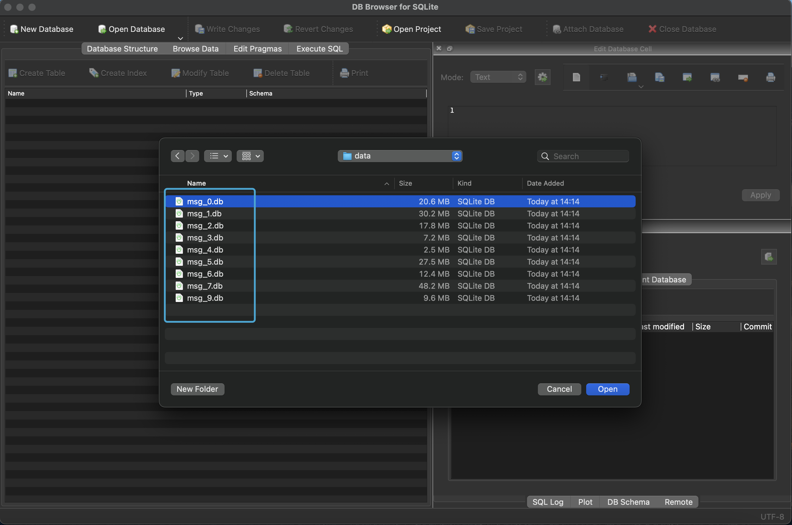

## 微信导出聊天记录

微信到现在也没有添加一个导出微信聊天记录的功能，我简单搜了一下下，好像还是有不少的工具可以用的。在这篇文章里边来介绍一种更好用的方法。只要跟着我的步骤来操作就可以啦！

这篇文章仅适用于 mac 用户，如果是 windows 操作系统的话（可以直接划走了），应该是有更好用的软件就解决了。


## 1 聊天记录的存储位置

微信的聊天记录都是在这个位置存储，你可以看到有很多 `db` 结尾的数据库。

可是呢，我的电脑上没有在这个路径，我也不清楚为什么，可能我是 M1  芯片的原因?

算了先不管了，如果你的芯片是 `Intel` 的话可以直接看看下边这个路径。

```shell
~/Library/Containers/com.tencent.xinWeChat/Data/Library/Application\ Support/com.tencent.xinWeChat/xxx/yyy/Message/*.db
```

如果你是 M 系列的芯片，或者你在上边那个路径也找不到的话，那么有一个好用的方法，应该也是同样适用于 `Intel` 芯片的 mac 的。

你随便找到一个朋友的聊天窗口，然后找到一张图片，右键选择在访达中显示（show in finder），


接着你就会看到打开的访达窗口了，在下方显示的就是这个文件夹的路径了。

如果你的访达打开之后，没有显示这个路径，那你就自己去搜索一下怎么设置一下打开这个功能叭 ~


好啦 ~ 

那么我们在这个路径上往回找几个文件夹，找到 `Message` 文件夹，然后点一下。


在这个文件夹中你可以看到很多以 `db` 结尾的文件，这里面就存储了你的聊天记录，并且这些都是 SQLite 类型的数据库，但是现在还不能直接访问这些数据库里边的内容，因为被加密了。


接着你把这些 db 结尾的文件全部都拷贝一下，放在一个你自己创建的文件夹里边，我就直接放在桌面的 data 文件夹中了。


## 2 拿到数据库的密码

拿到数据库的密码才能访问嘛。

首先要关闭 MacOS 系统的 SIP。否则的话，接下来的操作系统不允许，你可以在拿到密码后再把 SIP 功能给打开，不影响的。

可以参考这篇文章关闭 SIP：

传送门：https://weibo.com/ttarticle/p/show?id=2309404840827934605457

注意：可能这个又和芯片有关系，如果你是 Intel 的话可以先试一下 command + R，如果你是 M 系列芯片的话，可以先试一下 长安开机键。具体这段话是什么意思，你看一下这篇文章的内容，你就明白啦。

好啦！那么现在也关闭了 SIP，就可以继续接下来的操作了。

**打开微信**

先打开微信，但是先不要登录！

就保持着这个界面就可以啦。


接着打开你的 终端，可以在你的控制台里找一下。

或者 按下 command + 空格 搜索 终端。

因为我这里是英文模式，所以我要搜 `Terminal`，接着就点它就好啦。


**在终端输入**

在终端输入这串命令，按回车，如果这时候报错了，大概率是因为你的 SIP 功能没有关闭，你可以通过刚才提到的那篇文章关闭 SIP 功能。这串命令通过后，你就进入了 lldb 的子 shell。

```
sudo lldb -p $(pgrep WeChat)
```


**继续输入**

输入这串命令，按回车。

```
br set -n sqlite3_key
```

这串命令通过后输入 **c**，再按回车

**登录微信**

这时候点开刚才打开的但是没有登录的微信界面。点击登录。

点击登录后，你的微信应该是会卡着登录不进去的。

**继续输入**

如果你是 Intel 芯片的 mac 电脑，输入这串命令

```
memory read --size 1 --format x --count 32 $rsi
```

如果你是 M 系列芯片的 mac 电脑，输入这串命令

```
memory read --size 1 --format x --count 32 $x1
```

这条命令通过后，你会看到几行类似这样的内容：


**处理这串密码**

如果你会使用 Python 的话，那么你就创建一个Python文件，然后把source里边的内容改成你的屏幕上输出的内容，运行这个程序得到的输出就是你的数据库密码了。

如果你不会使用 Python 也不用担心，那么你就手动处理好了。

手动处理的话：

1. 把每一行中冒号以及冒号前边的内容全部删掉（冒号也要删掉）
2. 再把每一行中的空格删掉
3. 把每一行中的 0x 删掉
4. 把剩下来的每行的内容按照行的顺序依次拼接成一行，第一行在前，第二行在后，以此类推
5. 把多行的内容拼接成一行后，在这一行的最前方加上一个 0x（注意这里是数字 0 而不是字母 o）

```
source = """
0x000000000000: 0xab 0xcd 0xef 0xab 0xcd 0xef 0xab 0xcd
0x000000000008: 0xab 0xcd 0xef 0xab 0xcd 0xef 0xab 0xcd
0x000000000010: 0xab 0xcd 0xef 0xab 0xcd 0xef 0xab 0xcd
0x000000000018: 0xab 0xcd 0xef 0xab 0xcd 0xef 0xab 0xcd
"""
key = '0x' + ''.join(each.partition(':')[2].replace('0x', '').replace(' ', '') for each in source.split('\n')[1:5])
print(key)
```

经过上述步骤的处理后，你就会得到一串内容，这就是你的密码啦，它大概长这个样子：

```
0xabcdefabcdefabcdabcdefabcdefabcdabcdefabcdefabcdabcdefabcdefabcd
```


## 3 打开 SQLite 数据库

下载一个软件来打开数据库文件

传送门：https://sqlitebrowser.org/dl/

如果你是 M 系列的芯片的话，你要下载 Apple Silicon 的版本

如果是 Intel 的芯片，那就下载 Intel 的版本


**点击打开数据库**


**找到一个 db 文件**

找到你刚才拷贝出来的数据库文件，然后随便选择一个打开，那么打开其他的数据库文件的方法也是一样的啦，在这里我就选择我的 `msg_0.db` 文件啦。




**选择这两个选项**

这时候会让你输入密码，要选择图中箭头标识的这两个选项。

最后把刚才我们处理好的密码复制粘贴到 Password 后边的编辑框中

最后点 OK


**浏览记录**

打开后，你可以看到，在我的 `msg_0.db` 中一共有 37 张数据库表，每张表格里边都记录了你和一个人的聊天记录。

如果你是非计算机的同学，其实数据库表的样子就和 Excel 的表格的样子是差不多的，只不过数据库表是一定有表头的。


在图中有一个 `Browse Data` 的按钮，点击这个这个按钮，我们就可以打开其中任意一张表格了。

每行都是一条聊天记录，

每一行的 mesDes 列会指明这条聊天记录是谁发送的，0代表是你发送的，1代表是你的好友发送过来的。

msgCreateTime 告诉你这条聊天记录的创建时间

你可以在箭头所示的 `选择一张数据库表` 那里选择任意一张数据表进行浏览。


**导出记录**

你可以把数据表内的内容按照很多种格式导出。

如果你想方便使用代码处理可以导出为 json

非计算机的小伙伴还可以导出为 excel 格式


在这里你只要按 command + A 全选所有表格导出就可以啦

