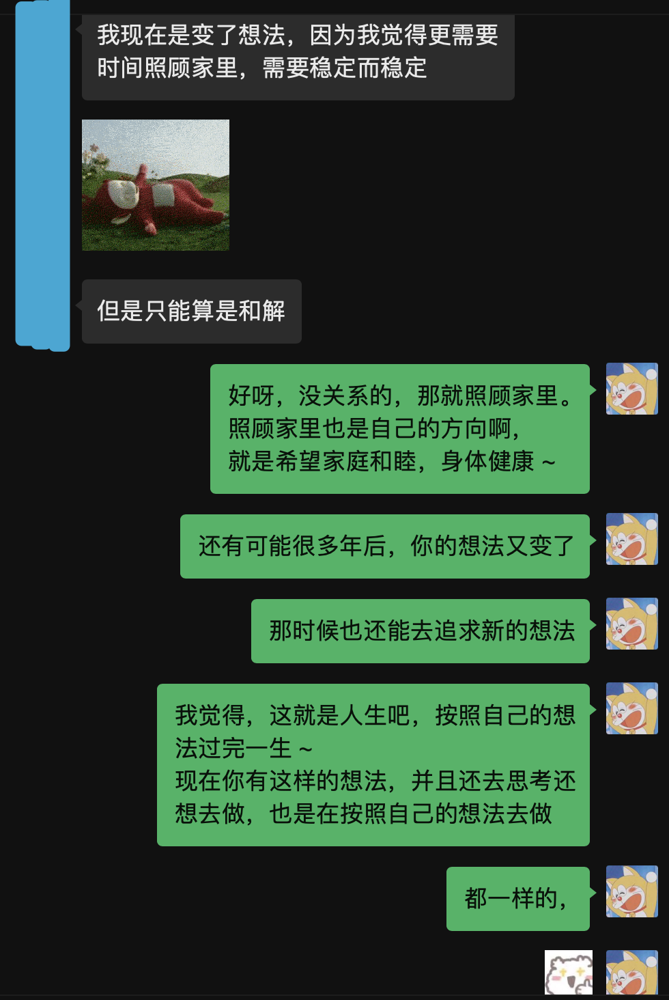

## 你想成为一个什么样的人

你好啊，我是蓝莓。

在我的公众号一直都是写和计算机相关的内容比较多的，今天这篇文章我想写一篇和计算机无关的文章。这篇文章的起因是源于我这两天和我一个朋友的对话，我们讨论了三方面的内容。

为什么要考研；毕业后想去做什么，选择什么；在一个需要维持“人际关系”的环境里，我们决定做出什么样的改变。

**为什么要考研**

先来说一说为什么要考研这件事情。不得不说，现在计算机专业的确还是非常的火，在计算机考研这件事儿上，最近两年，大部分的高校从原来的自主命题都在逐渐的调整为了 408 统考。随着报考计算机专业的人数增加，考试难度也在不断增加了。

我一直都希望自己能做一个 “理想主义” 者，所做的事情就是跟着自己的心去做的，而不是绝大部分妥协于所谓的 “现实”。

当我朋友问到我为什么要考研的时候，我是这样回答的。

为了写这篇文章，我刚才专门儿跑去问我朋友当初为什么要决定考研，哈哈，我朋友说我：“你就好像是那个搞调研的”。哈哈，不过调研出来了，朋友说，考研在一定程度上是回报率比较高的事情。

如果有想要读研的小伙伴，也真的可以考虑一下自己到底喜欢什么方面的专业，选择一个自己喜欢的专业。说到这里了，分享一段话：热爱，是支撑你留在赛场上的最后，也是最重要的东西，而只要你还在赛场上，就一切都有可能。

**毕业后何去何从**

我毕业后的最终目标可能不是去做计算机相关的工作，尽管我非常喜欢这个专业。我可能更希望自己成为一个 RS。至于 RS 是什么呢？这是我自己发明的一个代词。我暂时还不打算公布 RS 是什么，因为我没办法匿名呀。

哈哈，不过呢，我的朋友是可以匿名出现的，对于这件事情来说，我朋友现阶段更希望趋近于相对“稳定”的工作和生活。

无外乎就是能够选择的路就是，考公、编制、国企、央企，这类的方向。

是的，这些方向是我的朋友告诉我的，我的朋友还说希望有了这样一个工作后还想去读个博呢，在这里祝我的朋友能够顺利实现这个想法。

对于朋友说到的方向，我的回答是这样的：

> 想去国企央企，就加油！我觉得一个人能有个方向特别好。虽然很多人的想法和方向不是我的信仰。但是每个人都有信仰就特别好。能说服自己就行。

对于相对稳定的生活，我是这样回答的：

每个人的生活环境都是不一样的，因此每个人的想法也都会有差异，像我就觉得人生这么短不应该被世俗所定义，想做什么就抓紧时间去做吧。很多时候，我也非常不确定选择的那条路是不是能行。可是你不要忘了，即使是很多人走过的路，由于时间和环境发生了变化，走同样的路也不一定能行的。

**决定做出的改变**

最近，我和我的朋友都看了狂飙这部电视剧。

电视剧里的主人公，强哥，真的有太多太多值得让我学习的东西了。

在有一些场合和一些人讲话的时候，你是不是会感到非常紧张呢？特别是面对那些比自己的层级要高的一些人。比如在校时的一些学校领导、工作时的领导、

