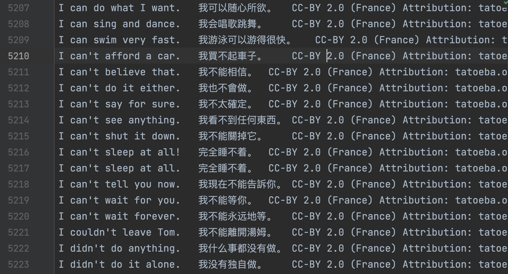
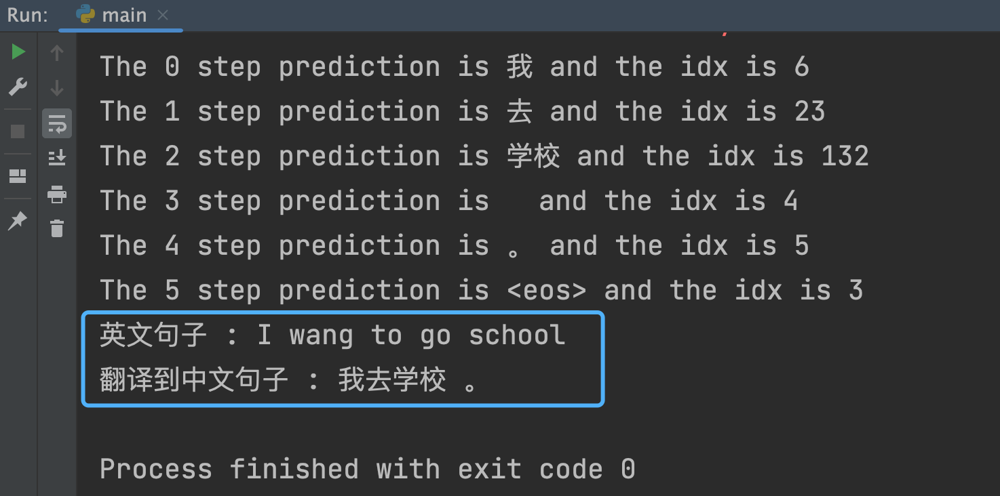

## 彻底理解注意力机制

从这篇文章开始，我想逐步的聊一聊关于我对 `Transformer` 模型的理解，而在这个模型中 `Self-Attention` 机制（自注意力机制）是一个非常重要的内容。那么在这篇文章中就先来详细的理解 `Self-Attention` 的计算过程是怎样的。

在我这些文章更新完成后，我会使用 `Transformer` 做一个简单的机器翻译 `demo`。我找来了一些中英文对照的训练数据（数据量并不大，加起来也就不到三万条）。数据大概长这个样子，这里面还掺杂着繁体字，不过我们可以在处理数据的时候把繁体字都转化成简体。

这个 `demo` 可以实现一些简单的翻译，比如我输入 `I want to go school.` ，这个模型会返回给我一个这样的结果。

你可以看到在输出的内容中，第一次先翻译出来 `我`，接着翻译出了 `去`，最后是 `学校` 以及标点符号 `。`。

## Self-Attention 的过程

