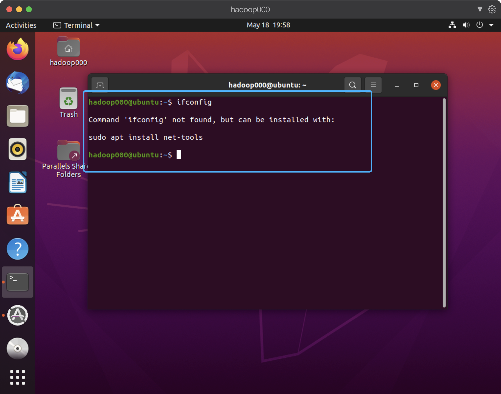
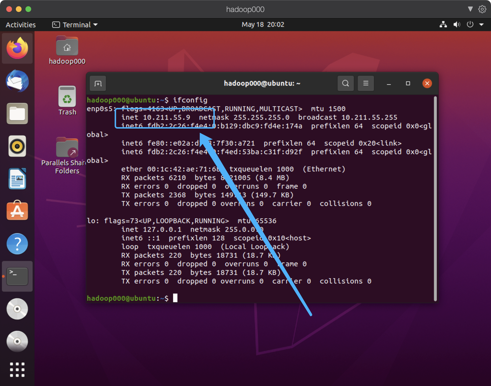
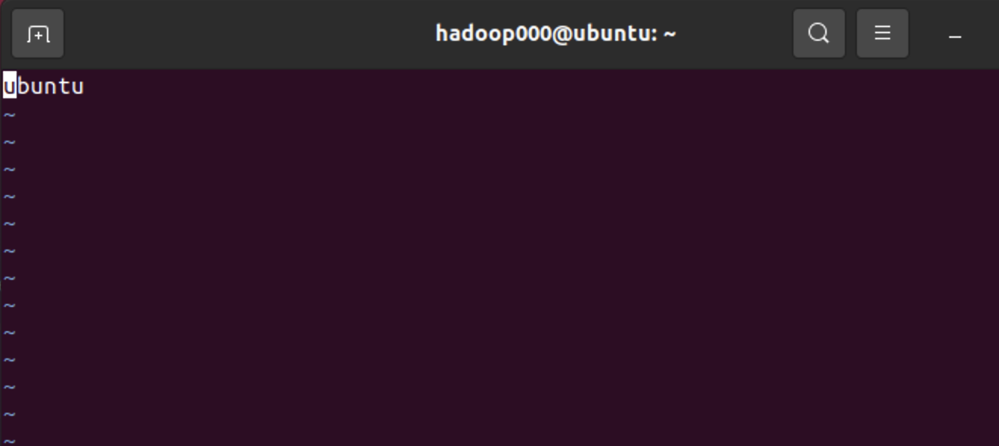
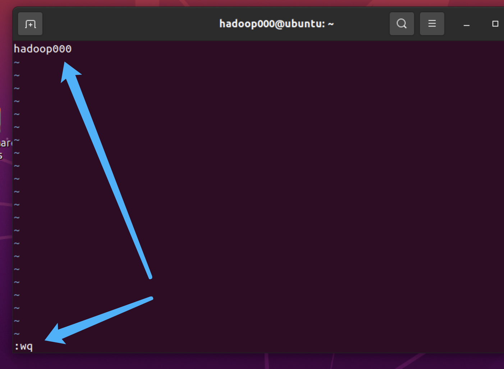
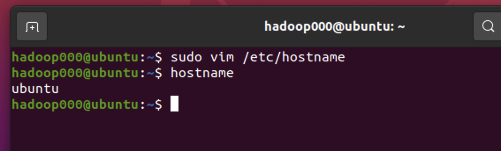
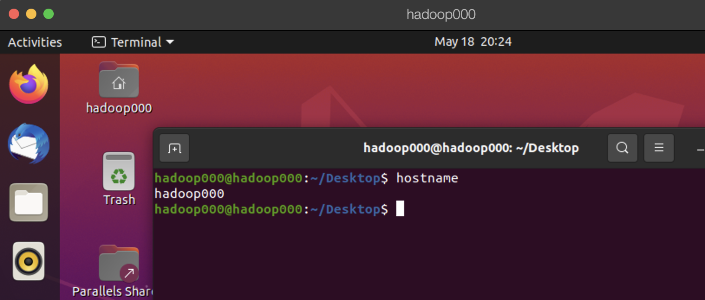
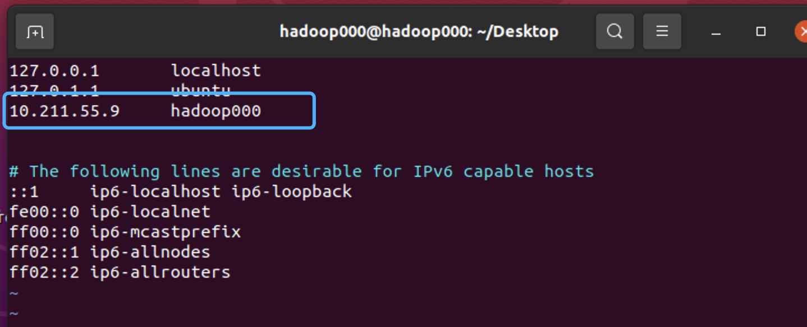

## 单机搭建伪分布式 Hadoop

哈喽啊 ~ 

实在是太久没有更新了，今天这篇文章做一个在单机节点上搭建 Hadoop 的教程，单个机器搭建 Hadoop 和在多台机器上部署几乎是没有太大差别的，那么下次的文章，我回写一个在多个机器上搭建 Hadoop 的教程。


## 1 实验环境

在写这篇文章前，我专门重新安装了一台虚拟机。我用的是 Ubuntu 20.04 版本的系统

装好之后，虚拟机就是这样子的：

为了方便我直接通过 ssh 远程这台虚拟机，需要查看一下这台机器的 ip 地址，这时候你需要安装一些必备的工具，比如 `net-tools`，不然 `ifconfig` 命令就不能用咯，当然了，还有诸如 `vim` 这样的工具也是需要的，在你搭建 Hadoop 的过程中，就自己安装一下好啦 ~ 



通过这个命令安装 net-tools

```shell
sudo apt install net-tools
```

又或者安装 vim

```shell
sudo apt install vim
```


## 2 配置 hostname 和 hosts

命令 `ifconfig` 查询虚拟机的 ip 地址



我这台机器的 ip 地址是：10.211.55.9

**修改 hostname**

现在我们来修改一下主机名，修改为 hadoop000，因为 Hadoop 是可以部署在大量的机器上的，因此我们可以直接把每台主机的 hostname 进行编号，第一台机器，我们就使用 hadoop000 就好啦 ~ 

```shell
sudo vim /etc/hostname
```

我们直接修改 `/etc/hostname` 的文件内容，也就代表着修改了主机名，我这台机器的 hostname 默认是 ubuntu



现在修改为 hadoop000，并保存退出



好啦，可以通过命令 hostname 来查看一下当前的主机名是什么：



没有生效对叭，最简单的方法就是把虚拟机重新启动一下子就可以啦。可以使用命令 `reboot` 重新启动机器，这时候我们再查看一下主机名，就没有问题咯。



**修改 hosts**

```
sudo vim /etc/hosts
```

我们把刚才查到的虚拟机 ip 地址 10.211.55.9 和 主机名 hadoop000 做一个映射放在 /etc/hosts 里，并保存退出:



这样以后，我们凡是需要写 ip 的地方都可以直接使用主机名 hadoop000 来代替了，这样即使 ip 发生了变化，我们的很多配置文件中也不需要一个一个的进行修改，不然会是一件很麻烦的事情。


## 2 ssh 远程登录

如果你的设备是 windows ，你可以选择使用 XShell 作为远程连接的工具，如果你是 mac 用户，你可以直接使用终端的 ssh 命令来远程虚拟机。


至于如何配置免密登录，可以参考我的这篇文章：

**这是一篇文章 ssh 免密登录**

通过上述链接的文章，你可以明白如何通过你自己的计算机免密登录虚拟机了。但是我们还需要的是，能够让虚拟机通过 ssh 命令自己免密登录自己才行。因为我们搭建 Hadoop 后，其中的不同组件之间需要使用网络进行传递数据，而它就是使用了 ssh 来进行数据交互，然而在这一篇文章中，我们搭建的是单个机器的伪分布式，所以就是单个机器上的不同进程之间使用 ssh 连接自己这台机器然后和其他的进程之间进行数据交换。

