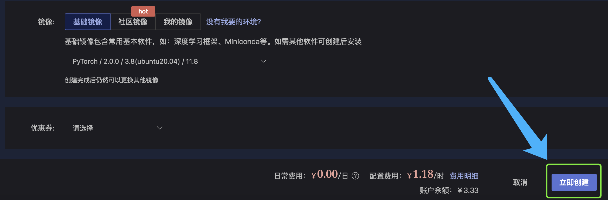
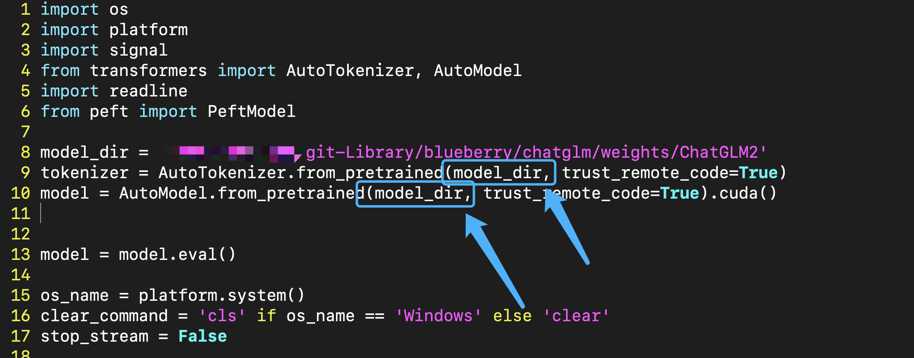

## 大模型 ChatGLM2 本地部署

哈喽呀，这次的文章让我们玩一玩 ChatGLM2 大模型，如果你想在本地使用这个模型的话，建议最好是拥有 24G 的显存容量。

不过呢 ~ 

如果你没有这么大的显存容量也不用担心，毕竟不是人人都有这种显卡的，你可以直接使用云服务器来使用这个。

**云服务**

个人觉得 AutoDL 这家非常好用，而且价格也不贵，显卡的种类非常多。建议选择一个显存容量达到24G而且不那么贵的显卡就足以完成本篇文章的的配置要求了。

在运行这个模型的过程中还需要下载这个模型的权重文件，仅仅是权重文件就达到了十多个G的大小。如果你有百度网盘VIP的话，建议你下载下来这些权重文件后先把这些文件上传到百度网盘。这是因为AutoDL这家是可以直接从你的百度网盘来下载文件的。

在这里，我就具体展开说怎么使用 AutoDL，就简单说一下好啦，相信聪明的你，一看就知道怎么使用咯 ~ 


## 1 AutoDL 云服务

官网传送门：https://www.autodl.com/home

1. 进去之后先注册个账号，这个不用我讲了叭，哈哈哈
2. 登陆之后，你账户里还没钱，你可以先充值个几块钱就行，可支付宝扫码支付嗷，自己研究下 ~ 
3. 之后点算力市场，我觉得A5000这张卡是拥有显存24G并且最便宜的卡了，1卡可租，说明这台机器上是有一张空闲的卡可以租用的，点它就行 ~


4. 点击1卡可租后就到了具体的配置界面


5. 向下滚动页面，就点这个基础镜像就好啦，它默认也是这个选项


6. 然后点击这个蓝色箭头指的地方，展开后依次选择下图的配置


7. 完成后就点击立即创建就可以咯 ~ 



8. 确保你的计算机上是有可以使用 ssh 连接服务器的，你可以依次点击 控制台 -- 容器实例 -- 以及右下角的ssh连接的地址和密码；这个地址可以密码直接复制之后粘贴在终端来连接服务器就可以啦；好啦，到这里你已经成功连接了服务器


9. 点这个 AutoPanel


10. 进去之后，可以看到上面有选项，性能监控那个选项卡，你可以查看到服务器的资源耗费情况；公网网盘选项卡，你可以通过百度网盘或者阿里云盘来下载数据到你的服务器上，如果你是有百度网盘vip的话，这个下载速度还是非常快的 ~ 几分钟就下载好啦，至于怎么使用，你可以看AutoDL提供的文档来使用公网网盘的功能


**Note**  由于我的本地是拥有 24G 显存的设备的，因此就不在AutoDL上面做演示啦


## 2 Hugging Face

在自然语言处理方面，很多已经被训练好的模型都放在了 **HUggingFace** 这个平台上。这个平台其实就像一个自然语言处理领域的 GitHub，大家会把一些已经训练好的模型发布在这里，而且 HuggingFace 提供了非常简单容易使用的 API 接口，你可以非常简单的从本地加载模型。

**hugging face传送门**  https://www.huggingface.co

**下载权重文件**

进入到 huggingface 官网后在上方的搜索框搜索 chatglm2，这时候你就看到 Models 选项卡下方的chatglm2-6b的子选项，带进去就好啦


chatglm2-6b hugging face 传送门：https://www.huggingface.co/THUDM/chatglm2-6b

挨着点一遍，全都下载下来就成，其实也用不到所有的文件，不过全都下载下来肯定是没问题的，然后你自己创建一个文件夹，把这些下载下来的东西都放进同一个文件夹中，如果你是需要使用AutoDL的haul，你可以下载下来后上传到百度网盘，这个上传的速度很快的，因为网盘会检查在云端有没有人上传过这些大文件，如果有的话，就不用你从本地一点一点上传过去了。接着就是漫长的等待时间啦：


## 3 GitHub

接下来，咱们去 github 找到 chatglm2 相关的代码，当然咯，你直接在 github 搜索框搜一下也能搜出来，我直接把链接给你好啦。接着你就点那个 download zip 把代码给下载下来就成了。

传送门：https://github.com/THUDM/ChatGLM2-6B


## 4 本地运行 ChatGLM2

接着，我们以上的准备工作都 ok 之后，就可以在本地运行它咯。

在运行前还需要安装一些依赖包，比如最基本的 pytorch 这些东西都要有，在代码中的 `requirements.txt` 中提供的并不是全部的依赖项，在文章下面，我会把我安装的所有依赖项都列给你，如果运行出现问题了，你可以对照看看是哪个没按，也可以根据报错信息来看。


好啦，在这张图中我们还看到了三个代码，分别是 `cli_demo.py` 、`api.py`和`web_demo.py` 这样的三个文件。在这篇文章中就使用 `cli_demo.py` 的的方式来部署。在官方的 github 中也给出了详细的使用方法。只不过在这里我们选择使用本地下载好的模型权重，而不是让它自动下载权重，所以需要简单修改一下 `cli_demo.py` 中的代码。


定义一个新的变量用来表示模型权重所在的文件夹路径，就是 `model_dir`

接着把下图中蓝色箭头指示的两个地方改成本地的模型权重所在的路径就 ok 咯 ~ 



**运行它**

进入到你准备好的依赖环境中，执行 `cli_demo.py` 文件就可以啦，在文章的最后，我会把我的环境中的依赖包全都列出来给你

`python cli_demo.py`

**效果展示**


问问它，你能干哈？


好啦 ~ 到这里，我的分享就结束啦 ~ 快让它在你的电脑上跑起来

**我的环境**

这里给出我电脑中安装的依赖包有哪些

```
absl-py==1.4.0
accelerate==0.19.0
aiofiles==23.1.0
aiohttp==3.8.4
aiosignal==1.3.1
altair==5.0.1
anyio==3.7.0
argon2-cffi==21.3.0
argon2-cffi-bindings==21.2.0
arrow==1.2.3
asttokens==2.2.1
async-lru==2.0.2
async-timeout==4.0.2
attrs==23.1.0
Babel==2.12.1
backcall==0.2.0
beautifulsoup4==4.12.2
bitsandbytes==0.39.1
bleach==6.0.0
cachetools==5.3.1
certifi==2023.5.7
cffi==1.15.1
chardet==4.0.0
charset-normalizer==3.1.0
click==8.1.3
cmake==3.26.3
comm==0.1.3
cpm-kernels==1.0.11
cycler==0.11.0
datasets==2.12.0
debugpy==1.6.7
decorator==5.1.1
deepspeed==0.9.2
defusedxml==0.7.1
dill==0.3.6
exceptiongroup==1.1.1
executing==1.2.0
fastapi==0.97.0
fastjsonschema==2.16.3
ffmpy==0.3.0
filelock==3.12.0
fonttools==4.40.0
fqdn==1.5.1
frozenlist==1.3.3
fsspec==2023.5.0
google-auth==2.21.0
google-auth-oauthlib==1.0.0
gradio==3.35.2
gradio_client==0.2.7
grpcio==1.56.0
h11==0.14.0
hjson==3.1.0
httpcore==0.17.2
httpx==0.24.1
huggingface-hub==0.14.1
idna==2.10
ipykernel==6.23.2
ipython==8.13.2
ipython-genutils==0.2.0
ipywidgets==8.0.6
isoduration==20.11.0
jedi==0.18.2
jieba==0.42.1
Jinja2==3.1.2
joblib==1.2.0
json5==0.9.14
jsonpointer==2.3
jsonschema==4.17.3
jupyter==1.0.0
jupyter-console==6.6.3
jupyter-events==0.6.3
jupyter-lsp==2.1.0
jupyter_client==8.2.0
jupyter_core==5.3.0
jupyter_server==2.5.0
jupyter_server_terminals==0.4.4
jupyterlab==4.0.2
jupyterlab-pygments==0.2.2
jupyterlab-widgets==3.0.7
jupyterlab_server==2.22.1
kiwisolver==1.4.4
latex2mathml==3.76.0
linkify-it-py==2.0.2
lit==16.0.5
Markdown==3.4.3
markdown-it-py==2.2.0
MarkupSafe==2.1.2
matplotlib==3.5.1
matplotlib-inline==0.1.6
mdit-py-plugins==0.3.3
mdtex2html==1.2.0
mdurl==0.1.2
mistune==2.0.5
mpmath==1.3.0
multidict==6.0.4
multiprocess==0.70.14
nbclassic==1.0.0
nbclient==0.7.4
nbconvert==7.4.0
nbformat==5.8.0
nest-asyncio==1.5.6
networkx==3.1
ninja==1.11.1
nltk==3.8.1
notebook==6.5.4
notebook_shim==0.2.3
numpy==1.24.3
nvidia-cublas-cu11==11.10.3.66
nvidia-cuda-cupti-cu11==11.7.101
nvidia-cuda-nvrtc-cu11==11.7.99
nvidia-cuda-runtime-cu11==11.7.99
nvidia-cudnn-cu11==8.5.0.96
nvidia-cufft-cu11==10.9.0.58
nvidia-curand-cu11==10.2.10.91
nvidia-cusolver-cu11==11.4.0.1
nvidia-cusparse-cu11==11.7.4.91
nvidia-nccl-cu11==2.14.3
nvidia-nvtx-cu11==11.7.91
oauthlib==3.2.2
orjson==3.8.12
packaging==23.1
pandas==1.2.4
pandocfilters==1.5.0
parso==0.8.3
peft==0.3.0
pexpect==4.8.0
pickleshare==0.7.5
Pillow==9.5.0
platformdirs==3.5.3
prometheus-client==0.16.0
prompt-toolkit==3.0.38
protobuf==3.20.0
psutil==5.9.5
ptyprocess==0.7.0
pure-eval==0.2.2
py-cpuinfo==9.0.0
pyarrow==12.0.0
pyasn1==0.5.0
pyasn1-modules==0.3.0
pycparser==2.21
pydantic==1.10.7
pydub==0.25.1
Pygments==2.15.1
pyparsing==3.0.9
pyrsistent==0.19.3
python-dateutil==2.8.2
python-json-logger==2.0.7
python-multipart==0.0.6
pytz==2023.3
PyYAML==6.0
pyzmq==25.0.2
qtconsole==5.4.3
QtPy==2.3.1
regex==2023.5.5
requests==2.25.1
requests-oauthlib==1.3.1
responses==0.18.0
rfc3339-validator==0.1.4
rfc3986-validator==0.1.1
rouge-chinese==1.0.3
rsa==4.9
scikit-learn==1.2.2
scipy==1.10.1
semantic-version==2.10.0
Send2Trash==1.8.2
sentencepiece==0.1.97
six==1.16.0
sniffio==1.3.0
soupsieve==2.4.1
stack-data==0.6.2
starlette==0.27.0
sympy==1.12
tensorboard==2.13.0
tensorboard-data-server==0.7.1
terminado==0.17.1
threadpoolctl==3.1.0
tinycss2==1.2.1
tokenizers==0.13.3
tomli==2.0.1
toolz==0.12.0
torch==2.0.1
torchaudio==2.0.2
torchvision==0.15.2
tornado==6.3.2
tqdm==4.65.0
traitlets==5.9.0
transformers==4.28.1
triton==2.0.0
trl==0.4.4
typing_extensions==4.5.0
uc-micro-py==1.0.2
uri-template==1.2.0
urllib3==1.26.15
uvicorn==0.22.0
wcwidth==0.2.6
webcolors==1.13
webencodings==0.5.1
websocket-client==1.5.1
websockets==11.0.3
Werkzeug==2.3.6
widgetsnbextension==4.0.7
xxhash==3.2.0
yarl==1.9.2
```

