## 扒一扒HuggingFace的LoRA实现源码

哈喽，最近这段时间玩儿了几天ChatGLM，用一些自己准备的数据集来微调大模型是一件很有趣的事情，HuggingFace平台提供了一套微调大模型的工具 `peft` ，支持了主流的大模型微调方法，比如LoRA。在这篇文章里不会从头到尾讲如何微调大模型的具体实现步骤，如果你已经使用 `peft` 提供的工具使用过 LoRA 了，那么你会不会想去知道 HuggingFace 是如何实现这个过程呢？这篇文章假设你已经知道了什么是注意力机制。

## 1 LoRA 原理简述

LoRA 的原理其实非常简单，那么就是一图胜千言。这张图就是来自《LoRA: Low-Rank Adaptation of Large Language Models》这篇文章，传送门：https://arxiv.org/abs/2106.09685

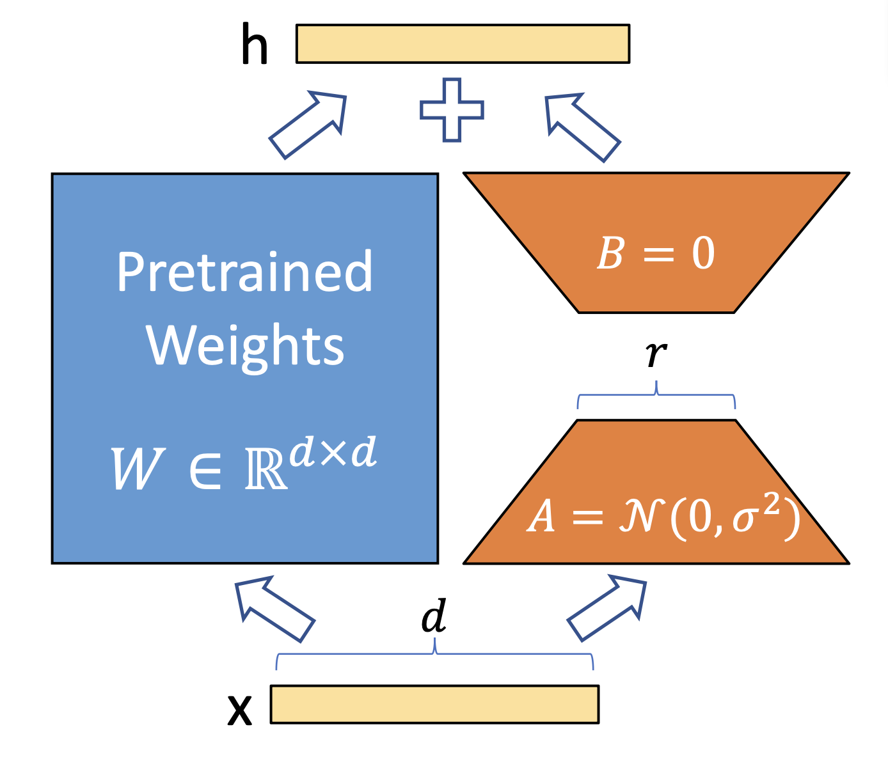

在 ChatGLM 中大量使用到了注意力机制，那么伴随着的也有很多的全连接层，在上图中的 `Pretrained Weights` 就是指代了模型中原本存在的权重。在本文中所使用的是 ChatGLM2 拥有 6B 的参数量，权重文件加起来有12G多。因此个人在 GPU 上全参数微调这么大的模型是比较困难的，其实这个参数量是很多发布的大模型中参数量最小的了。

如果不进行全参数量的微调，那么我们可以在训练的过程中调整部分参数，那不如我们直接加入一个分支，我们直接并联上一个 Module，最后我们让我们并联上的这个矩阵的输出和 `Pretrained weights` 的输出直接相加在一起。

这样的话，我们其实就是给模型原本的输出加上了一个增量，是的模型能看起来拥有同样的效果。用变成语言的表达式简单理解起来就是这样的
$$
W = W + \Delta{W}
$$
其中的 $\Delta{W}$ 就是我们添加上去的旁路的权重所产生的输出。

**微调成本**

为什么这样能减少微调的成本呢？其实我们并联上去的 `Module`包含了两个矩阵分别记作 `lora_A` 和 `lora_B` 。如果我们输入给这部分网络的向量长度是 4096 并且输出也是 4096，那么 `Pretrained_weights` 这部分的矩阵大小就是 $4096 × 4096 = 16777216$，这部分的参数量接近 $1700$万。接着，我们看看右侧并联上去的 `Module`的参数量会是怎样的，在这里有一个可调节的超参数，这个超参数代表的是 $lora\_A$ 的输出大小，和  $lora\_B$ 的输入大小，如果我们就设置这个超参数的值为 8，那么 $lora\_A$ 包含 $4096 × 8 = 32768$ 个参数，同理 $lora\_B$ 也包含这么多的参数量。$lora\_A$ 和 $lora\_B$ 的参数量加起来是 $65536$ 个参数，这个数量级的参数量已经远远小于全参微调的参数量了。学习过线性代数的你应该明白，一个长度为 4096 的向量丢进 $lora\_A$ 之后得到的向量长度是 8，这时候我们再把长度为 8 的向量丢进 $lora\_B$ 得到的向量长度是 4096，这个过程其实就是先压缩一下，再展开一下。

**推理速度**

接着我们看看推理速度会不会变慢，既然我们是并联上去的一个旁路，那么我们只需要把输入的内容丢给这个旁路之后让它去计算就可以了，整个过程都是可以并行运算的，因此推理速度并不会受到影响。

## 2 不依赖 HF 加载 ChatGLM2

在我们这篇文章 **玩一玩而大模型ChatGLM2** 中已经能够让我们运行起来 ChatGLM2 模型了。

文章传送门：

=============== 

可是我们是直接通过 hf 提供的接口来加载整个模型的。这种方式真是太透明了，以至于我们几乎不知道它到底在做什么，我们能不能看看这个模型长什么样子？

答案是可以的，下图是chatglm2在hf平台的文件列表，这里面包含了模型的权重以及构造模型的源码。其中 `modeling_chatglm.py` 中就包含了构造模型的 `Module` ，另外的 `config.json` 和 `configuration_chatglm.py` 分别提供了模型的配置信息和配置类。我们从 `config.json` 中加载配置信息到 `configuration_chatglm.py` 中的模型配置类中，然后把配置类的实力丢给 `modeling_chatglm.py` 中构造模型的 `Module` 就可以构造出来整个模型了，只是这时候我们还没有加载模型的权重。因为 chatglm2 也是使用 PyTorch 来写的，所以它继承了 `torch.nn.Module` 模块，我们自然可以使用 `torch.nn.Module.load_state_dict` 成员函数来加载模型的权重。

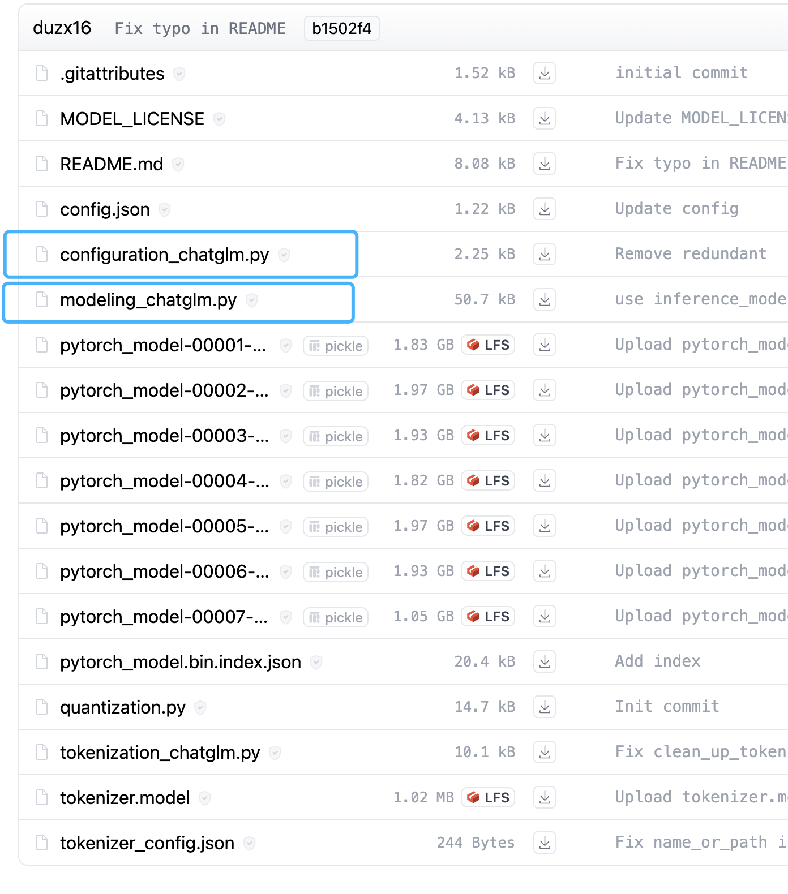

那么这部分，我们先暂停一下，到后面继续。

## 3 使用 HF 加载模型

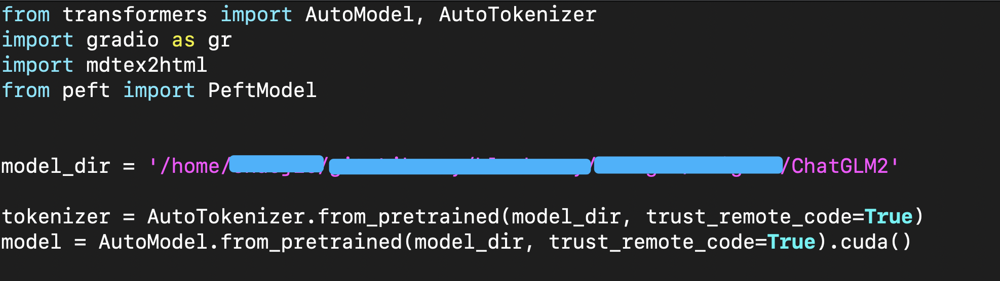

这段代码是 chatglm2 官方的 github 代码仓中提供的，当然啦，我修改了一下，我只是把加载模型的名字改成了我本地的路径，`model_dir`就是我存放 chatglm2 权重的路径。

不论是加载 `tokenizer` 还是 `model` ，我们都直接使用 `from_pretrained` 方法就可以加载了。其实不仅仅是加载 chatglm2 ，我们加载其他所有 hf 所支持的模型都是可以这么做的。可是你想过没有，它是怎么知道你加载的什么模型呢？以及你的模型使用什么 `Module` 来构造？

HF 会自己做一些判断，然后去对应模型的 HF 的仓库中下载对应的构造模型的文件，而这个缓存目录一般就在家目录（如果你是 Linux 系统的话），让我给你找出来看看。

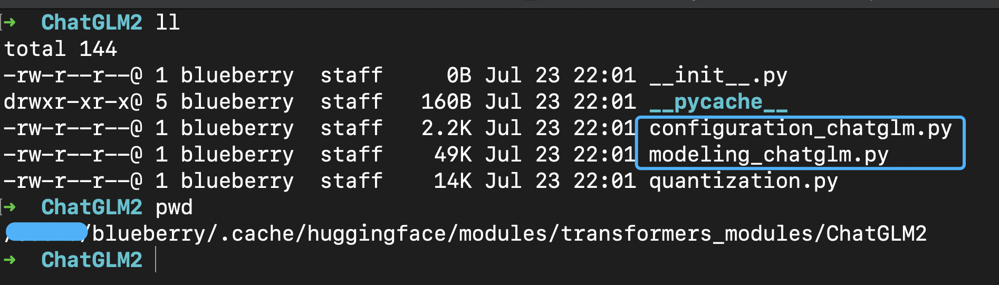

仔细观察我使用 `pwd` 输出出来的路径，当你在试着加载 ChatGLM2 的时候，hf 自动为你创建了这个文件夹，并且把 ChatGLM2 相关的文件放在了这里，包含了模型的 `Module` 文件 `modeling_chatglm.py` 和 配置它的 `configuration_chatglm.py` 。

其实我们还可以在本地加载模型的时候 `debug` 一下。

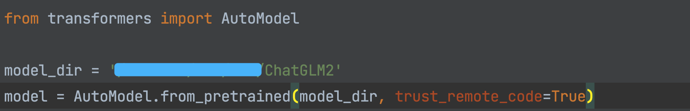

在这里的 `trust_remote_code` 就是说你同意了可以下载远端的代码在本地运行，这里所说的远端代码就是刚才我们看到的那些文件，对于 chatglm2 模型而言。

通过你 IDE 的功能，比如 `PyCharm` 你可以直接点进 `AutoModel.from_pretrained` 函数里看看发生了什么？

1. 这里的参数 `pretrained_model_name_or_path` 就是我们传入的模型所在的本地路径了。

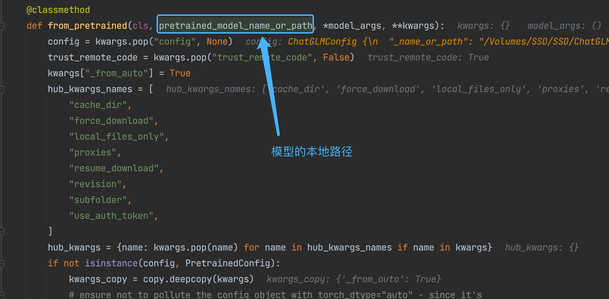

2. 我们这时候往下翻一翻打个断点，我们看到在我这里代码返回的时候，它又调用了 `model_class` 的 `from_pretrained` 方法。在这儿你回发现 `model_class`是 `modeling_chatglm.py` 文件中的 `ChatGLMForConditionalGeneration` 类，接着它又调用了 `model_class` 的 `from_pretrain` 方法，可见 `ChatGLMForConditionalGeneration.from_pretrained` 也是一个静态方法（@classmethod），并且将它的返回值直接当成最终的 `model` 返回了回去。
   另外你还会看到，这里的 `model_class` 是通过 `get_class_from_dynaimic_module` 来的，看这个函数的名字也很好理解，就是说从一个动态的模块中获取一个 class。之所以它能获取到 ChatGLM2 所需要的 class 不就是因为我们传入了哪些参数嘛，至于这个函数是如何自动下载 python 文件并且进行加载的，如果你感兴趣的话，可以自己点进去看看。

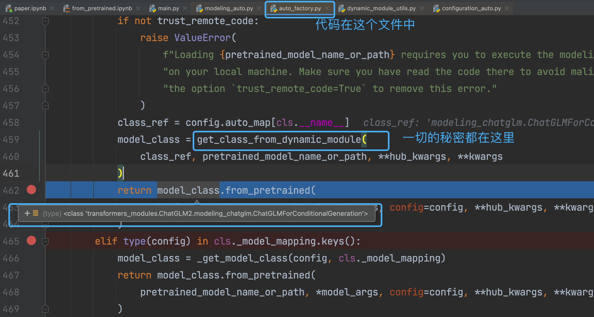

好啦，到这儿，我们明白了什么呢，就是 hugging face 也是需要下载模型对应的文件，然后使用该模型的特定方法进行模型加载的。

## 4 手动加载模型

好啦，既然我们已经知道了 `ChatGLM2` 是使用 `modelding_chatglm.py` 中的 `ChatLMForConditionalGeneration.from_pretrained` 方法进行加载的，我们何必不直接使用它来加载模型呢？

这就验证了，和本文的第 2 部分所提到的是一致的。

那么现在就用  `ChatLMForConditionalGeneration.from_pretrained` 来构建模型试试看。

在这里，我已经把那些有用的没用的文件全都放在 `chatglm` 这个文件夹种了，你添加一个 `__init__.py` 就可以把 `chatglm` 这个文件夹当成是一个 `python` 的 `package` 来使用了。

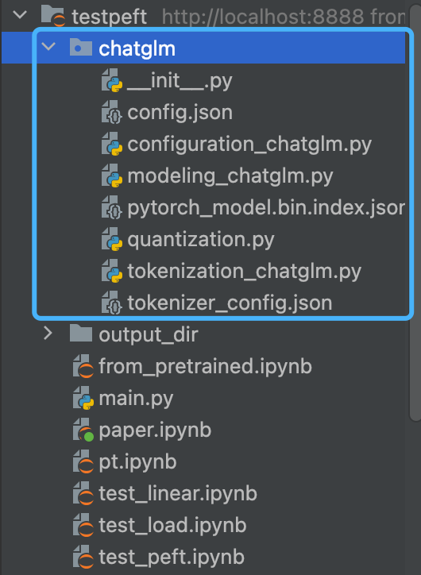

我在文本中的代码都在 `paper.ipynb` 文件中写的，所以我直接就可以导入 `chatglm` 这个里面的内容了。

先来看一眼，这个 `ChatGLMForConditionalGeneration` 这个 class 是怎么回事儿？你可以发现它继承了 `ChatGLMPreTrainedModel` 这个 class

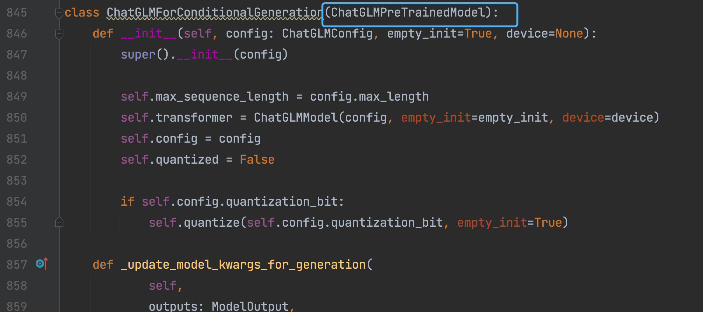

不用担心，`ChatGLMPreTrainedModel` 这个类也在 `modeling_chatglm.py` 文件中。哈哈，糟糕的是，你会发现 `ChatGLMPreTrainedModel` 又继承了 `PreTrainedModel`，更糟糕的是  `PreTrainedModel` 压根不在当前文件中，然而  `PreTrainedModel` 这个 class 是 `hugging face` 的代码中所提供的一个类。而且你再仔细翻一翻你会发现 `ChatGLMForConditionalGeneration` 和 `ChatGLMPreTrainedModel` 这两个 class 中都没有 `from_pretrained` 方法。

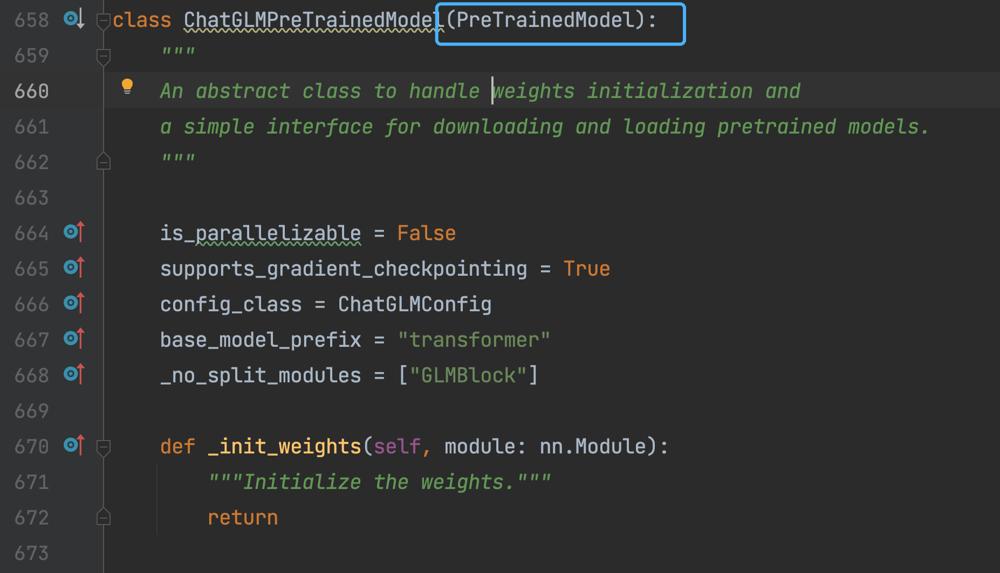

我们再向上找一下会找到 `PreTrainedModel` 这个 class，这时候继承链差不多到顶了。 `PreTrainedModel` 继承了 `torch.nn.Module`，这下差不多放心了，至少  `PreTrainedModel` 也是一个 `Module`。

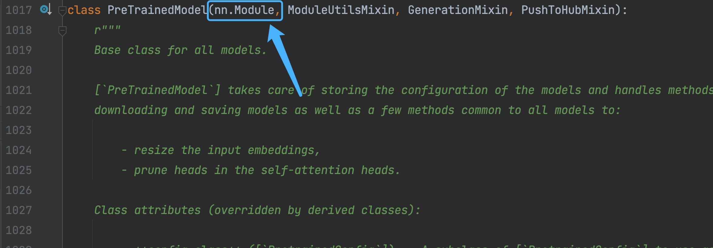

因此你就明白了，这个 `from_pretrained` 方法一定是在 `PreTrainedModel` 这个类中所定义的。那么接下来我们 `debug` 的重点对象就是这里啦。

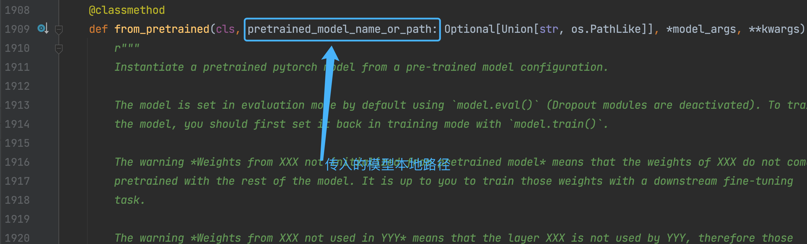

这个 `PretrainedModel.from_pretrained` 方法也是一个 @classmethod 静态方法，它的位置是在 hf 的代码中的 `modeling_utils.py` 文件中，你直接使用 `IDE` 的功能点进来就好，你会发现在 `modeling_utils.py` 文件的 `2531` 行的位置就是在获取 chatglm2 模型的权重文件路径了，至少 hf 已经拿到了这些权重文件的路径，如果你还想知道它是怎么拿到的，那你可以仔细看看代码，不得不说这个函数的代码是真的长，因为要检查太多东西适配太多内容了。

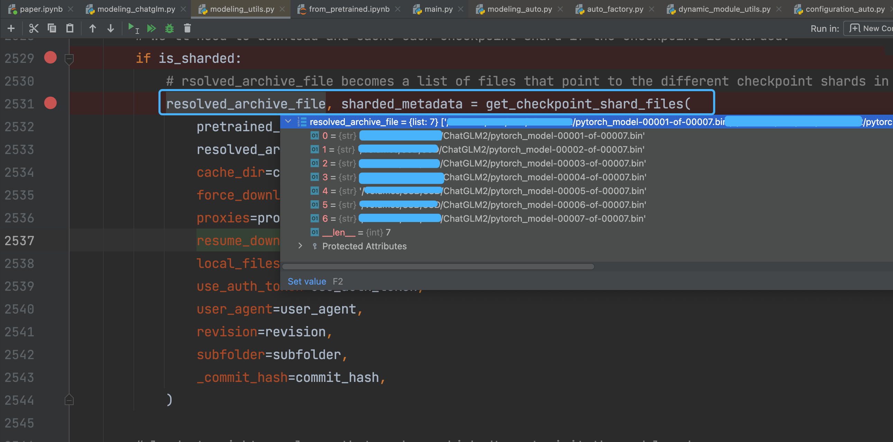

接着在 2619 行，我们可以看到，这时候已经拥有了 chatglm2 的框架，但是权重什么的都还没有加载进去。

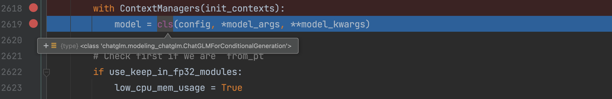

注意嗷，这里的 cls 就是代表 `ChatGLMForConditionalGeneration` 类本身！cls 代表的可不是什么实例对象，而就是这个类本身！哈哈，为什么是这个类而不是 `PretrainedModel` 这个类呢？因为我们调用 `from_pretrained` 方法是通过 `ChatGLMForConditionalGeneration` 来调用的，不管这个 `from_pretrained` 方法是在哪里定义的，cls 是谁只能是通过调用者来确定的，这就是 @classmethod 静态方法。

这时候我们就通过  `ChatGLMForConditionalGeneration` 构建出来了 chatglm2 这个模型的框架，你可以发现 config 是传给它的参数，比如 chatglm2 的注意力机制多宽啊，全连接层怎么个输入大小怎么个输出大小啊，这些信息都在 config 里面包含了。

好啦，总而言之，我们现在有了一个空壳 model，接下来就看看是怎么给它填充的参数吧。

在大概，2785 行的位置，我们看到了 `_load_pretrained_model` 方法，这也是一个静态方法，我们把空格 model 传给它，接着由它来为我们填充权重参数。 `_load_pretrained_model` 这个方法也是在 `PretrainedModel` 类中定义的一个 @classmethod 静态方法。接着我们点进  `_load_pretrained_model` 一探究竟。

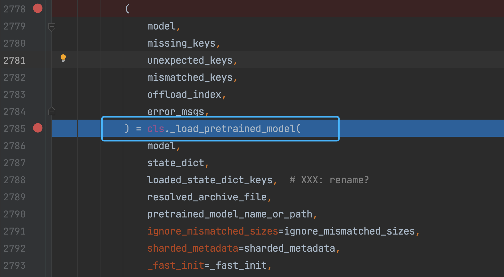

`_load_pretrained_model` 方法依然在 `modeling_utils.py` 文件中

大概 3109 行的位置我们看到这儿有一个 for 循环，开始遍历一开始收集到的权重文件的路径列表了，说明就是要开始一个一个的把那 7 个权重文件加载到刚才创建好的空壳 model 里面咯。`load_state_dict` 就是把 `shard_file` 所指向的 `pth` 文件读取进来，然后交给 state_dict 变量。

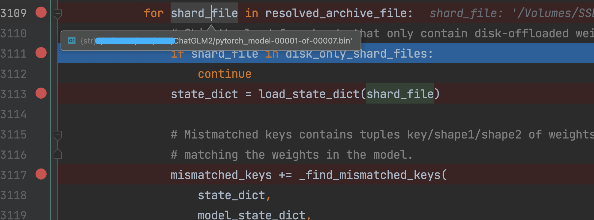

在 3145 行可以看到，这里就是把刚才的 state_dict 的权重放进 model 的函数了，并且每次填充完一个 `pth` 文件后都会手动释放掉刚才读取的 `pth` 文件所占用的内存空间 `del state_dict `

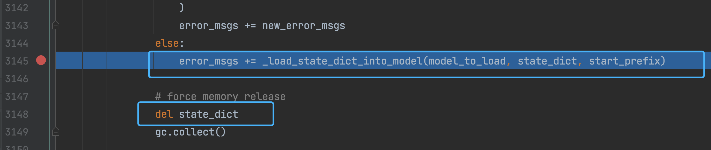

`_load_state_dict_into_model` 函数同样在 `modeling_utils.py` 文件中，大概在 488 行的位置

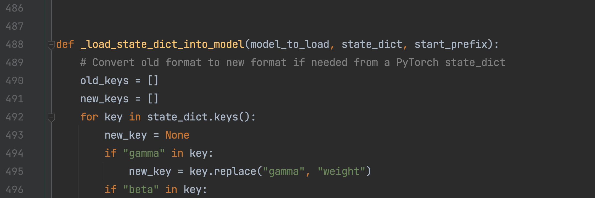

hf 在 _load_state_dict_into_model 中定义了一个 `load` 函数，`load` 函数由  _load_state_dict_into_model 所调用。而且你会发现，`module` 就是那个空壳 model，你看 debug 处的 `module` 所代表的是 `ChatGLMForConditionalGeneration` 这个 class 就很好理解了。然后又调用了  _load_state_dict_into_model 的 `_load_from_state_dict` 方法，其实    _load_state_dict_into_model 是 `torch.nn.Module` 所提供的一个方法，但是这个方法一次只能填充一个 `Module` 的参数，如果你需要填充该 `Module` 所嵌套的内层的 `Module` 的话你就需要递归地进行权重的填充了。

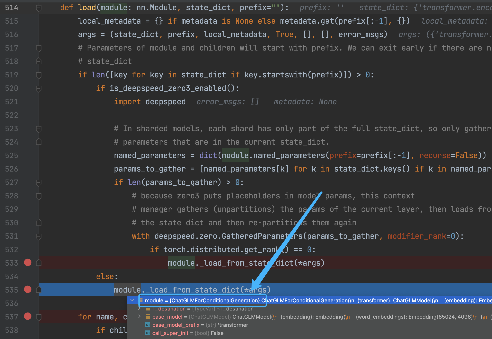

你只需要看到 `load` 函数中的这段代码，它在使用循环的方式递归地调用 `load` 函数，依次将所有内层的 `Module` 填充上参数。

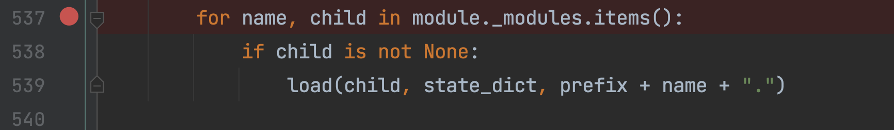

哈哈哈，到这里！你终于明白了，hugging face 是怎么做到把模型构造起来并且把权重从文件中填充进去了。那么我们不妨再看看 `torch.nn.Module._load_from_state_dict` 里面有什么

从这里我们可以发现，`torch.nn.Module._load_from_state_dict` 最终是要被 `torch.nn.Module.load_state_dict` 函数所调用的，那么，`load_state_dict` 不就是我们加载本地的权重给模型最常用的方法吗，我们再跳转到 `torch.nn.Module.load_state_dict` 函数中看看。

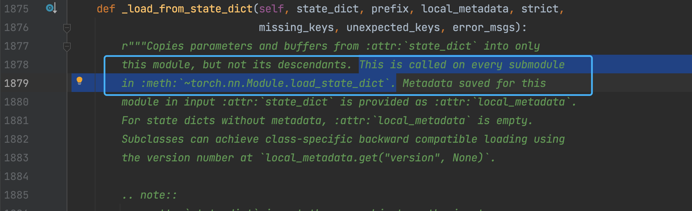

我们在  `torch.nn.Module.load_state_dict` 函数中看到，它也定义了一个 `load` 函数，并且通过  `torch.nn.Module.load_state_dict` 加载权重的过程也是在递归地调用 `torch.nn.Module._load_from_state_dict` 函数。哈哈哈，整了半天，hugging face 原来是抄了一下  `torch.nn.Module.load_state_dict` 中的代码给自己用了。

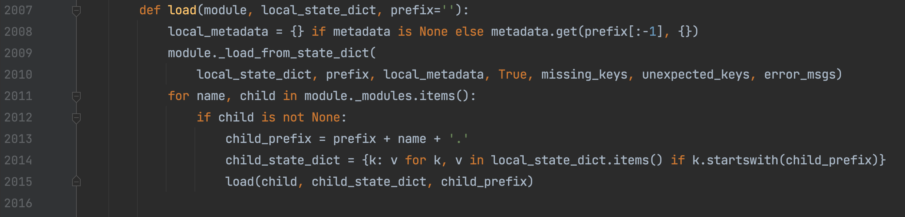

## 4 加载一下吧

在这里的参数 `map_location` 是指定权重参数的加载位置，由于我的笔记本上没有 `cuda`，所以我指定了 `cpu` 也就是加载到内存。另外的 `strict` 参数默认是 `True`，就是说，一次性必须把整个模型的所有参数都填充完成才行，如果填充不完就报错，由于我们这里需要填充 7 次，因为有 7 个 pth 文件，所以一次不能填充完，就要把 strict 设置为 `False` 才行。

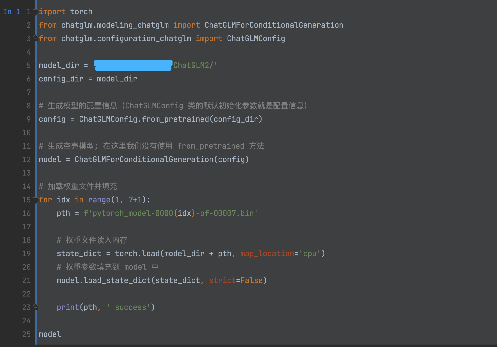

好啦，到这里，我们成功啦，这篇文章一直都还没有剖析 lora 部分的代码，不过总算是大概搞清楚了 hugging face 怎么动态加载模型了，而且也知道了怎么手动的加载 chatglm2 模型了。

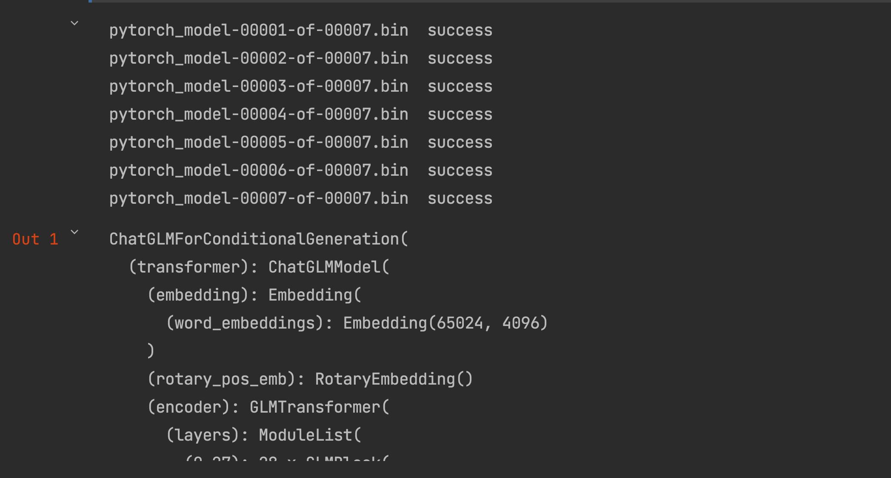

那么关于 lora 部分的源码就放在下一次的文章好啦。

如果你能看到这里！那真是辛苦你啦 ~ 