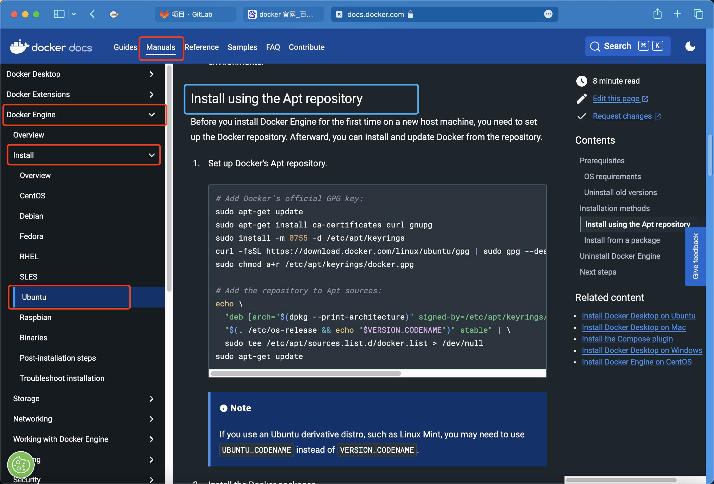
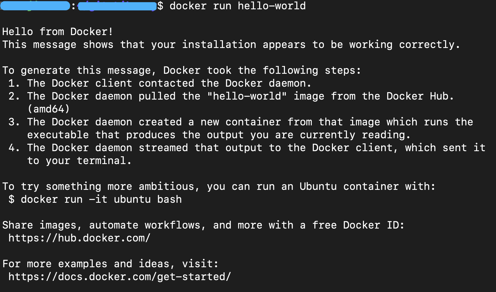
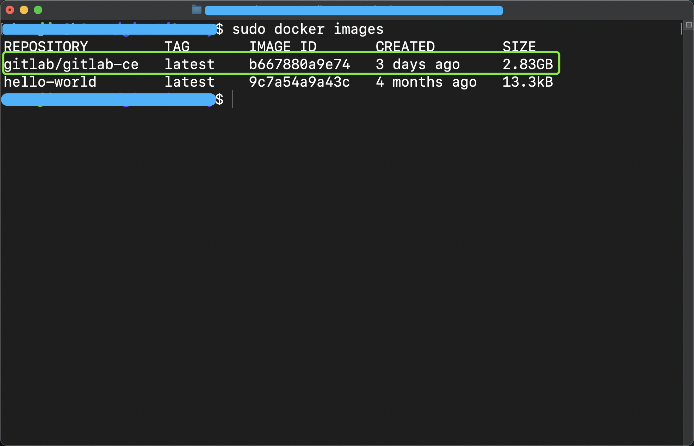
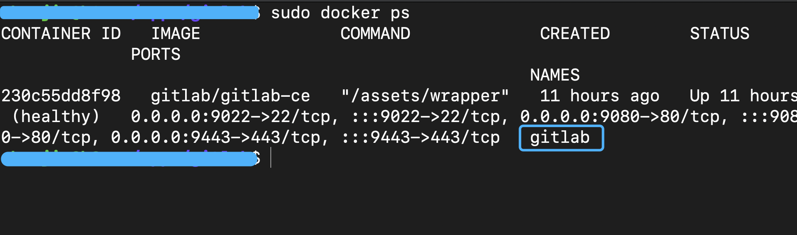

## 使用 Docker 快速搭建 GitLab

在这篇文章快速向你介绍，如何使用 Docker 快速搭建 GitLab，在这篇文章中所有的操作均在 ubuntu 系统中完成。


## 1 安装 Docker

安装 Docker 的话，直接参考 Docker 的官方安装教程即可，在这里我给出了 ubuntu 的官方安装教程链接，如果你是其他的系统，那么可以打开官网后再打开你的系统对应的安装教程。

官方传送门：https://docs.docker.com

官方安装教程传送门: https://docs.docker.com/engine/install/ubuntu/




那么根据 Docker 的安装教程，我们只需要依次执行教程中所提及到的命令即可完成安装

```shell
sudo apt-get update
sudo apt-get install ca-certificates curl gnupg
sudo install -m 0755 -d /etc/apt/keyrings
curl -fsSL https://download.docker.com/linux/ubuntu/gpg | sudo gpg --dearmor -o /etc/apt/keyrings/docker.gpg
sudo chmod a+r /etc/apt/keyrings/docker.gpg

echo \
  "deb [arch="$(dpkg --print-architecture)" signed-by=/etc/apt/keyrings/docker.gpg] https://download.docker.com/linux/ubuntu \
  "$(. /etc/os-release && echo "$VERSION_CODENAME")" stable" | \
  sudo tee /etc/apt/sources.list.d/docker.list > /dev/null
  
sudo apt-get update
```

```shell
sudo apt-get install docker-ce docker-ce-cli containerd.io docker-buildx-plugin docker-compose-plugin
```

如果以上命令能够顺利执行完成，那么恭喜你 Docker 已经成功完成安装了

接下来我们跑一个 hello world 仪式感 ~ 我们只需要执行这条命令，就可以启动一个最小的 Docker 镜像了，通常用来验证 Docker 是否成功安装。

执行后，如果你能看到如下图所示的输出，说明安装成功咯 ~ 

```shell
sudo docker run hello-world
```




## 2 安装 GitLab

接下来，我们就是使用 Docker 来安装 GitLab 了

**下载镜像**

通过 docker pull 命令下载 gitlab 的镜像，这个过程需要花费一些时间

```
sudo docker pull gitlab/gitlab-ce
```

下载完成后查看一下是否下载成功，如果你能看到输出信息中已经有了 gitlab/gitlab-ce 的话，说明镜像下载成功了

```
sudo docker images
```



**创建目录**

接着，我们在宿主机创建几个目录，随后挂在到容器中，这样一来，我们所产生的数据就方便我们备份了，共需要创建三个目录

我的选择是把这三个目录创建在 `~/apps/gitlab/` 目录中，你可以根据自己的需要来选择

```shell
mkdir -p ~/apps/gitlab/config
mkdir -p ~/apps/gitlab/logs
mkdir -p ~/apps/gitlab/data
```

**查看你的 ip 配置域名**

为了方便而言，通过 `ifconfig` 命令查看你的 ip 地址，这个就不用我来具体说明了叭 ~ 

如果你有一个公网ip和一个申请好的域名的话，你可以直接使用这样的方式来部署，在我这里，只是在局域网使用。

随后我们编辑 `/etc/hosts`文件，将域名和ip地址绑定在一起，通过 `vim`打开 `hosts`文件

```
sudo vim /etc/hosts
```

然后我们把这一行代码加进去，注意这里的 `your_ip_addr`要替换成你通过 `ifconfig` 命令查询到的，你的 ip 地址，后面对应的 `wecool.com`你也可以随意修改成你喜欢的域名，在这里我们就使用这个来做实验了。

```
your_ip_addr	wecool.com
```


## 3 启动服务

现在我们只需要启动 gitlab 服务就可以了

```shell
sudo docker run --detach \
--shm-size 32g \
--hostname wecool.com \
--publish 9443:443 \
--publish 9080:80 \
--publish 9022:22 \
--name gitlab \
--restart always \
-v /home/blueberry/apps/gitlab/config:/etc/gitlab \
-v /home/blueberry/apps/gitlab/logs:/var/log/gitlab \
-v /home/blueberry/apps/gitlab/data:/var/opt/gitlab gitlab/gitlab-ce
```

**配置项**

1. --shm-size 32g   ;  将 shm 共享内存的大小设置为了 32G，一开始的时候我没有设置，导致总是报 500 或者 502 的错误
2. --hostname  wecool.com   ; 设置你的 gitlab 服务所使用的域名，随后你进入到 gitlab 的 web 界面后，通过 git 拉取代码或者推送代码，它在 web 界面所展示的主机的地址都是会受这个配置项影响的
3. --publish 9443:443  ; 将 宿主机的 9443 端口和 docker 容器的 443 端口映射，剩余两个端口映射同理
4. --name gitlab  ; 配置启动后的容器名
5. --restart always  ; 容器挂掉了是否自动重启，自动自动重启
6. -v /home/blueberry/apps/gitlab/config:/etc/gitlab  ; 将宿主机的 /home/blueberry/apps/gitlab/config 目录挂载到 Docker 容器的 /etc/gitlab 目录上，其实就是让它存数据的时候直接存在宿主机的文件系统上嘛。在这里我挂在目录的时候使用了宿主机上，我们创建的那些目录的绝对路径形式。剩余的两个目录挂载也是同理的

好啦，现在我们就运行上面的那一串命令就可以启动 gitlab 服务了，启动需要花一些时间，大概 1 到 2 分钟的样子。

**查看容器状态**

通过如下命令查看容器是否正常运行

```shell
sudo docker ps
```

在这里可以看到，我的服务已经运转了 11 个小时了。




## 4 初次登录

初次登录的时候，要使用 root 用户进行登录

root 是管理员账户，随后其他用户的申请什么的，都需要你通过这个用户来赋予权限才行。


**访问 gitlab 的主页**

因为我们已经配置了域名 `wecool.com` 所以我们可以直接通过域名访问，然而我们把 `docker` 容器的 `80` 端口映射到了宿主机的 `9080` 端口，所以我们访问 `gitlab` 的地址是 `wecool.com:9080`，就可以打开这个界面了，请一定要注意看看你的 `hosts` 文件中是不是已经将 ip 和 域名绑定在一起了！


**默认账户**

1. 用户名: 默认的用户名是 `root`

2. 密码：而 `root` 用户默认的密码是被放在 `~/apps/gitlab/config` 目录中的 `initial_root_password` 文件中，你可以通过命令 `cat ~/apps/gitlab/config/initial_root_password` 来查看内容，然后把这个密码复制下来就可以登录 `gitlab` 了

注意我们在找默认密码的时候，是在宿主机的目录中去找，因为你已经把这个目录给挂载上去了，你就直接在宿主机的文件系统中去找那个默认密码的文件就可以了，并且这个默认密码的文件会在 24 小时后被自动删除，你一定要及时修改密码嗷。

至于具体的路径，就要看你在前面是如何配置的了。

**关于备份**

你只需要把我们创建的那三个文件夹备份好就可以了，如果换了一个地方部署 gitlab 应用，你只需要把相应的文件夹进行挂载即可


