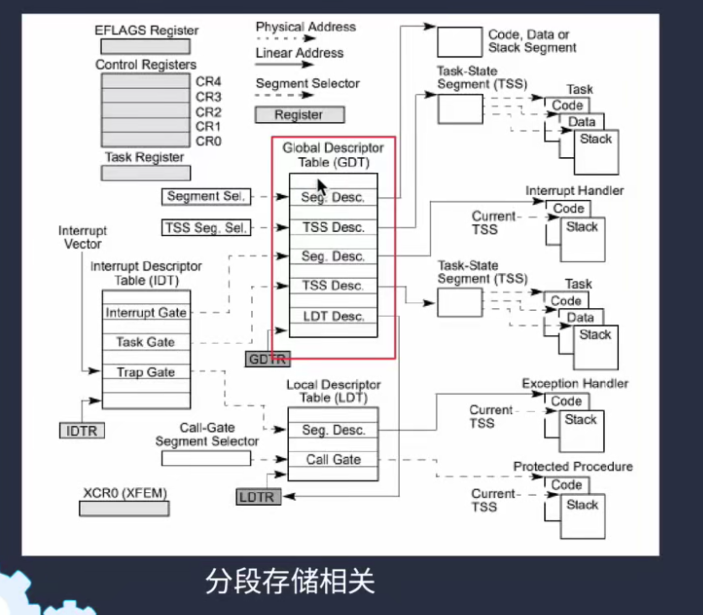

## 实模式到保护模式


## 保护模式中的寄存器

1. 段寄存器（16bit）
2. 通用寄存器（32bit）
3. 指令指针寄存器（32bit）
4. 标记寄存器（32bit）


## GDT表



相对于 16位 模式，在 32位 模式中的段基址已经不再是一个简单的基地址了，除了要有一个基地址外，还要有一些对当前段的描述性信息，这些信息相对来说比较多，在寄存器中放不太现实，因此这些信息都放在内存中，一个新的数据结构GDT诞生。

GDTR 寄存器指向 GDT 表在内存中的起始地址

## 段描述符

GDT表中的每一个表项称为 **段描述符** ， 每个 **段描述符** 的大小是 64bit


G：控制段界限的单位，G=1 代表段界限的单位是 4KB，G=0 代表是以字节为单位
D：设置GDT表项是 32位 模式
P：指示当前段描述符是否存在
DPL：描述当前段的特权级
S：描述当前段是系统段（TSS或者调用门这种属于系统段）还是代码段或者数据段
TYPE：描述当前段时代码段还是数据段，以及是否可读可写

```c
#define SEG_G       (1 << 15)   // 设置段界限的单位是 4KB
#define SEG_D       (1 << 14)   // 设置GDT表项是 32位 模式
#define SEG_P_PRESENT       (1 << 7) // 指示当前的段描述符是否存在

#define SEG_DPL0     (0 << 5) // 最高特权级
#define SEG_DPL3     (3 << 5) // 最低特权级

#define SEG_S_SYSTEM        (0 << 4)  // 系统段设置为 0
#define SEG_S_NORMAL        (1 << 4)  // 代码段或数据段设置为 1

#define SEG_TYPE_CODE       (1 << 3)    // 当前段是代码段
#define SEG_TYPE_DATA       (0 << 3)    // 当前段时数据段
#define SEG_TYPE_RW     (1 << 1)    // 当前段可读可写
```


type 字段配置项


## 选择子

在段寄存器中保存的内容称为 **选择子**


在选择子的低 3bit 用作了别的用途，只有 高13bit 是用作索引的，所以 gdt 的表项是从第1号表项开始使用的（其实地址偏移量为 8B）

TI 位用来说明当前的 选择子 指向的表项 是 GDT 的表项还是LDT的表项

RPL 是特权级相关的


蓝色方框中是段寄存器中存储的值，绿色方框中是该段寄存器指向的GDT表项中对应的值


## 分段存储和分页存储


在打开分页机制之前，线性地址就是实际的物理地址

逻辑地址 ==> 线性地址 ==> 物理地址


## 段式存储


cs 指向代码段

其他的都指向数据段

第一种平坦模式中都是从 0 到 4GB 可以访问全部地址空间

第二种平坦模式 将数据段和代码段进行了分离


**段式存储的内存访问**


用选择子查找 segment desc 中的表项 然后让其中的 base addr 基地址 和 代码中提供的 offset 偏移地址相加 得到 线性地址（当页式存储没有打开的时候，线性地址就是物理地址）


