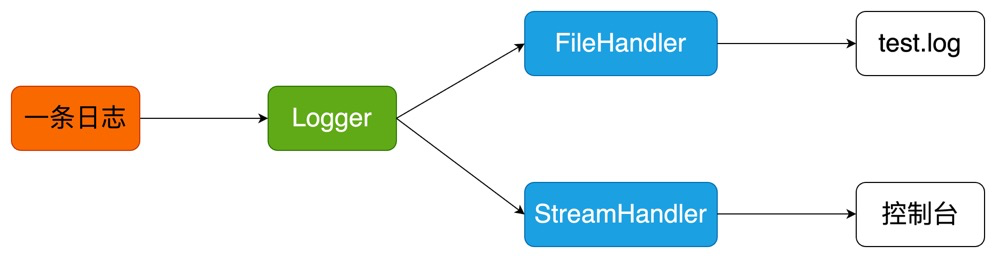
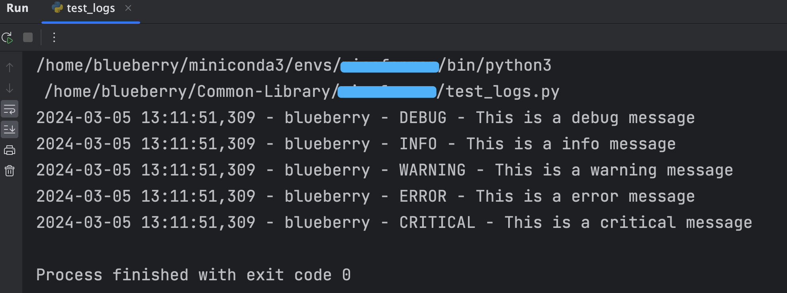
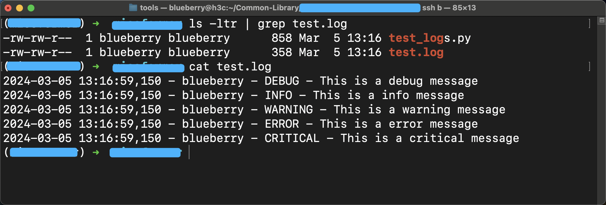

##  让 Python 使用 logging 打个日志

哈喽，我是蓝莓 ~ 

在这篇文章让我们简单的看看，怎么使用 logging 模块


## 开始 ~

**Logger 对象** 

```python
import logging 


logger = logging.getLogger('blueberry')
logger.setLevel(logging.DEBUG)
```

通过 `logging.getLogger('blueberry')` 创建一个 logger 对象，并且给它起个名字叫做 blueberry，接下来我们所有的一切和日志相关的操作就通过 `logger` 对象来完成了。`logger.setLevel(logging.DEBUG)` 用来设置当前我们 `logger`输出的日志的最低级别。

在这个 `logging` 模块中共有五个日志的级别，分别是：

DEBUG < INFO < WARNING < ERROR < CRITICAL

其中 `DEBUG` 的级别最低，如果我们将 `logger`的日志级别设置为 `INFO`，那么低于`INFO`这个日志级别的日志将不会被输出，就是说：`logger`只会输出大于等于它的日志级别的日志。


**Handler 对象**

```python
# 创建一个handler，用于写入日志文件
fh = logging.FileHandler('test.log')
fh.setLevel(logging.INFO)

# 再创建一个handler，用于将日志输出到控制台
ch = logging.StreamHandler()
ch.setLevel(logging.DEBUG)
```

在这里，我们学习使用两种 `Handler`对象，分别是 `FileHandler`和`StreamHandle`

`FileHandler` 对象，用于将`logger`对象收到的日志信息输出到 文件，并且我们需要指定一个文件所在的路径，我在这里直接写为 `test.log` 则是代表将日志信息输出到当前程序所在目录下的 `test.log` 文件中

`StreamHandler` 对象，用于将 `logger` 对象收到的日志信息输出到 控制台

你会发现，我们在对具体的 Handler 对象也使用 `setLevel` 设置了该`Handler`日志的级别，实际是因为，日志需要经过两轮的过滤，最终才会将通过过滤后的日志输出到对应的位置。



一条日志来了之后，先经过 `Logger` 过滤，如果该日志的等级大于等于 `Logger` 设置的日志级别则通过，这条日志将会继续流到`Handler`对象，到具体的`Handler`对象后，该日志会再次经过`Handler`对象的过滤，最终通过两轮过滤后才会被输出到对应的位置


**Formatter 对象**

```python
# 定义handler的输出格式
formatter = logging.Formatter('%(asctime)s - %(name)s - %(levelname)s - %(message)s')
fh.setFormatter(formatter)
ch.setFormatter(formatter)
```

现在，我们输出的日志还没有一个固定的格式，因此我们使用 `Formatter` 对象来为日志定义具体的格式

`Formatter` 对象需要绑定在`Handler` 对象上，就是说，每一个输出日志的出口中都可以有不同的日志格式。在这里，我们就让`fh`和`ch`两个实例对象使用相同的日志格式就可以了

```python
'%(asctime)s - %(name)s - %(levelname)s - %(message)s'
```

每条日志是占一行的，这个代表的意思就是，每一行日志的：

第一个内容是时间，使用 `%(asctime)s` 表示

第二个内容是该`logger`对象的名字，使用 `%(name)s`来表示，这个名字就是一开始设置的 `blueberry` 

第三个内容是这条日志的级别，使用 `%(levelname)s` 表示

第四个内容是这条日志的内容，使用 `%(message)s` 表示

其他出现在字符串中的字符按照原样显示

接着使用 `setFormatter` 函数将 `formatter` 实例对象与 `Handler` 绑定


**为 logger 对象添加 Handler**

```python
# 给logger添加handler
logger.addHandler(fh)
logger.addHandler(ch)
```

最后需要将这两个`Handler`对象与具体的`logger`对象进行绑定

**记录一条日志**

```python
# 记录一条日志
logger.debug('This is a debug message')
logger.info('This is a info message')
logger.warning('This is a warning message')
logger.error('This is a error message')
logger.critical('This is a critical message')
```

当我们使用 `logger` 对象不同的函数时，每一条日志也就拥有了对应的级别，随后每条日志就会按照上图中所示的路线一次经过过滤后才能够输出到对应的位置

在本文中，我们将所有的`Handler`的日志级别都设置为了`DEBUG`，也就是是说所有经过该`Handler`的日志都会被输出，此外本文中的`logger`对象使用的日志级别也是`DEBUG`


## 让我们做个实验

**终端**

首先在终端中，所有的日志信息都输出了



**文件中**




## 成品代码

```python
import logging


# DEBUG < INFO < WARNING < ERROR < CRITICAL

# 创建一个logger
logger = logging.getLogger('blueberry')
logger.setLevel(logging.DEBUG)

# 创建一个handler，用于写入日志文件
fh = logging.FileHandler('test.log')
fh.setLevel(logging.DEBUG)

# 再创建一个handler，用于将日志输出到控制台
ch = logging.StreamHandler()
ch.setLevel(logging.DEBUG)

# 定义handler的输出格式
formatter = logging.Formatter('%(asctime)s - %(name)s - %(levelname)s - %(message)s')
fh.setFormatter(formatter)
ch.setFormatter(formatter)

# 给logger添加handler
logger.addHandler(fh)
logger.addHandler(ch)

# 记录一条日志
logger.debug('This is a debug message')
logger.info('This is a info message')
logger.warning('This is a warning message')
logger.error('This is a error message')
logger.critical('This is a critical message')

```


