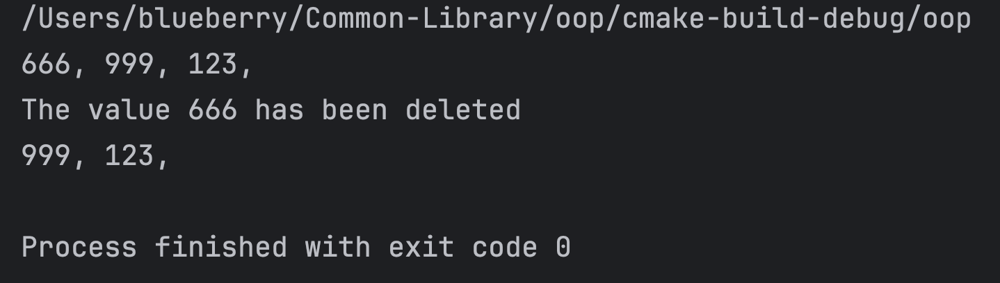

## 原来 C 语言也能面向对象编程

C 语言是一个面向过程的编程语言，不过还是可以在形式上实现面向对象的代码风格的，那么这篇文章就分享一下如何简单的使用 C 语言实现面向对象


## 1  面向过程的例子

在这个例子中，我们实现一个固定长度的队列，并且分别实现添加操作和取队头元素的操作

1.  push操作 ==> 添加操作
2. pop 操作 ==> 获取队头的元素并在队列中删除它

为了实现的过程更简单一些，我们在每次从队列中删除一个元素之后，我们就让后面的所有元素向前移动一个位置

```c
#include <stdio.h>

int main() {

    int cur = -1;  // 指向队尾
    int container[100];  // 用来存储队列中的元素

    // 添加一个元素 666
    cur += 1;
    container[cur] = 666;  

    // 添加一个元素 999
    cur += 1;
    container[cur] = 999;

    // 添加一个元素 123
    cur += 1;
    container[cur] = 123;

    // 输出队列中的所有元素
    for(int i = 0 ; i <= cur ; i++) {
        printf("%d, ", container[i]);
    }
    printf("\n");

    // 删除队头元素
    for(int i = 1; i <= cur; i++) {
        // 将后面的元素向前移动一个位置
        container[i-1] = container[i];
    }
    cur -= 1;  // 维护 cur 变量的定义

    // 输出队列中的所有元素
    for(int i = 0 ; i <= cur ; i++) {
        printf("%d, ", container[i]);
    }
    printf("\n");

    return 0;
}
```

**操作对象的定义**

这个代码看上去还是比较简单的。我们使用 cur 变量指向队列尾部的元素，所以当队列中不存在任何元素的时候，我们就让它指向 -1 这个位置； 

```c
int cur = -1;  // 指向队尾
int container[100];  // 用来存储队列中的元素
```


**插入元素**

当我们添加一个元素到队列中的时候，我们只需要在保证数组不越界的情况下，先让 cur 向后移动一个位置，然后将其对应的值存储到 container 中就可以了，就像这样：

```C
// 添加一个元素 999
cur += 1;
container[cur] = 999;
```


**删除元素**

从第1号位置开始，将它的值覆盖到前面一个位置，当我们遍历完后，所有的值也就向前移动了一个位置，同时队头元素的值也被覆盖掉了，相当于完成了删除；当然啦，这种实现方法是比较低效的；

```c
// 删除队头元素
for(int i = 1; i <= cur; i++) {
    // 将后面的元素向前移动一个位置
    container[i-1] = container[i];
}
cur -= 1;  // 维护 cur 变量的定义
```


## 2  初次面向对象

从第一部分的代码来看，其实有很多代码都是重复的，那么我们就可以对它进行一个简单的包装

并且你会发现一个问题，如果我们需要两个队列的话，那么我们就要把类似于下面的这段代码都要重新写一遍

```c
int cur = -1;  // 指向队尾
int container[100];  // 用来存储队列中的元素
```

所以，我们可以把这部分代码放进结构体中

```c
struct Queue {
    int cur;  // 指向队尾
    int max_len;
    int container[100];
};
```

我们再为 Queue 定义几个操作

**初始化（构造函数）**

```c
void init(struct Queue* self) {
    self->cur = -1;
    self->max_len = 100;
}
```

**append 添加元素**

```c
int append(struct Queue* self, int value) {
    if(self->cur >= self->max_len) {
        return 0;  // 添加失败
    }

    self->cur += 1;
    self->container[self->cur] = value;

    return 1;  // 添加成功
}
```

**获取并删除元素**

```c
int pop(struct Queue* self) {
    if(self->cur < 0) {
        return -1;  // 删除队头元素失败
    }

    int value = self->container[0];

    // 删除元素
    for(int i = 1; i <= self->cur; i++) {
        // 将后面的元素向前移动一个位置
        self->container[i-1] = self->container[i];
    }
    self->cur -= 1;  // 维护 cur 变量的定义

    return value;  // 添加成功
}
```

**打印队列中所有元素**

```c
void show(struct Queue* self) {
    for(int i = 0 ; i <= self->cur ; i++) {
        printf("%d, ", self->container[i]);
    }
    printf("\n");
}
```

通过指针的方式，我们就可以非常轻松的操作  Queue 对象了，因此，我们在 main 函数中的逻辑就会变成下边这样

```c
int main() {

    struct Queue q;
    init(&q);  // 队列初始化 (相当于构造函数)

    // 添加一个元素 666
    append(&q, 666);

    // 添加一个元素 999
    append(&q, 999);

    // 添加一个元素 123
    append(&q, 123);

    // 输出队列中的所有元素
    show(&q);

    // 删除队头元素
    int value = pop(&q);
    printf("The value %d has been deleted \n", value);

    // 输出队列中的所有元素
    show(&q);

    return 0;
}
```

这样一来，代码就简洁了不少

## 进一步封装

那我们是不是还能让它看上去更加像面向对象的形式呢，当然可以

**对Queue结构稍加修改**

```c
struct Queue {
    int cur;  // 指向队尾
    int max_len;
    int container[100];

    // 我们使用函数指针来指向该对象所需要的方法
    void (*init)(struct Queue* self);
    int (*append)(struct Queue* self, int value);
    int (*pop)(struct Queue* self);
    void (*show)(struct Queue* self);
};
```

**添加一个创建该对象的函数**

在这个函数中，我们为 Queue 对象所应该具有的方法赋值，但是并不需要完成构造函数的任务，因为 newQueue 是创建 Queue 对象用的

```c
struct Queue* newQueue() {

    struct Queue* q = malloc(sizeof(struct Queue));

    q->init = init;
    q->append = append;
    q->pop = pop;
    q->show = show;

    return q;
}
```

构造函数以及其他的函数都不需要修改，那么我们来看看完整的代码，并且看看 main 函数中的写法

```c
#include <stdio.h>
#include <stdlib.h>


struct Queue {
    int cur;  // 指向队尾
    int max_len;
    int container[100];

    // 我们使用函数指针来指向该对象所需要的方法
    void (*init)(struct Queue* self);
    int (*append)(struct Queue* self, int value);
    int (*pop)(struct Queue* self);
    void (*show)(struct Queue* self);
};


void init(struct Queue* self);
int append(struct Queue* self, int value);
int pop(struct Queue* self);
void show(struct Queue* self);


struct Queue* newQueue() {

    struct Queue* q = malloc(sizeof(struct Queue));

    q->init = init;
    q->append = append;
    q->pop = pop;
    q->show = show;

    return q;
}


void init(struct Queue* self) {
    self->cur = -1;
    self->max_len = 100;
}


int append(struct Queue* self, int value) {
    if(self->cur >= self->max_len) {
        return 0;  // 添加失败
    }

    self->cur += 1;
    self->container[self->cur] = value;

    return 1;  // 添加成功
}


int pop(struct Queue* self) {
    if(self->cur < 0) {
        return -1;  // 删除队头元素失败
    }

    int value = self->container[0];

    // 删除元素
    for(int i = 1; i <= self->cur; i++) {
        // 将后面的元素向前移动一个位置
        self->container[i-1] = self->container[i];
    }
    self->cur -= 1;  // 维护 cur 变量的定义

    return value;  // 添加成功
}


void show(struct Queue* self) {
    for(int i = 0 ; i <= self->cur ; i++) {
        printf("%d, ", self->container[i]);
    }
    printf("\n");
}


int main() {

    struct Queue* q = newQueue();
    q->init(q);  // 队列初始化 (相当于构造函数)

    // 添加一个元素 666
    q->append(q, 666);

    // 添加一个元素 999
    q->append(q, 999);

    // 添加一个元素 123
    q->append(q, 123);

    // 输出队列中的所有元素
    q->show(q);

    // 删除队头元素
    int value = q->pop(q);
    printf("The value %d has been deleted \n", value);

    // 输出队列中的所有元素
    q->show(q);

    return 0;
}
```



好啦，我们可以看到，在 main 函数中看上去更像是面向对象风格的写法咯

