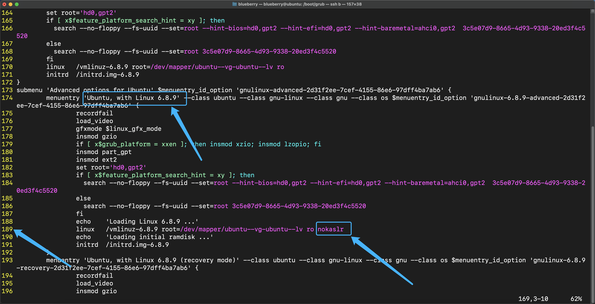

## 这次我们来调试 Linux 内核

你好啊，我是蓝莓 ~ 

学习操作系统内核的一个重要的方式就是调试它，在这个过程中，我们能看我们所做的每一个操作的背后是如何运转的，在这篇文章就来完成这件事情。

**启动一台虚拟机**

在[彻底理解虚拟网络搭建](https://mp.weixin.qq.com/s/uevCC0Kl5dDGKLYTma-opw)这篇文章中，我已经提到了如何使用QEMU启动一个可以上网的虚拟机。

**重新编译内核并安装**

在[添加系统调用 && 编译内核](https://mp.weixin.qq.com/s/21fHyiEnKGeQqMvQExG4WA)这篇文章中提到了如何在创建好的 QEMU 虚拟机中编译一个全新内核并安装到虚拟机中

有了这两篇文章的基础，我们就可以调试一下自己写上去的系统调用了

**目标：**

1. 启动 QEMU 虚拟机
2. 拷贝源码到本地
3. 配置一些文件
4. 使用 gdb 调试内核


## 1 启动 QEMU 虚拟机

在这里，我假设你已经安装好了虚拟机，我使用的虚拟机的镜像是 `ubuntu-24.04-live-server-amd64.iso` , 镜像的下载地址：

https://releases.ubuntu.com/noble/ubuntu-24.04-live-server-amd64.iso

简单的说一下在那两篇文章中没有提及到了一些参数是什么意思：

1. `-smp 32` 这个就是说我要为这个虚拟机分配几个 CPU 的核心
2. `-s` 这个参数代表的意思是让 QEMU 来监控虚拟机中运行的内核并且监听 `localhost:1234` 这个端口，这样的话，我们只需要在宿主机让 gdb 调试工具通过这个端口与 `QEMU` 进行通信就可以来调试内核了

接下来，我们只需要通过下面这条命令来启动虚拟机就可以了，你可以相应的对参数后面的值做出调整

```bash
qemu-system-x86_64 \
        -enable-kvm \
        -name ubuntu \
        -smp 32 \
        -m 4096 \
        -hda /home/blueberry/qemu/kernel.img \
        -vnc :10 -cpu host \
        -net nic,macaddr=52:54:11:12:34:10,model=virtio \
        -net tap,ifname=tap0,script=no,downscript=no \
        -s
```


## 2 拷贝源码到本地

既然调试的过程是在宿主机，那么我们就需要把操作系统内核的代码给拿出来，在[添加系统调用 && 编译内核](https://mp.weixin.qq.com/s/21fHyiEnKGeQqMvQExG4WA)这篇文章中我们对新的内核进行了编译并且把内核放在虚拟机中的 `/homoe/blueberry/expr/linux-source-6.8.9` 这个位置，那么我们接下来只需要将这个编译后的代码全部都给拷贝出来就可以了

直接使用 `scp` 命令拷贝ip地址为 `192.168.166.101` 的机器的 `/home/blueberry/expr/linux-6.8.9` 这个目录的内容到执行这这条命令的目录来，我的宿主机的用户名也是 `blueberry` 虚拟机中的用户名也是 `blueberry` ，并且我在宿主机的家目录下也建了一个文件夹叫做 `expr` 

具体的，那个 ip 地址，你需要根据你的实际情况进行填写

```
➜  expr pwd
/home/blueberry/expr
➜  expr scp -r blueberry@192.168.166.101:/home/blueberry/expr/linux-6.8.9 ./
```

拷贝完成之后，我在宿主机的 `expr` 目录中就有了源码：

```bash
➜  expr ls -ltr
total 4
drwxrwxr-x 26 blueberry blueberry 4096 May  9 17:56 linux-6.8.9
```


## 3 配置一些文件

接下来，我们需要进行一些配置

`修改 grub.cfg 文件 `

为了能使我们打的断点有效果，需要关闭 `KASLR` ，如果不关闭的话，则有可能使内核的地址空间布局随机化。为了达成这个目的，我们只需要编辑 `/boot/grub/grub.cfg` 文件就可以了

```bash
blueberry@ubuntu:~$ cd /boot/grub
blueberry@ubuntu:/boot/grub$ ls
fonts  gfxblacklist.txt  grub.cfg  grubenv  i386-pc  locale  unicode.pf2
blueberry@ubuntu:/boot/grub$ sudo vim grub.cfg
```

我这里实在189行的位置，你首先需要找到你是要对哪个内核进行调整，因为我编译的内核版本是 `Ubuntu, with Linux 6.8.9` 所以我要找到这一项的配置，然后你需要在途中框出来的那个位置添加上 `nokaslr` 这个就完成了



为了保证这个能生效，你需要把你的虚拟机关掉，然后重新打开才可以

**划重点：**

为了保证调试的时候能够顺利调试，你在打开虚拟机的时候一定要从高级选项的那个界面中选择与你的代码相匹配的那个内核！！！


## 4 使用 gdb 调试内核

最后，我们就可以直接来调试内核了

首先我们来到宿主机的家目录：

```bash
➜  ~ pwd
/home/blueberry
➜  ~ vim .gdbinit 
```

然后我们在 `.gdbinit` 这个文件中添加一行内容，前面的 `add-auto-load-safe-path` 不用改动，后面的目录要写成你的内核代码所在的目录，接着就保存退出就可以了

```bash
add-auto-load-safe-path /home/blueberry/expr/linux-6.8.9
```

现在你需要保证你的虚拟机是打开的，并且已经重新启动过了，接着在宿主机来到内核代码所在的目录：

```bash
➜  linux-6.8.9 pwd
/home/blueberry/expr/linux-6.8.9
```

直接执行 `gdb vmlinux` 命令，然后进入到 `gdb` 调试界面后输入 `target remote :1234` 来连接 `QEMU` 虚拟机：

```bash
➜  linux-6.8.9 gdb vmlinux 
GNU gdb (Ubuntu 9.2-0ubuntu1~20.04.1) 9.2
Copyright (C) 2020 Free Software Foundation, Inc.
License GPLv3+: GNU GPL version 3 or later <http://gnu.org/licenses/gpl.html>
This is free software: you are free to change and redistribute it.
There is NO WARRANTY, to the extent permitted by law.
Type "show copying" and "show warranty" for details.
This GDB was configured as "x86_64-linux-gnu".
Type "show configuration" for configuration details.
For bug reporting instructions, please see:
<http://www.gnu.org/software/gdb/bugs/>.
Find the GDB manual and other documentation resources online at:
    <http://www.gnu.org/software/gdb/documentation/>.

For help, type "help".
Type "apropos word" to search for commands related to "word"...
Reading symbols from vmlinux...
(gdb) target remote :1234
Remote debugging using :1234
0xffffffff821cb09b in pv_native_safe_halt () at ./arch/x86/include/asm/irqflags.h:48
48		asm volatile("sti; hlt": : :"memory");
```

好啦，这时候为我们在编译内核的时候所添加的系统调用打个断点，直接使用 `break sys_helloworld` 就可以在 `sys_helloworld` 这个函数的入口地址处打上断点了

```bash
(gdb) break sys_helloworld
Breakpoint 1 at 0xffffffff81120500: file kernel/sys.c, line 2928.
```

现在你会发现你的虚拟机已经停了，你不管输入什么命令都没办法使用，因为现在是调试状态，想让它跑起来，我们需要在 `gdb` 的命令处输入 `c` 来继续运行内核代码，其中 c 就是 continue

这时候，命令行会告诉我们处于运行状态 Continuing 了

```
(gdb) c
Continuing.
```


**触发断点**

那么我们怎么才能触发这个断点呢？

只需要使用我们写的测试程序就可以了，我们现在进入到 `QEMU` 虚拟机的命令行，并且来到这个目录 `/home/blueberry/expr` ，我们只需要在 `Continuing` 的状态下在虚拟机中运行 `hello.o` 这个程序就会使用我们定义的系统调用，进而触发断点：

```
blueberry@ubuntu:~/expr$ pwd
/home/blueberry/expr
blueberry@ubuntu:~/expr$ ls
hello.c  hello.o  linux-6.8.9  linux-6.8.9.tar.xz
blueberry@ubuntu:~/expr$ ./hello.o 
```


**断点被触发了**

好啦，现在我们在 `gdb` 调试界面就可以看到断点被触发的提示了，并且这时候你会发现虚拟机并没有很快执行完这个程序，那是因为我们设置的断点起效果了，在下面这个代码框中，我贴上了刚才在使用 `gdb` 的时候所有的输出信息，看最后那段，你就可以发现这一点了：

```bash
➜  linux-6.8.9 gdb vmlinux 
GNU gdb (Ubuntu 9.2-0ubuntu1~20.04.1) 9.2
Copyright (C) 2020 Free Software Foundation, Inc.
License GPLv3+: GNU GPL version 3 or later <http://gnu.org/licenses/gpl.html>
This is free software: you are free to change and redistribute it.
There is NO WARRANTY, to the extent permitted by law.
Type "show copying" and "show warranty" for details.
This GDB was configured as "x86_64-linux-gnu".
Type "show configuration" for configuration details.
For bug reporting instructions, please see:
<http://www.gnu.org/software/gdb/bugs/>.
Find the GDB manual and other documentation resources online at:
    <http://www.gnu.org/software/gdb/documentation/>.

For help, type "help".
Type "apropos word" to search for commands related to "word"...
Reading symbols from vmlinux...
(gdb) target remote :1234
Remote debugging using :1234
0xffffffff821cb09b in pv_native_safe_halt () at ./arch/x86/include/asm/irqflags.h:48
48		asm volatile("sti; hlt": : :"memory");
(gdb) break sys_helloworld
Breakpoint 1 at 0xffffffff81120500: file kernel/sys.c, line 2928.
(gdb) c
Continuing.
[Switching to Thread 1.22]

Thread 22 hit Breakpoint 1, sys_helloworld (words=0x5e56c6367008 "I am blueberry from user mode.", count=31) at kernel/sys.c:2928
warning: Source file is more recent than executable.
2928	asmlinkage int sys_helloworld(char * words, int count) {
```


**查看函数调用**

输入 `bt` ，我们就可以看到函数调用的过程：

```bash
(gdb) c
Continuing.
[Switching to Thread 1.23]

Thread 23 hit Breakpoint 1, sys_helloworld (words=0x55de1b0c9008 "I am blueberry from user mode.", count=31) at kernel/sys.c:2928
2928	asmlinkage int sys_helloworld(char * words, int count) {
(gdb) bt
#0  sys_helloworld (words=0x55de1b0c9008 "I am blueberry from user mode.", count=31) at kernel/sys.c:2928
#1  0xffffffff811205e8 in __do_sys_helloworld (count=<error reading variable: dwarf2_find_location_expression: Corrupted DWARF expression.>, 
    words=<error reading variable: dwarf2_find_location_expression: Corrupted DWARF expression.>) at kernel/sys.c:2940
#2  __se_sys_helloworld (count=<error reading variable: dwarf2_find_location_expression: Corrupted DWARF expression.>, 
    words=<error reading variable: dwarf2_find_location_expression: Corrupted DWARF expression.>) at kernel/sys.c:2939
#3  __x64_sys_helloworld (regs=<optimized out>) at kernel/sys.c:2939
#4  0xffffffff8100693d in x64_sys_call (regs=regs@entry=0xffffc900038abf58, nr=nr@entry=335) at ./arch/x86/include/generated/asm/syscalls_64.h:336
#5  0xffffffff821c3cff in do_syscall_x64 (nr=335, regs=0xffffc900038abf58) at arch/x86/entry/common.c:52
#6  do_syscall_64 (regs=0xffffc900038abf58, nr=335) at arch/x86/entry/common.c:83
#7  0xffffffff82200130 in entry_SYSCALL_64 () at lib/vsprintf.c:799
#8  0x000078efa2033000 in ?? ()
#9  0x000055de1b0cadb0 in ?? ()
#10 0x0000000000000000 in ?? ()
```


**查看代码**

接着让我们执行 `list` 就可以展示出当前所停在的这个位置附近的代码，没错，`sys_helloworld` 正是我们写的那个函数呀：

```bash
(gdb) list
2923		if (copy_to_user(info, &s_32, sizeof(s_32)))
2924			return -EFAULT;
2925		return 0;
2926	}
2927	
2928	asmlinkage int sys_helloworld(char * words, int count) {
2929	        int ret;
2930	        char buffer[512];
2931	        if(count >= 512){
2932	                return -1;
```


**向前执行一步**

让我们输入 `step` 向前执行一步，接着命令行会提示我们当前执行到了哪一行代码，而且还未执行：

```bash
(gdb) step
2930	        char buffer[512];
```

到这里为止，我们就已经可以调试 Linux 内核了，`gdb` 还有很多其他的命令可以用来调试，这些内容就直接去搜索相关的就可以咯


**奔跑吧**

最后让我们在命令行再次输入 `c`

```bash
(gdb) c
Continuing.
```

这时候你会发现，虚拟机的那个命令行窗口也输出了内容，说明 `hello.o` 执行结束了

```bash
blueberry@ubuntu:~/expr$ pwd
/home/blueberry/expr
blueberry@ubuntu:~/expr$ ls
hello.c  hello.o  linux-6.8.9  linux-6.8.9.tar.xz
blueberry@ubuntu:~/expr$ ./hello.o 
return 65 from kernel mode.
```

