## 图解分布式共识算法 Raft（领导者选举）

你好啊，我是蓝莓，在这篇文章中我们来聊聊 Raft ~

为什么要使用分布式技术呢？

在互联网上每天产生的数据量是非常大的，甚至我们在使用软件的过程中，每一次按钮的点击和屏幕的滑动都会被记录下来形成日志。对于这些大量的数据进行存储是一个问题，进行分析也是一个问题。因此分布式技术的出现就是因为：当一台机器干不动的时候，联合众多机器一起干，分布式也不是凭空产生的，都是随着实际问题的产生而产生的。因此如何让众多的机器能够协调成为一个整体就成为了一个重要的问题。

**Raft 算法论文**

原文传送门：https://ramcloud.atlassian.net/wiki/download/attachments/6586375/raft.pdf

中文翻译版：https://github.com/maemual/raft-zh_cn

**目标：**

1. Raft：关于 Raft 的基本认识
2. Leader Election：领导者选举的具体过程
3. RPC：使用到的两种 RPC 的论文原图

## 1 Raft

既然我们知道了，Raft 所要解决的问题就是协调一组机器作为一个整体进行工作。那么 Raft 是要做什么呢？回想一下现实生活中的例子，一个部门的人一起来完成同一件事情，那么这个部门肯定是有一个 `老大` 的，这个老大做的事情就是对下面的人发号施令，老大让他们干什么，他们就干什么。如果有一天这个老大突然生病了，估计要请上那么一两个月的假来养病，这时候这个部门没有 `老大` 了，那可怎么办，比较简单的方法当然是从这个部门里面选择一个人作为新的老大咯继续对下面的人发号施令了呀。

Raft 共识算法将达成共识这件事情拆分成为了三个部分：

1. Leader Election 领导者选举（主要来讲如何选老大）
2. Log Replication 日志复制（如何发号施令）
3. Safety 安全性（为保证算法能够正确运行，对前两者的补充）

在这篇文章中，我们只说领导者选举这个部分

## 2 Leader Election

在 Raft 中选举领导是基于投票的，我们就假设这个部门一共有三个人，我们来看看这三个人是如何根据一套规则选择出一个 `Leader` 并且维护领导者权威的。

### 三种状态

在 Raft 算法中，每个 Raft 节点都处于三种状态中的一个，分别为：

1. Leader 领导者
2. Candidate 候选人
3. Follower 追随者

### 记录状态使用的字段

在本篇文章中，我们只说领导者选举，所以我们只使用到了这几个字段来记录状态：

1. currentTerm：Raft 节点当前所处的任期
2. votedFor：Raft 节点在 这一次任期中把票投给了谁

在 Raft 论文中的原图如下所示：

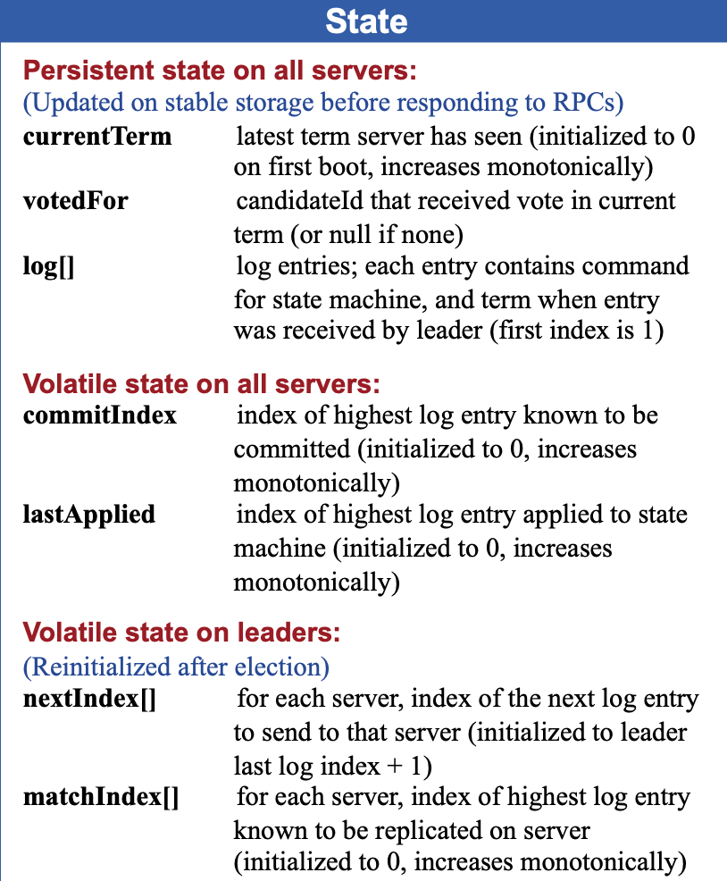

每个 Raft 节点都有一个倒计时的时钟，你可以为这个倒计时的时钟指定一个倒计时的下限和上限，假设我们指定下限为 `300ms` 和上限为 `400ms` ，如果这组人中是有 `Leader` 的，比如我们约定好，如果谁当选了 `Leader` 就每隔 `150ms` 就发送一次心跳消息，这样可以通知其他的 Raft 节点这组机器里面是有 `Leader` 的，从而告诉他们不用毛遂自荐了。

其实发送心跳的消息只要能在每个节点的时钟超时之前收到就可以了，这样就不会发生一直有人要竞选的尴尬局面。之所以我们要让时钟处于 `300ms` 到 `400ms` 之间随机选一个数，这是因为，如果大家都是使用同一个时间进行倒计时，那么大家大概率在同一时间超时，大家同时发起选举，每个人都给自己投一票，这样下去可能永远不会有人收到半数以上的投票，因为一轮选举中（就是每个任期中）每个人都只能投一票出去，除非进入到下一轮选举才能够再次投票。随机化的倒计时方法可以很好的避免这种尴尬局面的产生，让大家不在同一时间超时就不会同时发起选举了。

**有领导吗**

在一组计算机刚刚启动的时候是没有 `Leader` 的，这时候每个节点都在等待时钟超时，如果自己的时钟一旦超时，就主动发起选举，我们可以发现，大雄的倒计时剩余的时间最短，所以一定是大雄率先发起选举。

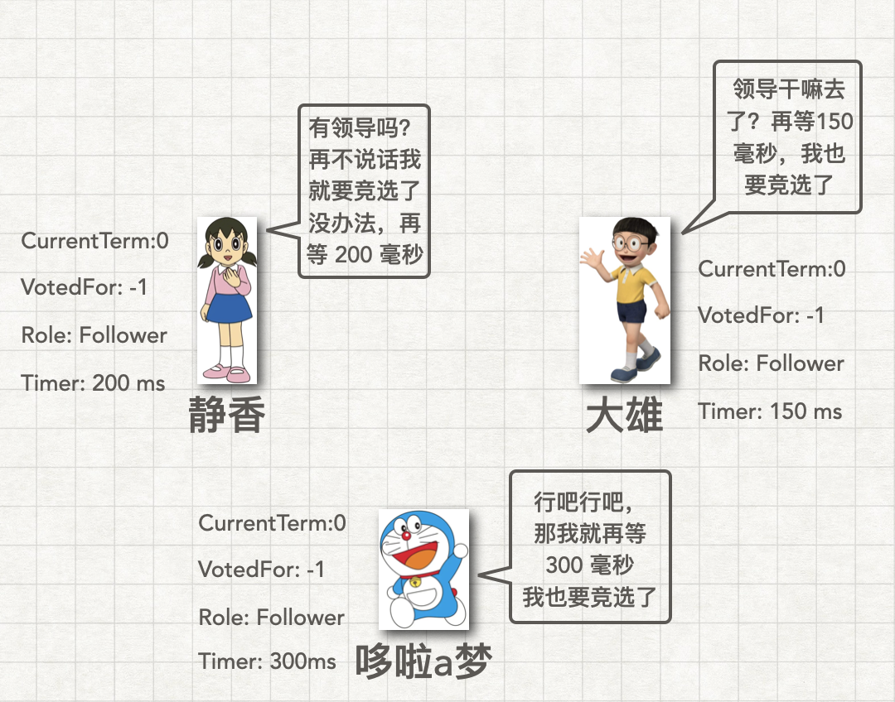

**大雄到时间了**

这时候大雄已经超时了

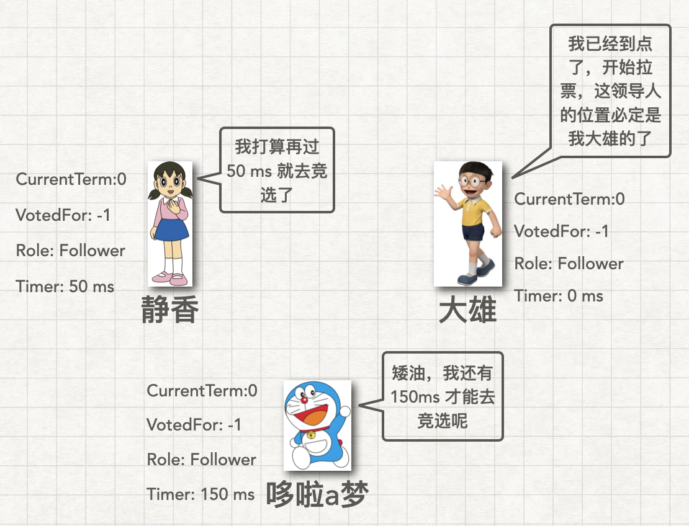

**大雄发送要票请求**

大雄首先将自己推荐为候选人 Candidate，然后将自己的  `CurrentTerm` 在原来的基础上增加 1。这说明大雄发现，在上一个任期中一直没有 `Leader` 通知我领导人的存在，所以我要主动进入到下一轮的选举中进行选举。

大雄做的事情：

1. 将自己的任期 CurrentTerm 加 1
2. 将自己的 Role 从 Follower 转换为 Candidate 并给自己投上一票
3. 用小本本记录自己已经获得的选票数量，现在大雄的 `votes` 记录为 1，每当 `votes` 的值增加一次的时候，他就算一算自己的选票数量是不是超过了总数的一半，一旦超过一半，大雄就把自己从 Candidate 转变为 Leader 成为真正的领导人

在实现中大雄通过 `RPC` 向其他人发送 `RequestVote` RPC 请求进行要票

被要票的人做的事情：

1. 首先看看要票人的任期是不是比自己小：如果要票人的任期比自己小，那就直接拒绝给他投票，并且告诉他自己的任期是什么，当要票人收到回复后一旦发现自己的任期已经落后了，要票人就会直接从 `Candidate` 变为 `Follower` 并且重置自己的时钟以及对齐任期
2. 如果要票人的任期大于自己：那被要票的人就将自己的任期提升，保持最高的任期，说明被要票的人应该注意到，现在已经进入了更新的一轮的选举过程了，这时候被要票的人就拥有了在新一轮选举中的投票权，直接同意投票给要票人即可
3. 如果要票人的任期等于自己：那这时候被要票的人就看看自己是不是已经投过票了，如果被要票的人还没有投过票那就直接同意投给要票人即可，如果被要票的人投过票了就直接拒绝即可

关于第 3 点：如果被要票的人投过票了，还可以检查一下这个票是不是投给当前正在向自己要票的这个人，因为在网络环境中很有可能被要票人的 `RPC` 回复消息丢失的情况，所以要票人没有收到回复，不太确定是拒绝了自己还是同意了自己，所以这时候要票人可以再次发送一次要票请求进行尝试

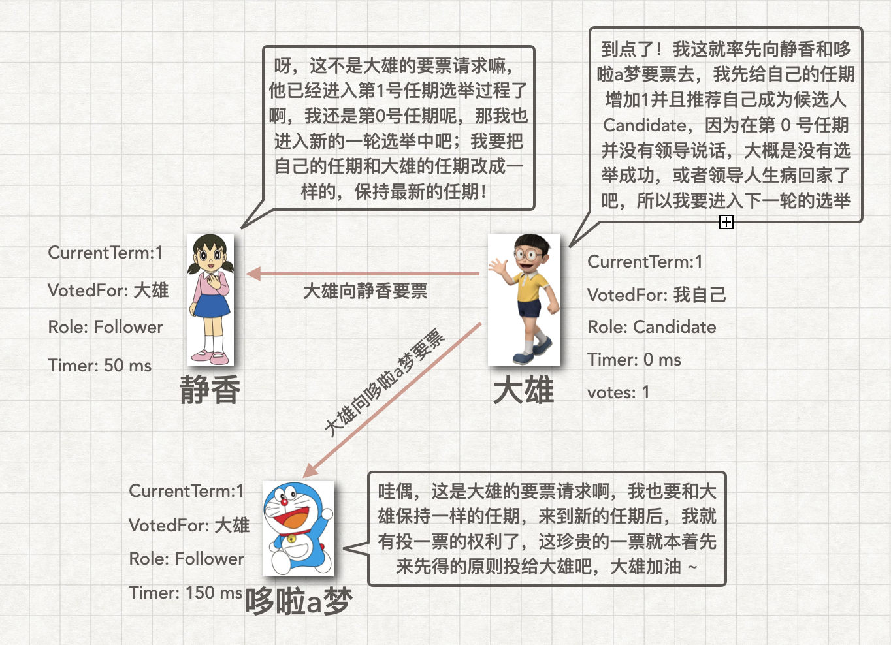

**静香支持大雄**

我们可以发现，静香所处的条件是：要票人的任期大于自己，因此静香做如下的事情：

1. 静香的 CurrentTerm 和 大雄的 Term 对齐，更新为 1
2. 静香投票给大雄，使用 VotedFor 从 -1 修改为 大雄，其中 -1 在本文中代表没有投票给任何人的意思
3. 重置倒计时时钟：一旦同意投票给大雄，意味着静香认可了大雄，所以答应大雄在一段时间内不会再次发起选举，所以要将自己的时钟重置

大雄做的事情：

每次大雄收到一票后都要检查一下自己的 `votes` 是不是超过总节点数的一半了，一旦超过一半就可以直接从 `Candidate` 变身为 `Leader` 了

1. 大雄需要检查投票是否成功，如果投票成功直接给自己的 `votes` 增加 1，然后看看是不是能够变成 `Leader`
2. 如果投票没有成功，那就要检查一下被要票人的任期，如果被要票人的任期小于等于自己，那么就说明被要票人已经投给别人票了，在这一次选举中不能给当前这个要票人进行投票了，如果被要票人的任期大于自己，那说明要票人的任期落后了，要票人应该从 `Candidate` 变为 `Follower` 并且重置自己的时钟，同时将自己的任期和这个更新的任期对齐

显然在这里大雄所做的事情应该是属于第 1 种情况

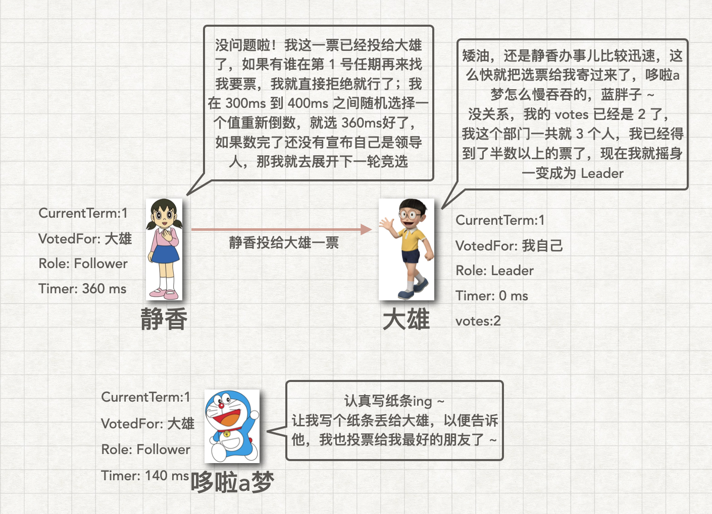

**静香苦等，多啦a梦奋笔疾书**

当静香投票成功后，静香就开始等待心跳，所谓的心跳就是一个 `RPC` ，在论文中起的名字叫做 `AppendEntries` 

`Leader` 需要通过这样的方式来告诉所有人，当前是有 `Leader` 的，每次你们收到我的心跳消息后，你们都要重置自己的时钟

**哆啦a梦支持大雄**

这时候大雄收到了 哆啦a梦的投票，不过已经没有什么用处了，大雄收到是没有问题的，我们需要在实现的过程中增加这一步的边界条件判断，如果已经是 `Leader` 了，收到后续的选票后要看看对方是同意了还是不同意，具体的事情和刚才收到静香的投票的时候是一样的：

1. 大雄需要检查投票是否成功，如果投票成功直接给自己的 `votes` 增加 1，然后看看是不是能够变成 `Leader`，如果自己已经是 `Leader` 了，那就不用再变咯
2. 如果投票没有成功，那就要检查一下被要票人的任期，如果被要票人的任期小于等于自己，那么就说明被要票人已经投给别人票了，在这一次选举中不能给当前这个要票人进行投票了，如果被要票人的任期大于自己，那说明要票人的任期落后了，要票人应该从 `Leader` 变为 `Follower` 并且重置自己的时钟，同时将自己的任期和这个更新的任期对齐

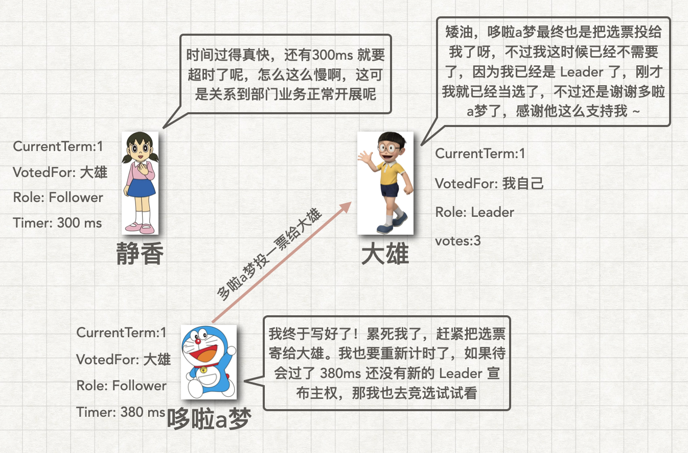

**来自大雄的心跳**

这时候，大雄要宣布自己的主动，那就是使用 `AppendEntries` RPC 向所有下属发送消息，证明领导人是存在的，告诉他们，你们不用发起选举了啊，都听我的号令

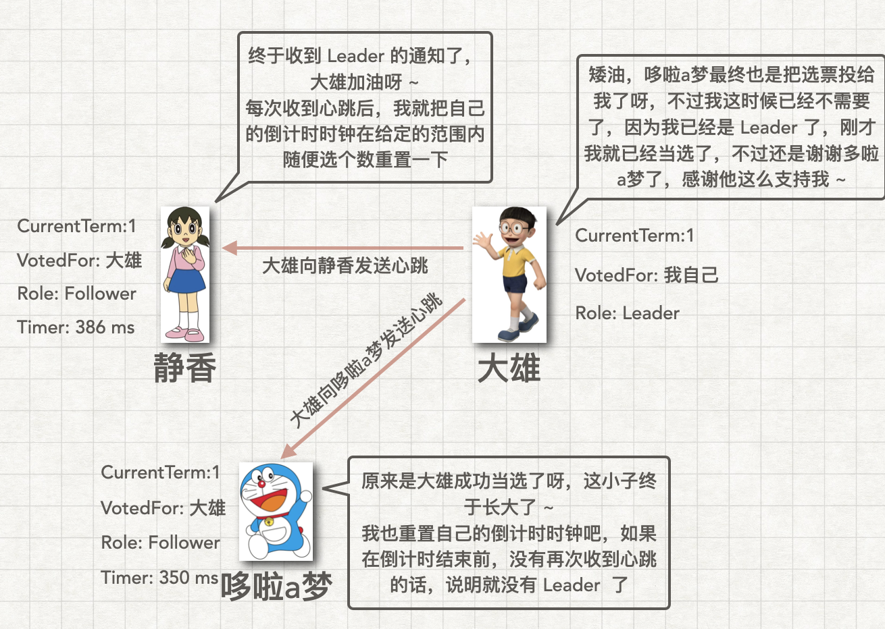

**响应 Leader 的心跳**

每次收到 `Leader` 的心跳后，他们 `Follower` 都要做这样的事情：

1. 如果自己的任期比当前的 `Leader` 小，那就对齐自己的任期，并且把 `VotedFor` 修改为 `-1` ，记住，`VotedFor` 只有在自己的任期增加的时候才可以修改为 `-1`，因为只有来到更新的一轮中，自己才能重新获得新的一次投票权
2. 如果自己的任期和当前的 `Leader` 相等，那么自己直接回复 `Leader` 并说，我已经收到你的心跳了，而且重置了自己的时钟，这代表中 `Follower` 认可了 `Leader` 的权威，并且答应在一段时间内不会再次发起选举
3. 如果自己的任期大于当前的 `Leader`，那也很简单，只需要回复当前的 `Leader` 说，我的任期都已经比你高了，你不能再继续当 `Leader` 了，你赶紧和我的任期对齐之后变成 `Follower` 吧

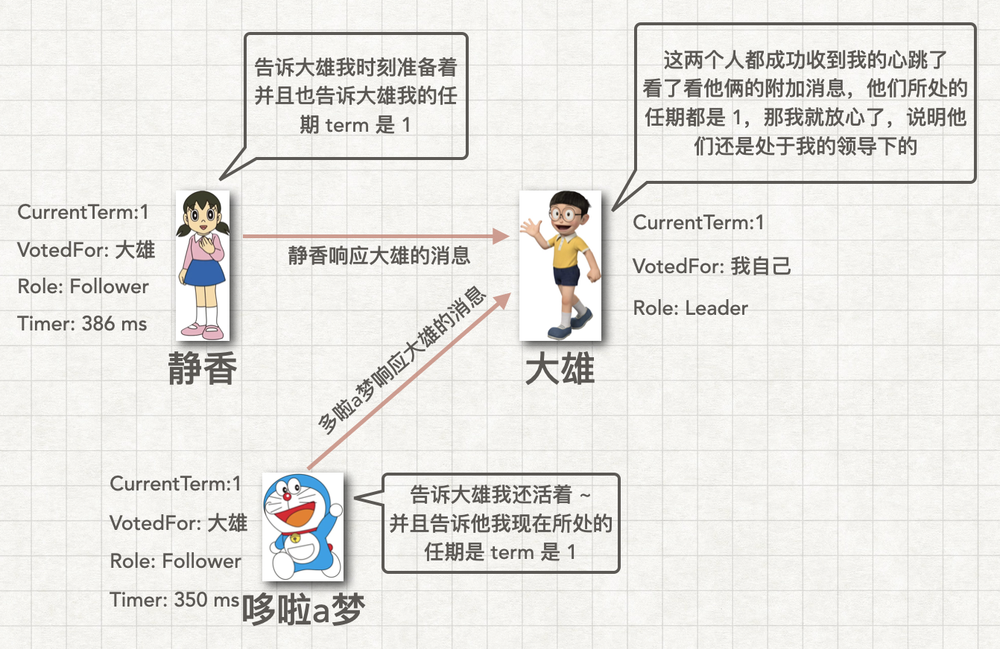

**大雄不干了！产生宕机的罪魁祸首**

在现实世界中，每个节点都是有可能出现问题的，比如大雄去睡觉了，这时候大雄肯定不会在梦中继续向其他节点发送心跳消息了，过一会儿如果大家没有收到心跳，率先超时的那个节点就会率先发起新一轮的选举，你可以发现，分布式系统是允许某个节点出现问题的，即使它宕机了，也还是能继续运行下去

可见，下一次就是哆啦a梦率先发起选举了

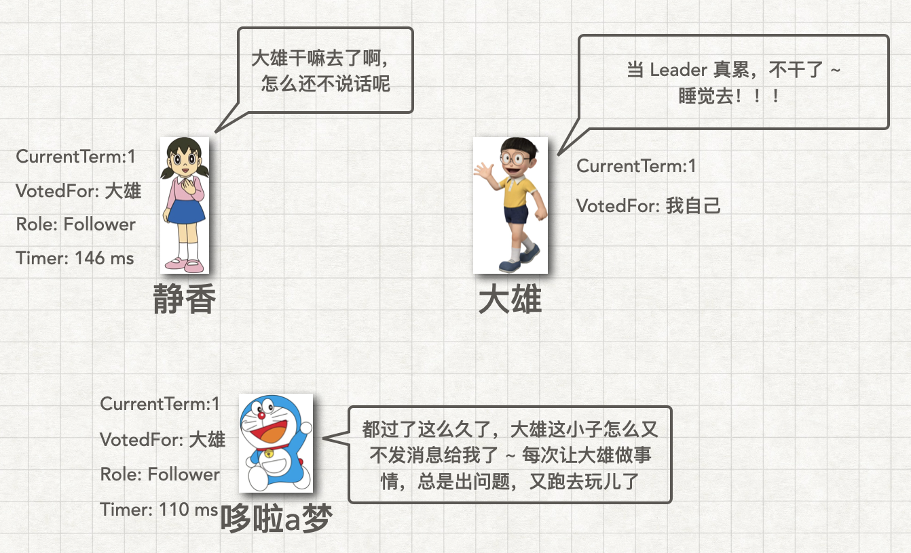

**多啦a梦超时，开始竞选**

重复刚才的过程，哆啦a梦增加自己的任期等一系列工作，发送要票请求给其他人

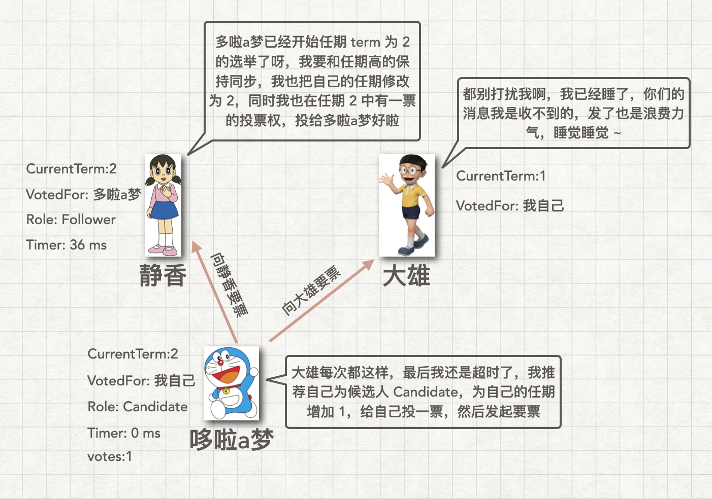

**静香投票给哆啦**

虽然哆啦a梦并不会收到大雄的回复，由于这是一个3节点的集群，所以只要哆啦a梦能拿到2票，就可以成功当选 `Leader`

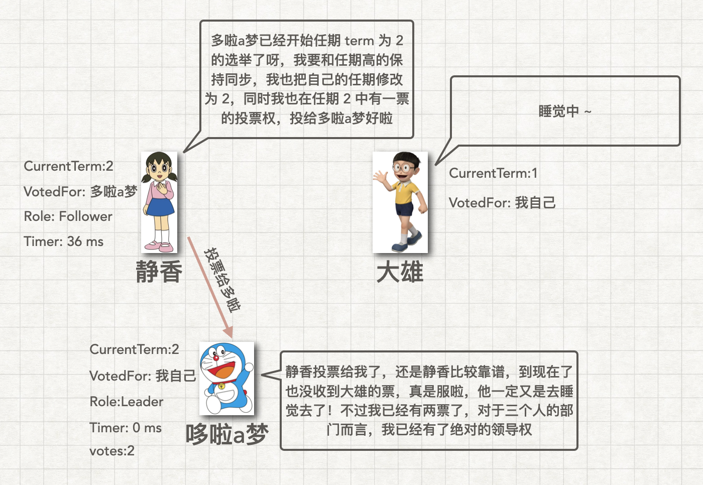

**收到哆啦a梦的心跳**

这时候，哆啦a梦开始发送心跳维护自己的权威

**回复多啦a梦的心跳**

哆啦a梦收到静香的响应

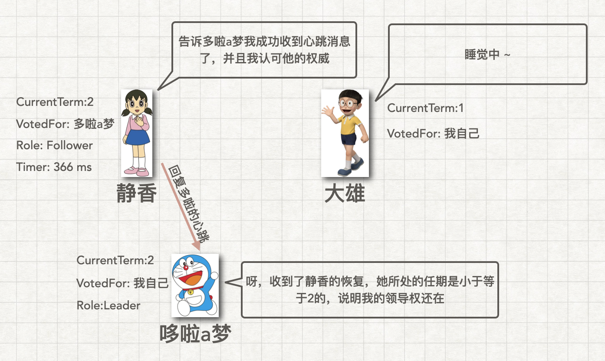

## 3 RPC

我们在本文中提到了两个 RPC，对照一下这些 RPC 中出现的字段，我们就很好理解是如何完成图中所说的那些事情了

1. RequestVote 
2. AppendEntries

### RequestVote

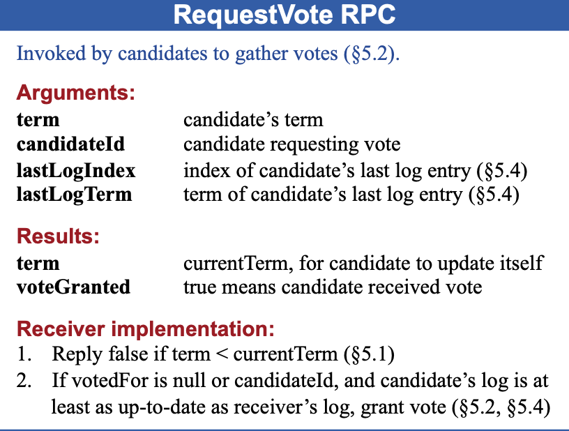

### AppendEntries

